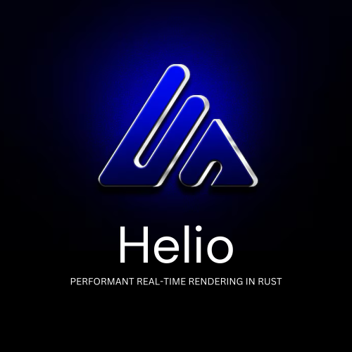
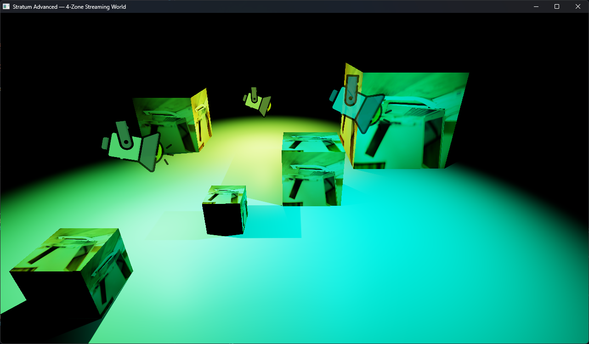
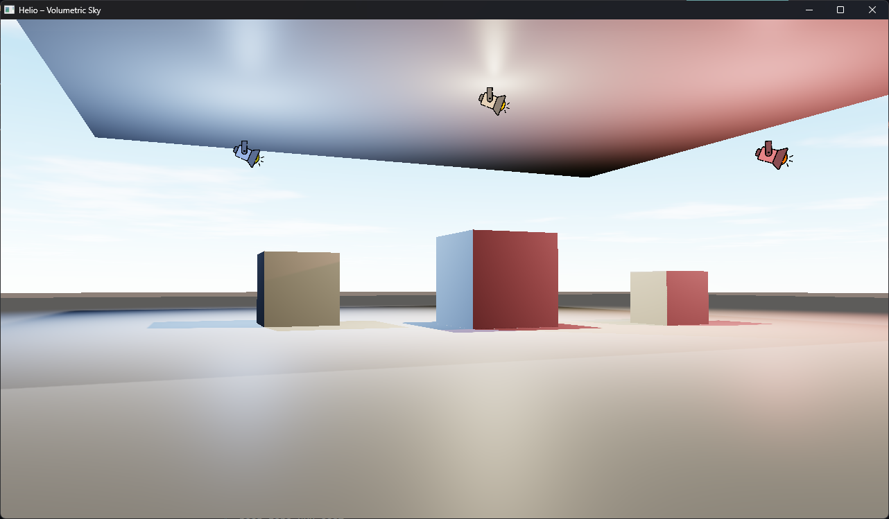
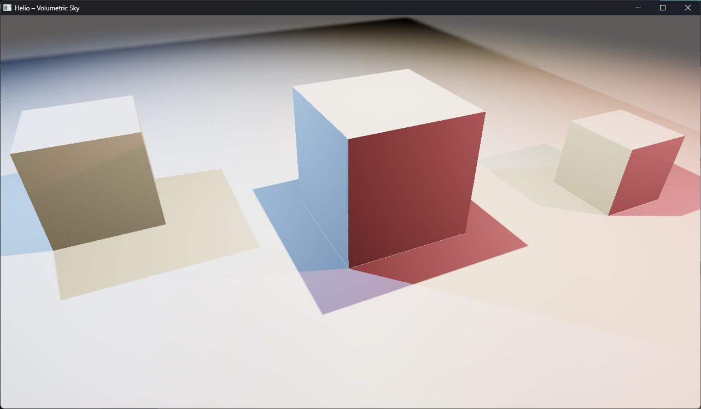
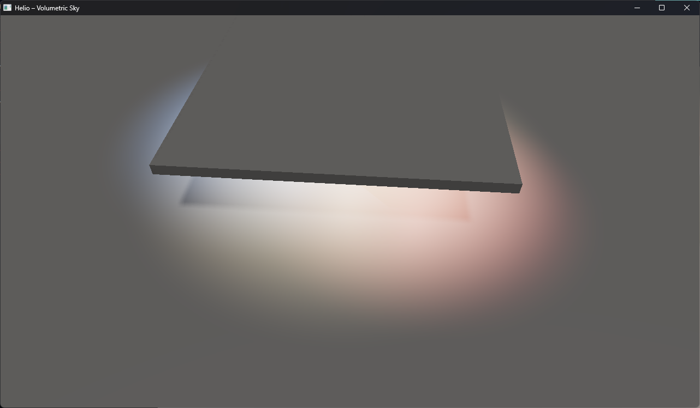
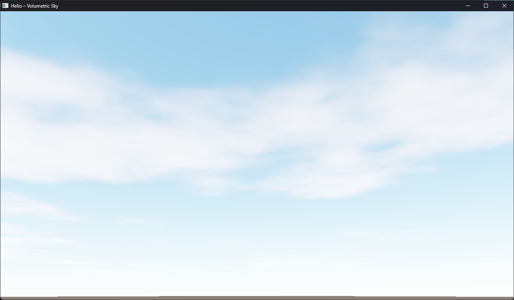
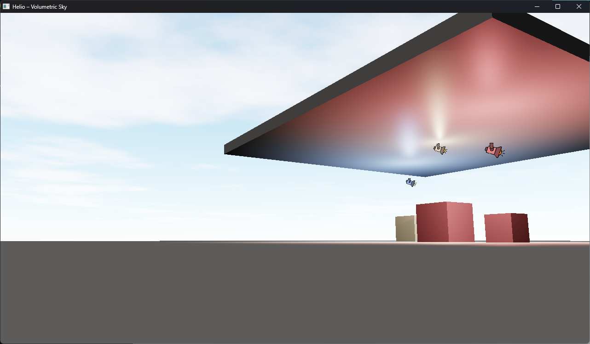

<div align="center">



**A production-grade real-time renderer built on [wgpu](https://wgpu.rs/)**

**WIP**

[](https://www.rust-lang.org/)
[](https://wgpu.rs/)
[](LICENSE)
[](#)
[](https://docs.rs/glam/)
[](https://docs.rs/bytemuck/)
[]()
[]()
[]()
[]()

> Cross-platform, data-driven, physically-based rendering — with a render graph, radiance cascades GI, cascaded shadow maps, volumetric sky, and bloom — all in pure Rust.

</div>


<div align="center">
    <table style="border-collapse: collapse; border: none;">
        <tr>
            <td style="border: none;"></td>
            <td style="border: none;"></td>
        </tr>
        <tr>
            <td style="border: none;"></td>
            <td style="border: none;"></td>
        </tr>
        <tr>
            <td style="border: none;"></td>
            <td style="border: none;"></td>
        </tr>
    </table>
</div>


## 🚀 Features

### Rendering
- **Physically-Based Shading** — metallic/roughness PBR with Cook-Torrance BRDF
- **Cascaded Shadow Maps** — 4-cascade CSM with PCF filtering, zero Peter-Panning front-face culling
- **Radiance Cascades GI** — screen-space global illumination with smooth probe volume blending
- **Hemisphere Ambient** — HL2-style two-color analytical ambient fallback for areas outside GI coverage
- **Bloom** — multi-pass physically-based bloom

### Lighting
- Directional lights (sun/moon with CSM)
- Point lights with attenuation
- Spot lights
- Per-light shadow casting
- Skylight ambient from atmosphere color

### Sky & Atmosphere
- **Rayleigh + Mie scattering** — physically accurate multi-layer atmosphere
- **Dynamic time-of-day** — rotate the sun in real time; sky, shadows, and ambient all respond
- **Cheap volumetric clouds** — planar-intersection FBM clouds with analytical sun lighting and sunset tint; near-zero GPU cost

### Architecture
- **Render graph** — automatic pass ordering and resource dependency resolution
- **Pipeline cache** — compiled PSO variants with instant hot-swapping via specialization constants
- **Resource pooling** — texture and buffer aliasing for minimal VRAM overhead
- **Shared bind groups** — proper resource sharing across features; no redundant uploads
- **Billboards** — GPU-instanced camera-facing sprites with correct depth occlusion

---

## 📦 Crates

| Crate | Description |
|---|---|
| `helio-render-v2` | Core renderer library — scene, mesh, material, passes, features |
| `helio-core` | Shared primitives and math utilities |
| `examples` | Runnable demos |

---

## 🏁 Getting Started

### Prerequisites
- [Rust stable toolchain](https://rustup.rs/)
- A GPU supporting Vulkan, Metal, DX12, or WebGPU

### Run the examples

```bash
# Sky atmosphere demo — sun rotation, colored point lights, clouds
cargo run --example render_v2_sky --release

# Basic scene — geometry, point lights, shadows
cargo run --example render_v2_basic --release
```

#### WASM example
```bash
cargo clean ; cargo build -p helio-wasm-app --target wasm32-unknown-unknown --release
```

### Controls (sky example)
| Key | Action |
|---|---|
| `W A S D` | Move forward / left / back / right |
| `Space` / `Shift` | Move up / down |
| `Q` / `E` | Rotate sun (time of day) |
| Mouse drag | Look around (click to grab cursor) |
| `Escape` | Release cursor |

---

## 🔧 Usage

```rust
use helio_render_v2::{Renderer, RendererConfig, Camera, Scene, SceneLight};
use helio_render_v2::features::{
    FeatureRegistry, LightingFeature, ShadowsFeature,
    BloomFeature, RadianceCascadesFeature,
};

// Build the renderer
let config = RendererConfig::default();
let mut renderer = Renderer::new(&device, &queue, surface_format, config).await?;

// Register features
let mut registry = FeatureRegistry::new();
registry.add(LightingFeature::new(&device));
registry.add(ShadowsFeature::new(&device));
registry.add(RadianceCascadesFeature::new(&device));
registry.add(BloomFeature::new(&device));

// Describe your scene
let scene = Scene {
    lights: vec![
        SceneLight::directional([0.4, -0.8, 0.4], [1.0, 0.95, 0.8], 3.0),
    ],
    sky: Some(SkyAtmosphere::default()),
    ..Default::default()
};

// Render loop
renderer.render(&device, &queue, &surface, &camera, &scene, &registry)?;
```

---

## 🗺️ Roadmap

- [ ] SSAO
- [ ] Screen-space reflections
- [ ] Skeletal animation
- [ ] Point light shadows
- [ ] Temporal anti-aliasing (TAA)
- [ ] WASM / WebGPU target

---

## 📱 Android

```powershell
$env:ANDROID_HOME = "C:\Users\...\Android\Sdk"
$env:ANDROID_NDK_ROOT = "$env:ANDROID_HOME\ndk\29.0.14206865"
cargo apk build -p feature_complete_android --target aarch64-linux-android
```

---

## 📄 License

[MIT](LICENSE)

---

<div align="center">
  <sub>Built with ❤️ in Rust · Powered by <a href="https://wgpu.rs/">wgpu</a></sub>
</div>
