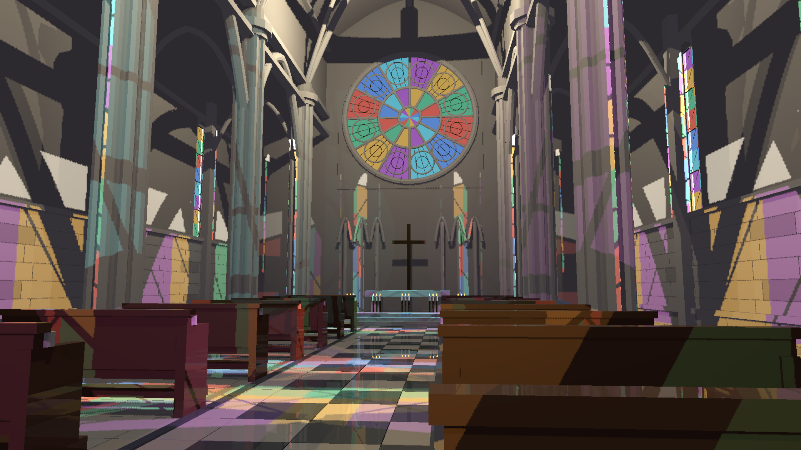
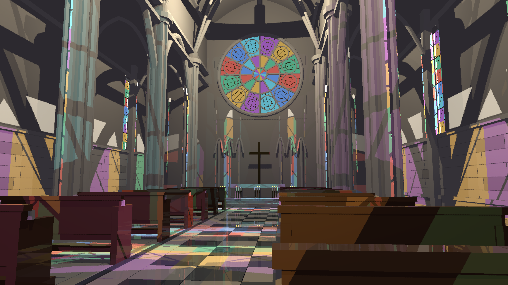
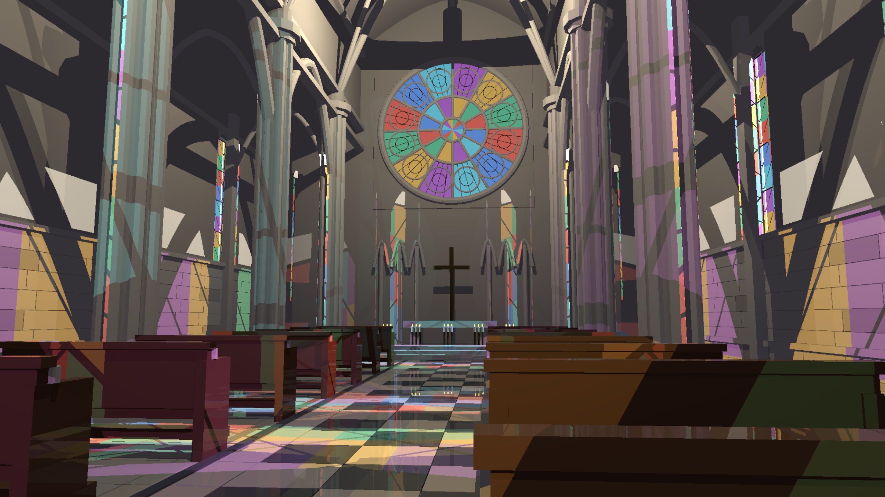

# Restore transparent surfaces in the FXAA HLFS graph

The native HLFS graph included a linear-HDR `TransparentPass`, but the FXAA variant skipped it. Colored shadow transmission still worked because it uses the scene acceleration structure independently; the visible stained-glass surfaces themselves were absent. The FXAA graph now blends transparent geometry into `pre_aa` after volumetric fog and before FXAA/tonemapping, matching the native graph's ordering and target format.

`cargo build --release -p examples --bin indoor_cathedral_hlfs` and `cargo test --release -p helio-default-graphs --test pass_build_context` pass. The latter is graph-builder ABI coverage; visual evidence comes from the actual captures. Deterministic 100-frame cathedral captures completed at 1440p and 4K, plus a 1440p all-light reference. The 1440p and 4K final captures were inspected: the rose window and side panes now display their material colors. At 1440p frames 31/63/99 the change affects 77,327 / 100,930 / 119,097 pixels compared with the preceding missing-glass captures. This is effect coverage, not a correctness score. Frame zero remains unchanged while the scene initializes.

An exploratory native-TSR capture exposed the missing panes in FXAA. That run is not a matched AA quality/performance comparison: it uses a different graph. No TSR preset promotion or antialiasing conclusion follows from it.

## Measurement limits

RTX 3060, native output resolution, FXAA, SSR and colored RT transmission enabled, temporal RIS disabled. One run per configuration, 100 moving-camera frames, first 16 excluded. HLFS-only timings exclude transparency, SSR, TLAS, fog, other passes and CPU. The serialized latency includes CPU/GPU synchronization and excludes capture readback; it is not pipelined whole-frame GPU timing.

| Capture | HLFS-only median / p95 ms | Serialized CPU + GPU median / p95 ms |
| --- | ---: | ---: |
| 1440p sampled | 4.455 / 5.096 | 23.897 / 29.115 |
| 4K sampled | 9.515 / 10.163 | 36.697 / 40.474 |
| 1440p all-light reference | 11.321 / 11.836 | 32.451 / 35.982 |

The reference configuration forces full-resolution shading; sampled mode shades at half width/height. Thus their remaining display-RGB NRMSE (5.48%, 5.85%, 5.74% at frames 31/63/99) includes reconstruction/aliasing differences and cannot alone diagnose missing lights. Sharp shadow-edge aliasing, faceted geometry, incomplete reflections and absent realistic textures remain. This correction restores a missing scene pass; it does not implement refraction or caustics and does not satisfy the full artifact-free/3-4 ms acceptance gate.

Reproduce using `HLFS_RT=1`, `HLFS_PRESAMPLED=1`, `HLFS_SSR=1`, `HLFS_RESOLUTION=1440p`, `HLFS_FXAA=1`, `HLFS_CAPTURE_TIMINGS=1`, followed by `target/release/indoor_cathedral_hlfs.exe --capture <directory>`. Use `HLFS_RESOLUTION=4k` for stress or add `HLFS_REFERENCE=1` for the slow reference. The former missing-glass control is retained in `helio-pass-hlfs/tests/validation/transmission-exact-20260920/after.png`.

