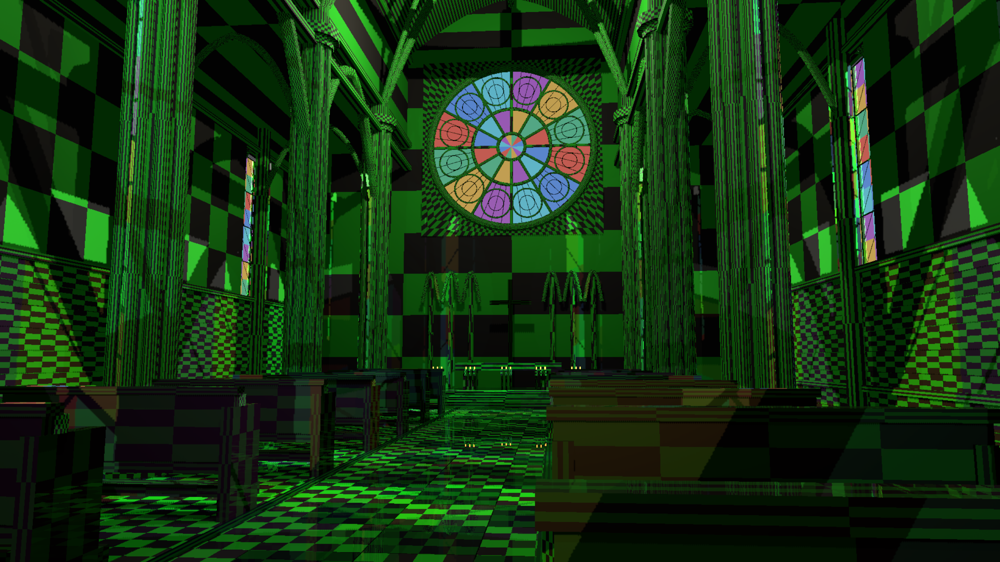
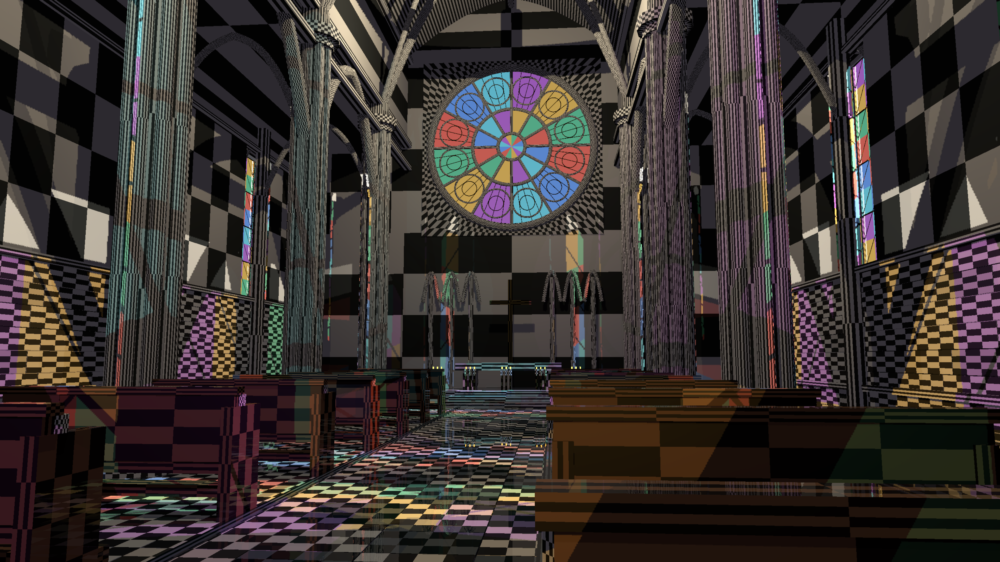

# SceneDB material texture binding validation

Renderer material arrays previously contained repeated white fallback views, and the G-buffer read a single fallback metadata row using every material ID. SceneDB already owns a TextureStore, but the renderer was not consuming it. The renderer now builds descriptor views from that store, caches texture handle identity, and refreshes the binding version on slot changes/removal. It neither allocates a competing texture registry nor uploads texture content. Unsupported dimensions/sample types and slot extents beyond the device binding capacity return a configuration error.

The pass-owned fallback metadata has a reserved `params.w = -1` marker. G-buffer, forward, portal and virtual-geometry shaders use the material row's five texture-store IDs with identity UV transforms in that case, rather than reading beyond the one-row fallback. Explicit metadata tables retain their transformed-slot behavior. G-buffer/forward cache keys compare `(texture_version, material_epoch)` pairs instead of XOR, avoiding collisions during simultaneous changes. The marker and slot ownership are documented in code.

## Controls

A new opt-in `HLFS_TEXTURE_CHECKER=1` capture diagnostic registers a 4x4 sRGB checker in SceneDB and assigns its base-color slot to opaque materials. This deliberately conspicuous texture is not an architectural art asset or a new default. With `HLFS_TEXTURE_LIFECYCLE=1`, frame 48 unregisters the slot and frame 80 registers a green replacement into the recycled slot.

Actual 1440p rendered-pixel comparisons:

- Ordinary scene versus the prior untextured build: RGBA-identical at frames 0/31/63/99.
- Lifecycle frame 31 versus the checker control: identical.
- Lifecycle frame 63 versus the untextured control: identical after removal.
- Lifecycle frame 99 versus the original checker: 2,313,499 pixels change to the replacement appearance.
- SceneDB upload count is exactly two in the lifecycle run. Stable frames perform no duplicate texture uploads.

The 1440p checker, green replacement and 4K checker captures were inspected. The build passes, and `cargo test --release -p helio-pass-gbuffer --test material_texture_shaders` parses/validates all four changed shader sources with Naga. Forward/portal/virtual-geometry source validation is not equivalent to rendered coverage of those paths; visual coverage here is the ordinary cathedral G-buffer path.

Reproduce with `cargo build --release -p examples --bin indoor_cathedral_hlfs`, then set `HLFS_RT=1`, `HLFS_PRESAMPLED=1`, `HLFS_SSR=1`, `HLFS_RESOLUTION=1440p`, `HLFS_FXAA=1`, `HLFS_CAPTURE_TIMINGS=1` and run `target/release/indoor_cathedral_hlfs.exe --capture <directory>`. Add checker/lifecycle flags for those controls; use `HLFS_RESOLUTION=4k` for stress. Each run has 100 moving-camera frames, with 16 warmup frames excluded from the saved timing summaries.

## Limits

This validates basic albedo binding and descriptor lifetime. Realistic architectural assets, material-specific scales, mip generation, anisotropic/filtering policy, normal/ORM/emissive-map rendered controls, expanded-binding devices, renderer teardown/recreation and transparent textured shading remain unvalidated or incomplete. The diagnostic uses the current shared default sampler and a single mip. TextureStore slot IDs recycle, so real frontends must clear material references before unregistering/reusing slots; the lifecycle diagnostic intentionally retains its albedo reference to exercise white fallback and replacement behavior. Missing normal maps cannot use a white albedo fallback as a neutral normal.

Timing CSVs and JSON record HLFS-only medians/p95; they exclude texture upload, G-buffer shading, SSR, TLAS, fog, transparency and all other work. They are not a texture-overhead measurement or a whole-frame claim. The artifact-free and complete 3-4 ms renderer goal remains unmet. The diagnostic's repeated checker aliasing is expected and does not establish realistic texture quality.

## Integration check

The branch advanced concurrently with `a85c879a` (culling fixes and drone example). The texture change was rebased onto that commit without overwriting it. The cathedral was rebuilt and both ordinary and texture-lifecycle 1440p runs were repeated; frames 0/31/63/99 in each run are RGBA-identical to the corresponding pre-integration controls. The earlier timing CSVs remain measurements from before that rebase; the integration repeat is a visual compatibility check, not a replacement timing claim.
