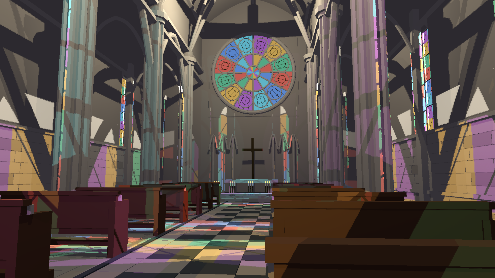
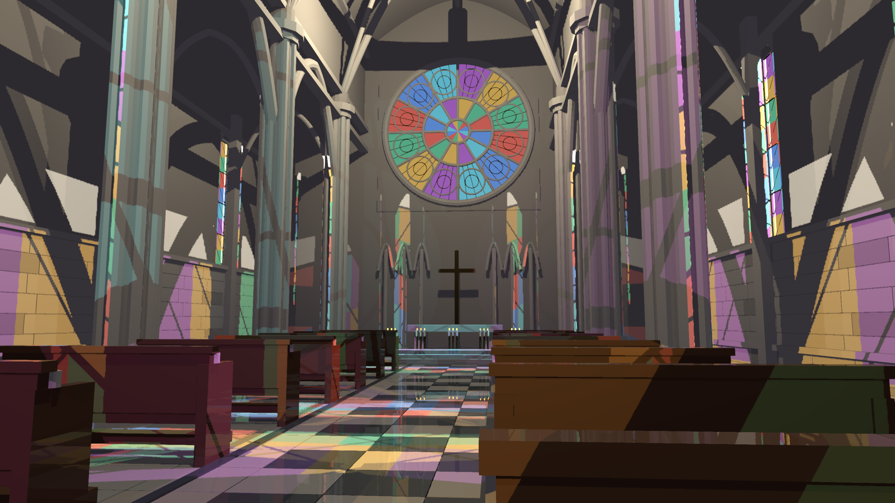

> Resolution correction (2026-09-20): architectural scene captures made by the shared harness without native TSR used renderer scale 0.75. A 1440p output was internally 1920x1080; 4K output was internally 2880x1620. References used that same internal size with full HLFS shading. Native-resolution wording for those captures is superseded; standalone GPU fixtures are unaffected. See the HLFS validation report `resolution-audit-20260920/README.md` for corrected, matched measurements.

# FXAA edge and graph lifetime checkpoint

The complete visual/performance acceptance gate remains failed. This fixes two demonstrated AA defects, not all white borders or reconstruction artifacts.

The old shader used the orientation second derivative as the blend threshold; a binary stair-stepped diagonal received zero blended pixels. The corrected shader selects the perpendicular side by local contrast, performs bounded edge-span search, and applies bounded subpixel coverage. Neighbor loads clamp at texture borders. A GPU readback fixture fails on the original shader and passes on the correction, checking actual diagonal blending, horizontal/vertical reflection symmetry and constant image borders.

A shader-only cathedral comparison was pixel-identical because PostProcess read pre_aa and overwrote the surface written by FXAA. The FXAA HLFS graph now filters into a linear HDR fxaa_color intermediate and explicitly feeds it to PostProcess. Other default graph AA chains have not been repaired/validated by this checkpoint. FXAA bind-group caching now uses texture-view identity, not its Rust wrapper address.

Adding the intermediate exposed a wgpu read/attachment conflict: water_output was republished as pre_aa, but its allocation lifetime ended before those consumers. ResourceBuilder::publish_alias now explicitly extends that allocation through consumers of the published name. Water declares the alias; a GPU-device regression checks its lifetime and prevents allocation reuse by the filter. This is a direct publication alias declaration, not automatic inference or transitive alias routing.

## Validation

- cargo test --release -p helio-pass-fxaa --test edge_symmetry -- --ignored --nocapture: passed (old shader fails with zero blended pixels).
- cargo test --release -p helio-core --lib published_view_outlives -- --ignored --nocapture: passed.
- cargo build --release -p examples --bin indoor_cathedral_hlfs: passed.
- Matched 1440p fixed-camera captures, 32 frames, no SSR, sampled and full-resolution all-light reference: rendered and visually inspected. The original shader and shader-only change gave identical final pixels; connected output changes 590,490 sampled / 638,090 reference pixels. Pixel-change counts establish integration, not a quality score. Diagonal raster edges are smoother; half-resolution shadow reconstruction artifacts persist.
- 4K moving-camera, 100 frames, colored transmission, fog, FXAA and SSR: completed without GPU validation errors; frame 99 inspected. Reconstruction aliasing and incomplete reflections remain. No interactive resize/input validation is claimed.

Captures use HLFS_RT=1, HLFS_PRESAMPLED=1, HLFS_FXAA=1 and HLFS_RESOLUTION=1440p or 4k. Fixed captures additionally use HLFS_FIXED_CAMERA=1 and HLFS_CAPTURE_FRAMES=32; reference adds HLFS_REFERENCE=1. 4K uses HLFS_SSR=1 and HLFS_CAPTURE_TIMINGS=1 with the default 100-frame path. Invoke target/release/indoor_cathedral_hlfs.exe --capture <directory>.

results.json and 4k-hlfs.csv retain timing scope. HLFS-only excludes FXAA, SSR, TLAS, post-process and every other pass. Serialized timing includes CPU and synchronization and excludes capture readback. These are not a measured FXAA cost or a whole-frame GPU budget result. The corrected AA adds an HDR intermediate; its performance/memory cost still needs isolated measurement. No 3-4 ms acceptance claim.

