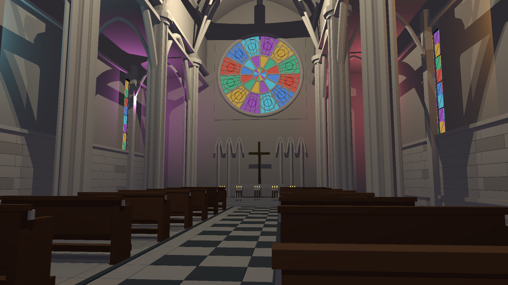
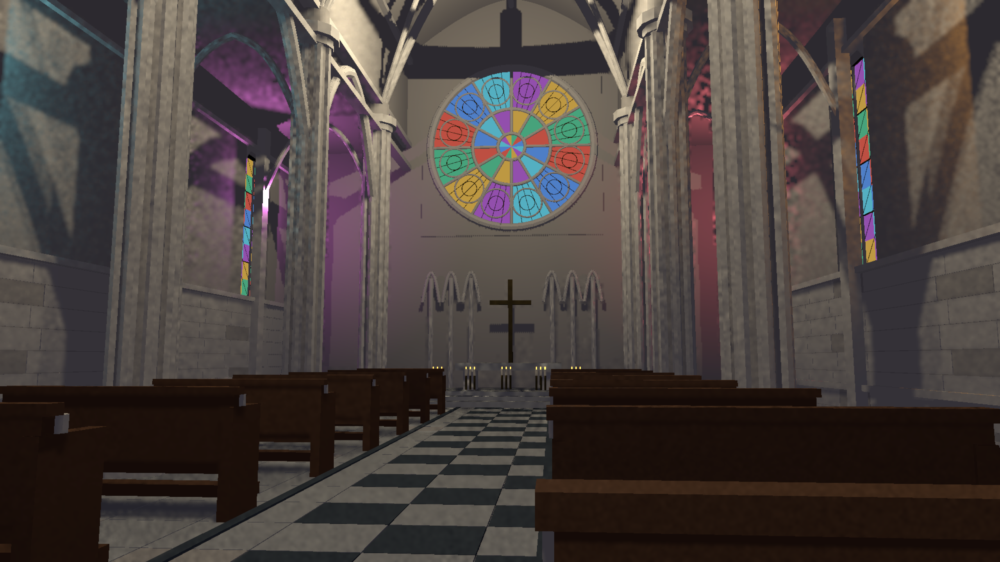

> Resolution correction (2026-09-20): architectural scene captures made by the shared harness without native TSR used renderer scale 0.75. A 1440p output was internally 1920x1080; 4K output was internally 2880x1620. References used that same internal size with full HLFS shading. Native-resolution wording for those captures is superseded; standalone GPU fixtures are unaffected. See the HLFS validation report `resolution-audit-20260920/README.md` for corrected, matched measurements.

# Artifact repair checkpoint (not final acceptance)

The earlier review image had localized bright edge spikes and self-shadow stripes that aggregate image-error gates did not reject. PR #248 is back in draft; the tracker is In Progress.

## Changes and falsification

- Thin surfaces missing half-resolution coverage were shaded after denoising with a random estimator. Small light sets (<=64 rows) now use exact repair in the presampled tier. The new one-pixel, 17-light regression checks 24 uncovered phases against all-lights reference. The 1,024-light path still requires further repair work.
- A 4x depth-ULP shadow bias removed stripes but erased a 2 cm blocker at 100 m. Rejected. A 1.5x bias also erased contacts at 150 m. Rejected; these were not accepted optimizations.
- Separating view and projection in depth/G-buffer rasterization removes precombined-matrix rounding error and visibly improves the cathedral. A new real raster-depth regression exposed a remaining self-hit at 150 m, missed by the older ideal CPU-depth fixture.
- G-buffer motion is now RGBA16F: XY retain motion in pixels, Z stores the small signed view-depth reconstruction residual, and W=2 validates it. Corrected ray origins use the residual quantization/transform error rather than a depth-buffer ULP. Producers without this residual explicitly write W=0. Portal/foliage attachment contracts were updated. G-buffer bandwidth increases from 48 to 52 bytes/sample; fresh performance validation is required.

10 RT GPU regressions and 14 screen-space GPU regressions pass. The affected G-buffer, depth, transparency, portal and foliage package tests pass (170 unit/layout checks). These do not prove scene-wide visual completion.

Matched 100-frame 1440p captures were rendered and inspected. The sampled image still has blotchy lighting and jagged edges. Native TSR was also captured and inspected: tracery edges improve, but lighting blotchiness remains. The original capture did not enable temporal AA. Native TSR adds cost: 32.625 ms median / 53.135 ms p95 serialized latency in this run, not an accepted GPU-budget result. The serialized sampled capture measured 23.388 ms median / 27.483 ms p95 including CPU preparation and frame work, excluding image readback. This is not the HLFS-only GPU timing or an acceptance result.

## Outstanding goal

Fix remaining visible artifacts and revalidate quality and RTX 3060 1440p performance, with 4K stress. Add useful engine RT support including coloured transmission and validate glass stacking, opaque occlusion and dynamic changes. Build three substantial showcase scenes: a cathedral grounded in real dimensions, a monumental stone arch, and a technology scene exercising varied reflections and many lights. Use realistic licensed PBR textures at appropriate physical scale, and validate normal/roughness texture loading. Audit and integrate existing fog and other appropriate engine passes instead of assuming that a named pass is complete. Keep the same PR draft until the whole requested state is verified; publish final images/numbers only when ready for review.

The current engine audit found fog in the HLFS graph but no SSR/planar-reflection composition there. The SSR package has a hybrid RT path to investigate. The glass-specific transparent material template still contains a debug-green return; it is not the material path used by these cathedral panes.

Research references for subsequent scene work:

- [Epic MegaLights documentation](https://dev.epicgames.com/documentation/unreal-engine/megalights-in-unreal-engine): stochastic light sampling, complexity diagnostics, area lights, fog/translucency and limitations.
- [Cologne Cathedral official dimensions](https://www.koelner-dom.de/erleben/der-dom-in-zahlen): exterior length 144.58 m, width 86.25 m, nave interior width 45.19 m, nave height 43.35 m, side aisle height 19.80 m. These support a real-scale scene, not a claim of an exact architectural replica without detailed plans.
- [City of Paris architectural overview](https://www.paris.fr/pages/a-la-place-de-l-arc-de-triomphe-devait-troner-un-elephant-18396): approximate exterior dimensions 50 m high, 44.8 m long and 22.2 m wide. The previously linked educational PDF concerns the 2021 wrapping installation, not dimensional plans; it was inspected and rejected as a geometry reference. A monument inspired by these proportions is not an exact replica.

## Compact-population sampling follow-up

Compact local light lists (up to 32 entries) now score all candidates before selecting the same fixed number of shadow rays. This removes unnecessary candidate-selection variance without converting the whole image to all-lights ray tracing. The new regression uses 3/17/32 co-located sources with unequal powers and checks unfiltered output against the all-lights result over eight frames per population. All 746 existing final-image quality checks also pass.

Matched display-RGB NRMSE at frames 31/63/99 improves from 9.01/8.30/6.64% to 7.56/6.84/5.15%. Remaining differences are visible; this is not artifact-free acceptance.

The real cathedral now has optional six-stage timing capture (`HLFS_CAPTURE_TIMINGS=1`). This identified exact thin-edge repair as the bottleneck: it traced out-of-range/back-facing lights. Rejecting their zero unshadowed contribution before tracing preserves frames 31/63/99 pixel for pixel. In the 100-frame capture (16 warmup, 84 measured), HLFS-only GPU median fell from 4.682 to 3.197 ms; interpolated p95 fell from 5.424 to 3.779 ms. Adjacent CSVs and JSON preserve the before/after evidence. These short real-scene runs exclude TLAS and all other passes and need longer repeated validation.

One fresh synthetic 1,024-moving-light/10,000-moving-instance run (120 warmup, 600 measured) measured 3.904 ms median / 4.537 ms p95 for HLFS plus TLAS. It is the same scoped primary workload as the previous report, not a whole-frame or general-scene guarantee.

