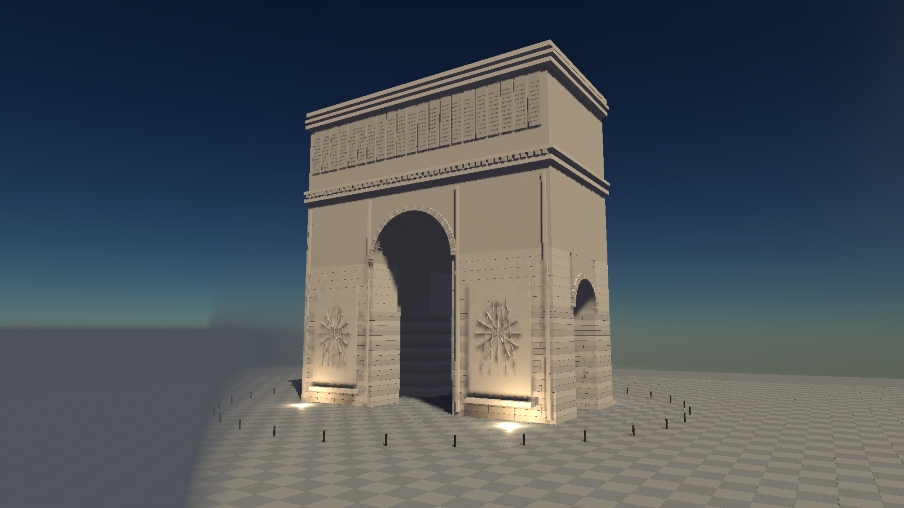
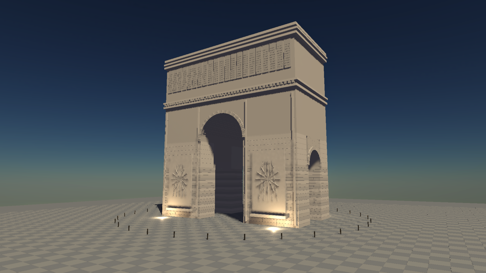

# Rotated camera forward and volumetric fog

The GPU camera previously extracted forward from the negative third column of the world-to-view matrix. For rotated cameras this is not the world-space look direction. Transforming local -Z by the inverse view matrix fixes the direction consumed by fog ray-length correction and billboard depth.

The regression test uses translated cameras looking in two different yaw/pitch directions and verifies both the normalized world direction and the depth of a point on the centre ray.

Before/after captures use the same monumental arch geometry, camera, lighting and height fog at 2560x1440 on RTX 3060 / Vulkan, with RT presampling and FXAA. Density is 0.0008, height falloff 0.025, max distance 350 m, anisotropy 0.3. Frame 99 shows the invalid left-hand fog patch before the fix and its removal after it. These are development captures; the arch example and atmosphere wiring are still uncommitted work at this checkpoint.

- `cargo test --release -p helio-core camera::tests::forward_matches_look_direction_under_yaw_pitch_and_translation`: passed.
- Release builds of `monumental_arch_hlfs` and `indoor_cathedral_hlfs`: passed.
- Offscreen 100-frame arch capture: completed without GPU validation errors.
- This is not a final visual-quality or performance acceptance. Shadow/detail aliasing, materials, broader scene work and the 3-4 ms dense-light gate remain open.

