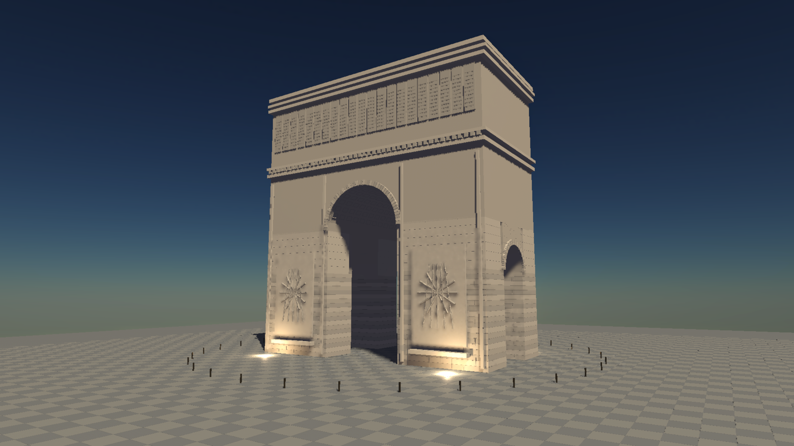

# Monument scene and full-resolution sun checkpoint

Development checkpoint, not final review acceptance. This original procedural stone arch uses approximate exterior proportions published by the City of Paris (about 50 x 44.8 x 22.2 m): https://www.paris.fr/pages/a-la-place-de-l-arc-de-triomphe-devait-troner-un-elephant-18396 . Ornament is invented, not a surveyed reconstruction.

The scene includes intersecting open vaults, coursed piers with recessed mortar, radial arch stones, coffers, cornices, reliefs, a paved plaza, five lights, atmospheric sky and height fog. Shared architecture primitives and capture hosting are extracted from the cathedral. An orbit viewer is included, but interactive input/resize validation is still outstanding.

The sky pass now activates SceneDB atmosphere draws without requiring the retired SkyActor context. Examples register the sky buffer before insertion to avoid the lazy registration first-write hazard. Empty atmosphere rows are guarded in both shaders. The existing row-zero singleton limitation remains; arbitrary environment entity indices and removal need dedicated validation.

For presampled populations up to 64 lights, the brightest directional light is separated and evaluated at full output resolution. Its identity is excluded from regular and small-population residual shading. A new hardware regression checks 1, 2 and 17 lights against the all-light reference; it caught and prompted a fix for double counting in the small-population path.

## Evidence

RTX 3060 / Vulkan, 2560x1440, FXAA, 100 frames, 16 warmup and 84 measured. Same scene and camera for before, after and reference. Single runs; timings are HLFS only, excluding TLAS, fog, other passes and CPU work. This five-light scene does not establish the dense-light 3-4 ms goal.

| Path | Median ms | P95 ms | Display RGB NRMSE at frames 31 / 63 / 99 |
| --- | ---: | ---: | --- |
| Prior filtered sun | 1.745 | 2.407 | 4.93 / 5.01 / 4.87% |
| Full-resolution sun | 1.743 | 2.302 | 0.99 / 1.22 / 1.42% |
| All-light reference | 3.680 | 4.266 | reference |

NRMSE uses post-tonemap image RGB, not linear-light energy. Differences remain around local uplights and thin detail. Subpixel masonry/inscription aliasing and reconstruction quality still require work. No realistic texture assets or reflection showcase are delivered by this checkpoint.

Validation: 14 hardware RT regressions and 14 screen-space regressions pass. The prior sky checkpoint passed 64 sky tests. Both cathedral and monument release builds pass. Final 100-frame normal/reference monument captures complete without GPU validation errors. The rotated-camera fog fix is documented in the adjacent camera-forward checkpoint.

Build: `cargo build --release -p examples --bin monumental_arch_hlfs`. For capture set `HLFS_RT=1`, `HLFS_PRESAMPLED=1`, `HLFS_RESOLUTION=1440p`, `HLFS_FXAA=1`, `HLFS_CAPTURE_TIMINGS=1`, then run `target/release/monumental_arch_hlfs.exe --capture target/monument`. Add `HLFS_REFERENCE=1` for the reference, or `HLFS_NO_FOG=1` for the fog control. With no arguments the example launches the orbit viewer (A/D orbit, W/S zoom, Q/E height).

