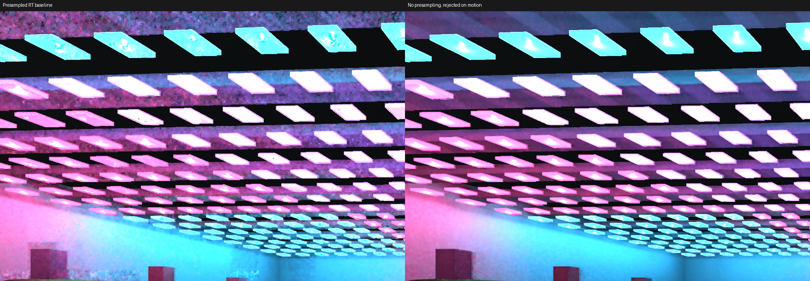
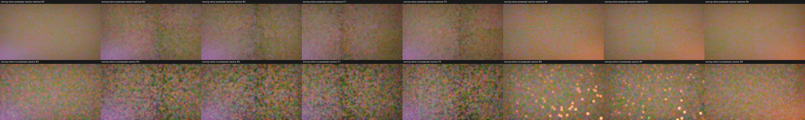

# Native 1440p RT performance investigation — 2026-09-23

**Status: visual and performance gates remain open.** These are RTX 3060 / Vulkan GPU timestamp measurements from release builds at commit `799b6130`. The gallery has 1,024 static, independently shadowed point lights, 38,400 triangles, eight material batches, and a moving camera. It is a diagnostic scene, not the separate 1,024-*moving*-light stress workload or the cathedral acceptance scene. Geometry and light counts were not reduced.

The primary run used `HLFS_RT=1`, `HLFS_PRESAMPLED=1`, `HLFS_SAMPLE_COUNT=1`, `HLFS_CANDIDATE_COUNT=8`, `HLFS_SAMPLE_SCALE=1`, `HLFS_RESOLUTION=1440p`, and `HLFS_TSR_NATIVE=1`. Output, G-buffer, and HLFS sampling were all 2560×1440. The capture ran 100 moving-camera frames, with frames 0–15 excluded from GPU medians. The full graph timestamp is GPU time, **not measured display FPS**. The capture also serialized rendering and readback; `frame-stage-timings.csv` records that separate CPU + GPU scope.

| GPU scope | Median ms |
| --- | ---: |
| Full render graph | 23.862 |
| HLFS total | 17.495 |
| HLFS sampling | 12.075 |
| HLFS temporal + spatial | 4.295 |
| G-buffer | 1.104 |
| TSR | 1.404 |
| Volumetric fog | 0.701 |

Per-pass CSVs retain the frame samples. Pass medians are separate distributions and do not sum exactly to the graph median. The full graph is about 42 GPU-equivalent frames/s in this scene, without a claim about presentation pacing or CPU-bound interactive FPS.

## What the controls rule out

The same release renderer was captured with one, two, four, eight, and sixteen discovery candidates at native 1440p. Each run had 48 frames and 16 warmup frames. Sampling medians were 11.18, 11.84, 11.82, 12.44, and 13.92 ms respectively. Reducing eight candidates to one saved only about 1.26 ms and was a quality-changing diagnostic. An unshadowed run likewise stayed near the shadowed sampling time; its image changed substantially, confirming that the shadow flag took effect. These tests point to substantial per-pixel cost outside candidate scoring and ray traversal.

Range-weighted coarse proposals, skipped presampling scratch initialization, an early BRDF exit, a cheaper light-selection target, a workgroup alias-table cache, a specialized one-sample path, and narrower spatial-pass surface reads were built and captured. None produced a material, repeatable whole-graph gain with acceptable visual evidence. All experimental shader edits were reverted. The specialized path saved only about 0.14 ms in a paired sampling comparison and added a second selection implementation.

Disabling tile presampling reduced the gallery graph median to 21.585 ms and HLFS median to 15.301 ms. The still frame looks smoother in the crop below, but that is not a quality pass. In a matched 96-frame fixture with 1,024 moving lights, a moving camera and blocker, and a key-light switch, the non-presampled version had 17 final-output failures versus zero for the presampled control. Its static-frame delta RMS was 0.067 versus 0.035; both exceeded the fixture's 0.01 limit, and both failed all eight grain checkpoints. The visibly brighter speckle clusters after the key switch are retained in the contact sheet. This mode change was rejected.

The existing half-resolution option is faster, but its gallery capture has visible colored mottling; a still image or pass-only timestamp does not clear the motion gate. The current native temporal and spatial filters alone consume roughly the requested 3–4 ms HLFS budget. Reaching that budget with the full 1,024 moving-light workload requires a different sampling/reuse design, not another small candidate-count or geometry reduction. [NVIDIA RTXDI's noise guidance](https://github.com/NVIDIA-RTX/RTXDI/blob/main/Doc/NoiseAndBias.md) specifically identifies spatial reservoir resampling after temporal reuse, disocclusion handling, and target-PDF quality as important to reducing blotches and boiling. That is a research direction, not a validated Helio result.

The PR remains draft. The next implementation must compare exact-reference frames, motion sequences, full-graph timestamps, 4K stress, and the separate moving-light/geometry workload before any performance or visual acceptance claim.
