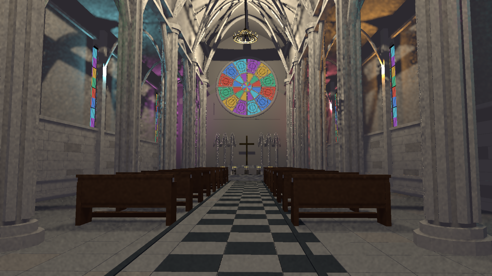
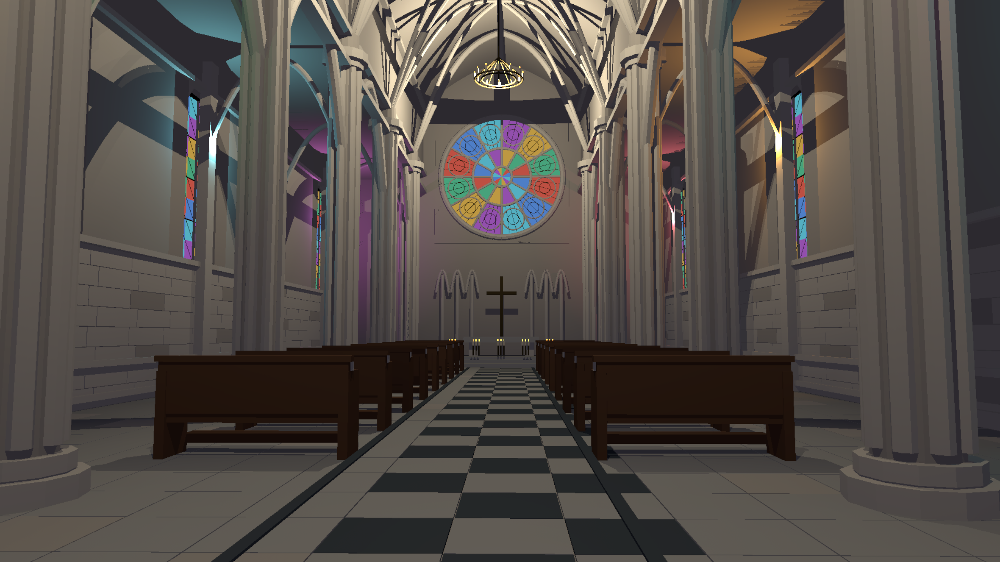
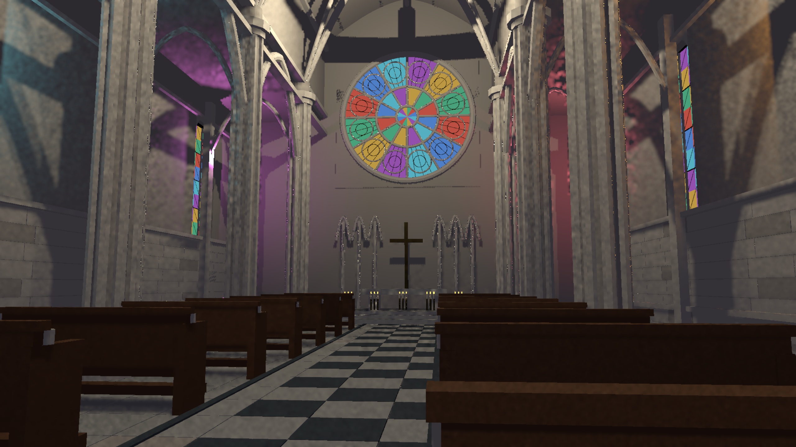
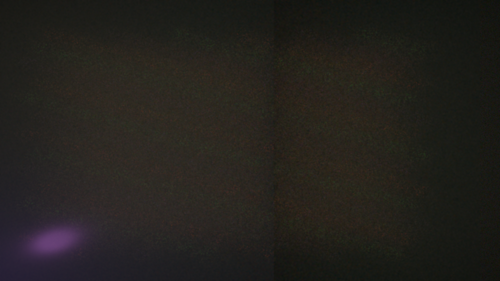

# RT review validation - 2026-09-19

The reconstructed 1440p primary workload passes the frozen <=4 ms median / <=5 ms p95 GPU gates in three 600-frame runs. All 746 final-image comparisons pass the unchanged <8% mean-energy error / <20% luminance NRMSE gates. This is an experimental direct-lighting tier, not a general 4 ms whole-frame guarantee.

## Reproducibility

RTX 3060 12 GB, NVIDIA 616.64, Vulkan. Run `./reproduce.ps1 -Mode Regression`, `-Mode Quality`, `-Mode Timing`, or `-Mode Capture` from PowerShell in this checkout. Keep other GPU workloads stopped. The script builds and locates its executable; it does not depend on a local profiler checkout or files under `target/` from the author's machine. The profiler dependency is pinned to published Pulsar-Native revision `45cda191beb316fee0859ae40d59f0dff986a66a`.

`results.json` summarizes the adjacent raw CSVs. Timing runs use 120 warmup and 600 measured frames. Each row sums all six HLFS GPU stages (including proposal construction, denoising and reconstruction) plus the per-frame TLAS build. Initial BLAS construction/upload, CPU SceneDB scanning/content hashing, G-buffer, transparency, post-processing and other frame work are excluded.

## Current GPU results

Every timing fixture has 1,024 moving lights and 10,000 moving instances. Each instance references the same 100-triangle mesh: **1,000,000 instanced triangles, 100 unique triangles**. This is a synthetic traversal workload, not one million unique triangles or an end-to-end SceneDB CPU benchmark.

| Workload | Median ms | p95 ms | p99 ms |
|---|---:|---:|---:|
| Reconstructed 1440p, run 1 | 3.906 | 4.583 | 4.828 |
| Reconstructed 1440p, run 2 | 3.920 | 4.595 | 4.793 |
| Reconstructed 1440p, run 3 | 3.901 | 4.523 | 4.733 |
| Native 1440p | 11.023 | 12.156 | 23.361 |
| Reconstructed 4K stress | 8.233 | 8.963 | 9.243 |
| Reconstructed 1440p, fully glossy + dominant light | 9.447 | 10.676 | 30.999 |

Reconstructed output uses half-width/half-height shading (1280x720 for 2560x1440 output). The primary plane has roughness 0.6. The glossy stress uses roughness 0.1 and metallic 0.9. Native, 4K, and fully glossy stress do **not** meet the 4 ms primary target. The glossy/native tail spikes are retained in the data, not discarded.

The current preset uses two shadow samples with two candidates each on ordinary surfaces, 256 weighted proposals per coarse tile, and weighted reconstruction. Glossy surfaces use four samples with sixteen independent candidates to avoid coherent errors from sharing a proposal pool across a narrow highlight. A globally dominant emitter is evaluated separately at full resolution, adding one visibility query per covered output pixel. These costs are included in the glossy stress row. Thin-surface repair may add full-resolution work.

## Quality and correctness

The 746 final-output checks comprise 181 rough-surface, 350 moving-glossy, 171 dominant-emitter replacement, and 44 full-resolution 1440p moving-glossy comparisons with ambient disabled. Masks cover the whole image, changed illumination, and bright glossy regions. The tests include cold history, camera/light motion, blocker insertion/removal and a change in dominant-light identity. Seeds 101/131/173/211 and 307/401/503/601 are now regression seeds, not untouched holdouts. The full-resolution check uses seed 701. Unfiltered output still has failures; the accepted output includes denoising and reconstruction.

30 targeted checks passed: 8 RT GPU regressions, 14 screen-space GPU regressions, 4 core acceleration regressions, 2 shader/configuration tests, and 2 GPU object-batch tests. Logs are adjacent. New regressions verify that sparse zero-power light slots do not consume the shading budget and that materials sharing a shader class still split into the correct opaque/transparent/forward ranges.

The `baseline-*` artifacts retain the earlier **failed** one-sample/eight-candidate implementation (73/175 glossy final-image failures). They are not the current preset's results and are not evidence of an equivalent-output speedup.

## Detailed cathedral and glass

The example now contains 251,076 procedural triangles in 14 material batches: clustered columns, ribbed vaults, staggered masonry, stone paving, oak pews, bronze chandeliers/candles and leaded windows. The interactive example supports `HLFS_RT=1` and `HLFS_PRESAMPLED=1`, flushes SceneDB updates, and publishes its TLAS each frame. The default remains screen-space lighting.

The existing transparent pass now reads material colour, opacity, roughness and metallic values, and blends into HLFS's linear HDR target before tonemapping. Transparent ranges no longer inherit the shading category of an unrelated opaque material sharing the same shader class. The glass uses alpha blending; **refraction and coloured RT transmission are not implemented**. Panes are deliberately excluded from the binary opaque caster projection. Coloured window fill lights are authored lighting, not simulated caustics.

Matched 1440p sampled/reference images were inspected at frames 31, 63 and 99, with 4K validation at frame 31. Display-RGB NRMSE is 10.59%, 10.32%, 8.41%, and 8.71%, respectively. These post-tonemapping diagnostics supplement, rather than replace, the linear-light quality gates. Residual noise and edge aliasing remain visible in the sampled images. Frame 0 is black while batch metadata initializes; it is a warmup frame with no valid comparison denominator.

Glass alpha 0 / 0.65 / 1 controls changed 80,071 pixels; all tested intermediate pixels lie between the endpoint colours (two-code-value tolerance). The 100-frame 1440p capture reports 21.448 ms median / 25.811 ms p95 serialized CPU+GPU latency, excluding image readback. That includes CPU acceleration preparation and is not a GPU pass timing or an interactive frame-rate measurement.

## Supported scope

The SceneDB projection supports opaque indexed world-space static-object meshes, including transform motion, edits and removal. CPU scanning/content hashing remains a cost. Masked/custom/transparent RT casters, virtual geometry, voxels, foliage, other coordinate spaces and stereo require explicit additional support. No claim of production-wide visual correctness, refraction, caustics, native-1440p 4 ms performance or whole-frame 4 ms performance is made here. `docs/` remains removed as requested; reproducible test evidence lives beside the GPU tests.
