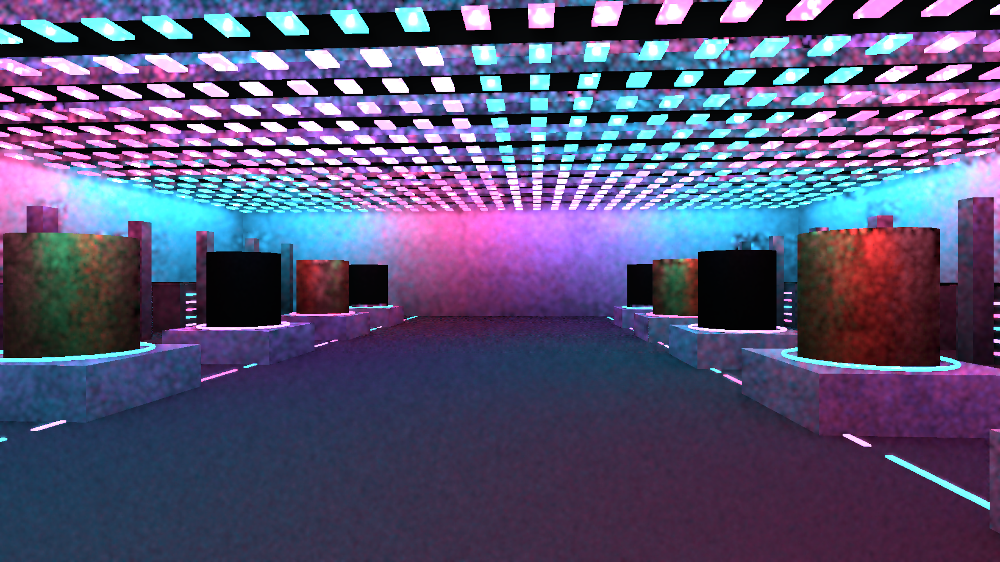
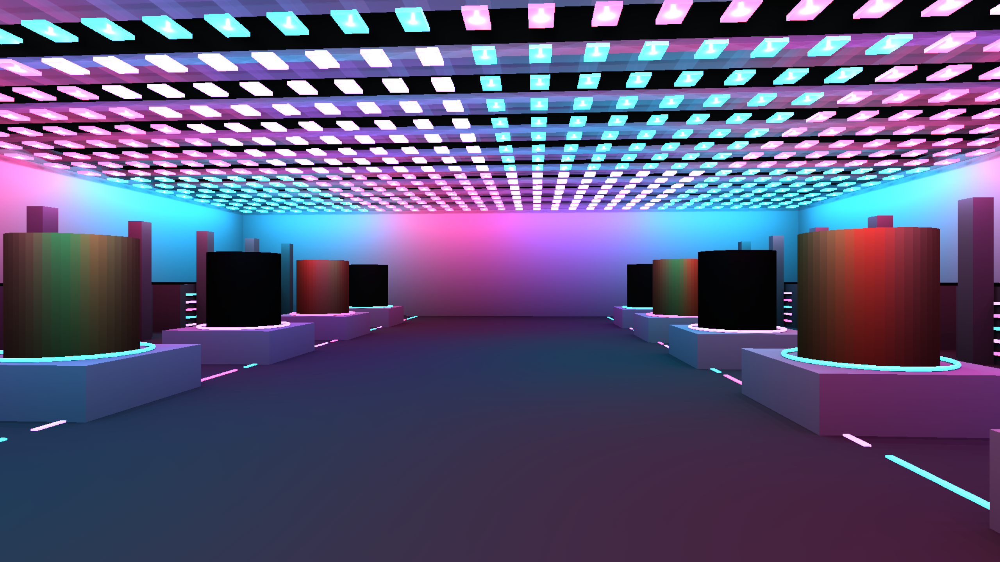
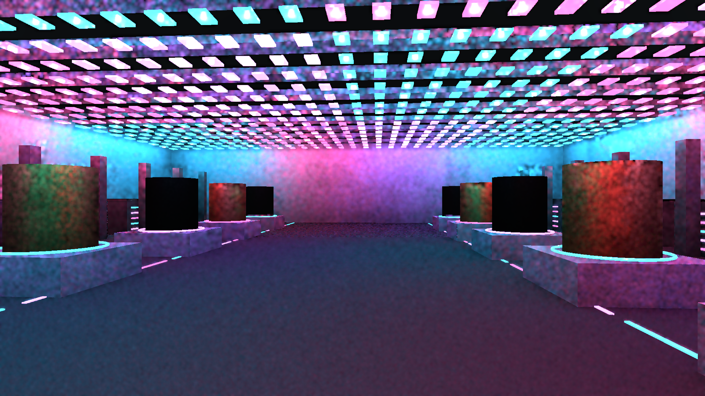
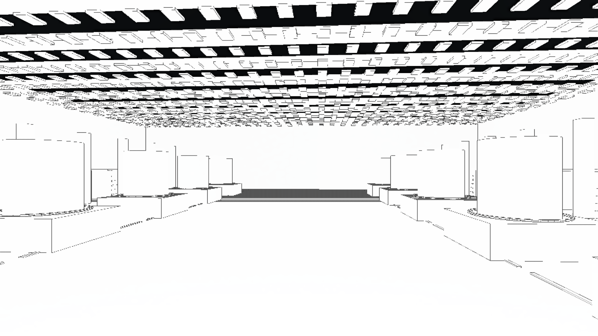
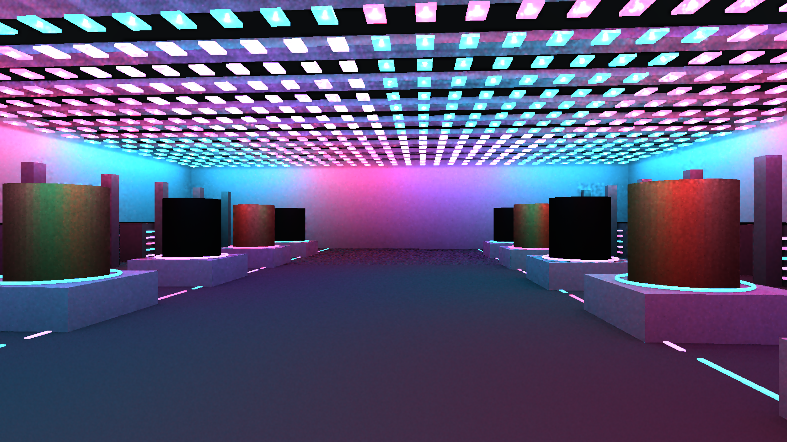
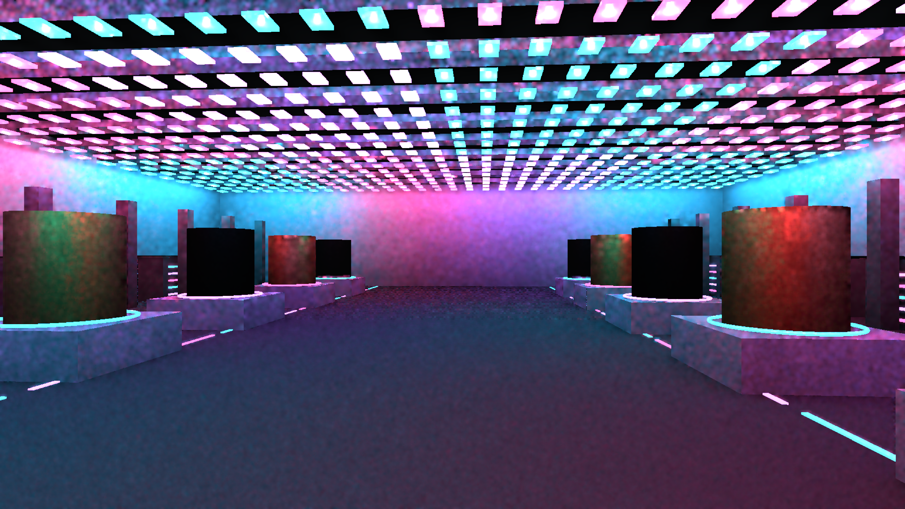
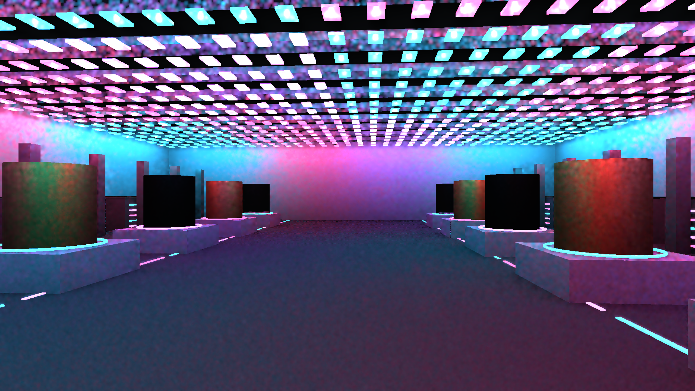
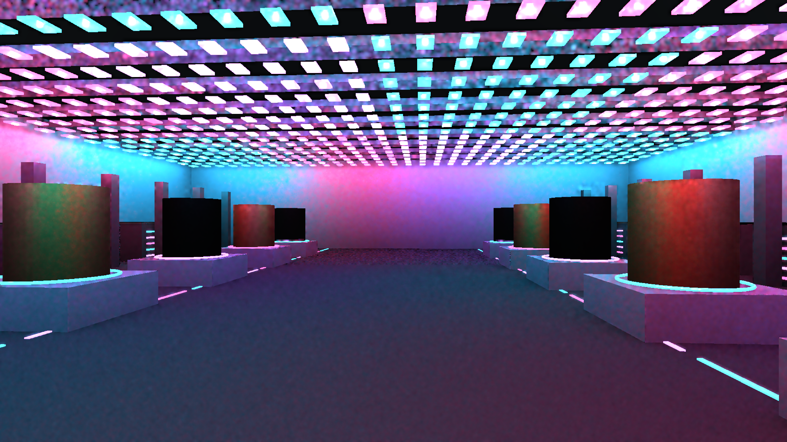

> Resolution correction (2026-09-20): architectural scene captures made by the shared harness without native TSR used renderer scale 0.75. A 1440p output was internally 1920x1080; 4K output was internally 2880x1620. References used that same internal size with full HLFS shading. Native-resolution wording for those captures is superseded; standalone GPU fixtures are unaffected. See the HLFS validation report `resolution-audit-20260920/README.md` for corrected, matched measurements.

# Technology gallery: rejected visual baseline

This new workload contains 1,024 independently shadowed local lights in a 48 x 68 m hall, with matching emissive fixtures, metallic display cylinders of differing roughness, structural bays and colored accents. The point sources sit below the opaque fixtures; the initial inside-fixture placement was corrected after a black lighting capture. Geometry is batched into eight materials. This is a diagnostic development scene, not a completed reflection showcase.

1440p, RTX 3060 / Vulkan, presampled RT, FXAA, 100 moving-camera frames, 16 warmup and 84 measured. Single runs. HLFS-only timing excludes TLAS, fog, other passes and CPU.

| Path | HLFS median ms | P95 ms | Display RGB NRMSE frames 31 / 63 / 99 |
| --- | ---: | ---: | --- |
| Presampled | 3.174 | 4.024 | 13.87 / 13.54 / 13.03% |
| All-light reference | 116.021 | 119.334 | reference |

**Visual gate fails:** severe colored sampling variance on walls and metal. Reference renders smooth direct-light gradients. The performance figure does not make the noisy result acceptable. Metrics use post-tonemap RGB, not linear energy. At this baseline the HLFS graph lacked reflection tracing/composition; black polished cylinders are not a verified reflection result. No realistic texture assets are present. The next work is variance control and reflection integration, followed by motion/disocclusion and 4K validation.

Build: `cargo build --release -p examples --bin technology_gallery_hlfs`.
Capture: set `HLFS_RT=1`, `HLFS_PRESAMPLED=1`, `HLFS_RESOLUTION=1440p`, `HLFS_FXAA=1`, `HLFS_CAPTURE_TIMINGS=1`, then run `target/release/technology_gallery_hlfs.exe --capture target/technology`. Add `HLFS_REFERENCE=1` for the all-light reference. Both 100-frame captures complete; release build passes. No interactive-viewer acceptance yet.

## Variance experiments

Added `HLFS_CANDIDATE_COUNT` to the capture harness to vary candidate scoring independently of shadow rays. The default remains unchanged. Same scene, camera, reference and capture protocol as above:

| Experiment | HLFS median ms | P95 ms | Display RGB NRMSE 31 / 63 / 99 |
| --- | ---: | ---: | --- |
| 2 rays, 8 candidates | 3.652 | 4.352 | 11.53 / 11.45 / 11.04% |
| 2 rays, 16 candidates | 4.028 | 4.631 | 11.35 / 11.16 / 10.69% |
| 4 rays, 8 candidates | 4.533 | 5.022 | 10.04 / 9.79 / 9.34% |
| Wider temporal bounds, 2 rays / 2 candidates | 3.175 | 3.770 | 14.65 / 14.49 / 13.54% |

The wider-history experiment removed the fixed 5% luminance bound and used sample standard deviation instead of standard error for clipping. It worsened error and was reverted. Increasing candidates helps modestly, but four rays exceed the budget while retaining obvious mottling. None passes the visual gate, and no production defaults changed. This rules out solving the current scene through these simple parameter increases alone; sampling/reuse needs further work.

## Stationary-camera control

`HLFS_FIXED_CAMERA=1` holds the final camera pose from frame zero, and the capture harness now also saves its final frame for runs longer than 100 frames. A 400-frame default two-ray run remains at display-RGB NRMSE 13.05 / 12.97 / 12.99 / 12.91% at frames 31 / 63 / 99 / 399 against the prior final-pose reference. Camera motion alone therefore does not explain the variance floor. Fog temporal history is not identical between the moving and fixed reference paths, so these are diagnostic image differences, not a strict isolated lighting-energy test.

A temporary composite visualization displayed stored history age divided by the configured maximum while leaving temporal processing in normal mode. Broad surfaces reached the configured age; low-age pixels clustered around edges. The diagnostic shader was removed and the normal binary rebuilt. This rules against a wholesale history reset as the main cause; it does not prove every reprojection or lighting-change case correct.

## History clipping isolation and rejected variance bounds

A diagnostic replaced only `history_color` in `filtered_history` with `max(history.rgb, vec3<f32>(0.0))`, retaining the existing age/blend and geometry rejection. With the stationary camera it reduced frame-399 RGB NRMSE from 12.91% to 6.01%. This implicates clipping/reset behavior as a substantial contributor to mottling; it does not prove the sampler unbiased or justify disabling rejection in production.

A second experiment replaced the fixed 5% luminance cap with a conservative scalar floor for all YCoCg bounds: `3 * sqrt(max(history_second_moment - history_luminance^2, 0) / max(age, 1))`. The exact rejected patch is preserved alongside these results. Both changes were reverted.

| Diagnostic | Final display RGB NRMSE | HLFS median / p95 ms | Outcome |
| --- | ---: | ---: | --- |
| Unclipped, stationary 400 frames | 6.01% | 3.095 / 3.860 | Diagnostic only; rejection disabled |
| Variance bounds, stationary 400 frames | 6.22% | 3.112 / 5.547 | Rejected; visible noise remains |
| Variance bounds, moving 100 frames | 9.32% | 3.176 / 3.760 | Rejected; lighting-change regression |

Single RTX 3060 runs at 1440p with FXAA, two rays/two candidates, 16 warmup frames. HLFS-only excludes TLAS and other passes. Stationary comparisons retain the earlier moving-reference fog-history limitation. The static p95 spike is retained, not discarded as an outlier. Full numbers are in `history-experiments.json`; CSVs preserve timings and all quality rows.

The 14 hardware-RT regression tests passed with variance bounds. However, the existing four-seed quality frontier (seeds 11/29/47/71, setting 2:2, presampling, reactive history, discovery=1) failed **45 of 90 final-output rows**, primarily after blockers appeared/disappeared. Restoring the original shader passed all 90 rows with the same settings. This is a measured regression, not an accepted noise/performance tradeoff. Reproduce with `cargo test --release -p helio-pass-hlfs --test gpu_hlfs_rt benchmark_rt_quality_frontier -- --ignored --test-threads=1`, setting `HLFS_RT_QUALITY_OUTPUT`, `HLFS_RT_QUALITY_SETTING=2:2`, `HLFS_RT_QUALITY_PRESAMPLE=1`, `HLFS_RT_QUALITY_REACTIVE=1`, and `HLFS_RT_QUALITY_DISCOVERY=1`.

Next: distinguish a spatially coherent lighting change from stochastic single-pixel disagreement before clipping temporal history. Test both stationary variance and the unchanged blocker-motion gate; a smoother still image alone is insufficient. No production defaults changed and the visual gate remains failed.

## Neighborhood rejection and visible-ID reuse experiments

Three further variants were rejected and all engine changes reverted. The first compared a geometry-validated, reprojected 5x5 history mean with the current 5x5 mean, preserving each history pixel's deviation from its old mean. It retained the original 5% luminance cap. This passed 90/90 motion-quality rows but did not reduce image error. Removing that cap while retaining the original standard-error bounds failed 13/90 motion rows, so no full-size capture was pursued for that variant.

The third enabled the existing sorted visible-ID tile guide in the presampled path, with separate key-light/change fields and a current-key exclusion to avoid double counting on key transitions. It still traced current-frame visibility and did not reuse stale shadow results. The initial motion test passed 90/90 rows; the final current-key exclusion was build/capture validated but did not receive a separate motion-suite run because the full scene already rejected this approach on quality/cost. Exact experimental patches are included for reproducibility; none is active renderer code.

| Variant | Moving frame-99 RGB NRMSE | Moving HLFS median / p95 ms | Static frame-399 RGB NRMSE |
| --- | ---: | ---: | ---: |
| Original baseline | 13.03% | 3.174 / 4.024 | 12.91% |
| Neighborhood means, 5% cap retained | 13.09% | 3.399 / 4.045 | 13.07% |
| Presampled visible-ID guide | 10.37% | 4.461 / 4.991 | 10.45% |

Same 1440p, two-ray/two-candidate, FXAA capture settings and earlier reference images. Single runs, 16 warmup frames, 84 moving or 384 stationary measured frames; the existing stationary-reference fog-history caveat still applies. `neighborhood-guide-experiments.json` and adjacent CSVs retain measurements. The guide costs more than the earlier eight-candidate experiment while retaining conspicuous mottling, so it does not satisfy either the requested visual outcome or budget. Normal renderer source and the example binary were restored after the experiments.

These results motivate compact weighted reservoir reuse rather than retaining and rescoring a sorted tile list. Any future reuse must handle support changes, removed lights, key transitions and disocclusion, retain fresh visibility, and pass both motion and stationary controls. This is the next implementation direction, not a claim that reservoir reuse has already been implemented or validated.

## Opt-in weighted temporal RIS implementation

Unlike the rejected visible-ID list, `HlfsConfig::temporal_resampling` retains compact weighted reservoirs: a selected light ID, effective count, inverse-PDF weight, and a two-word light-data/key fingerprint. Reprojection checks geometry. History contributes at most seven effective estimates to one new estimate. Visibility is always traced in the current frame, including colored thin sheets. The option is disabled in every preset and requires presampled RT at half resolution.

A new test found an 87.58% first-frame energy loss when 128 active lights were replaced by 128 different IDs in an unchanged 1,024-slot buffer. The small prior motion test had not covered this. A global fingerprint of the supported light data now rejects these stale proposals; the same reassignment test passes. This is conservative: moving or editing lights resets reservoir reuse globally, so current measurements do not demonstrate a reuse advantage with continuously animated lights. Moving occluders do not require this reset because visibility is freshly queried.

Final code, RTX 3060/Vulkan, 1440p, FXAA, two base rays/two discovery candidates. Three repeated 100-frame camera paths, 16 warmup frames. The 400-frame static run retains the earlier moving-reference/fog-history comparison limitation. NRMSE is display RGB against the all-light reference, not linear radiometric error. Values below are HLFS-only and exclude TLAS and every other pass.

| Configuration | Median ms | P95 ms | Final RGB NRMSE |
| --- | ---: | ---: | ---: |
| Same-build control, reuse off | 3.221 | 3.604 | 13.19% |
| Reuse on, moving run 1 | 3.428 | 3.828 | 11.69% |
| Reuse on, moving run 2 | 3.458 | 3.928 | 11.68% |
| Reuse on, moving run 3 | 3.423 | 4.037 | 11.90% |
| Reuse on, stationary frame 399 | 3.357 | 4.154 | 9.80% |

The nearby-reservoir experiment was not retained: moving frame-99 error was 11.49% at 3.606 ms median versus 11.57% at 3.391 ms for the earlier temporal-only variant, and stationary error worsened to 10.40% from 9.83%. The final implementation remains temporal-only. The final scene was inspected: colored mottling, edge aliasing, and the previously documented missing reflection integration remain. **The visual gate still fails**, and neither all-run sub-4-ms p95 nor the full target workload has been established. The option is retained as a measured development path, not a promoted quality preset.

Validation: 15 hardware-RT tests pass, including same-capacity light reassignment and a colored-transmission test extended to temporal reuse; 14 screen-space GPU tests pass. The final four-seed glossy camera-motion/key-switch test passes 171/171 final-output quality rows (review seeds 307/401/503/601). The existing quality thresholds were unchanged. Earlier temporal-only and nearby-reuse variants each passed the initial 90-row fixture. Captures and CSVs here retain the failures and limitations rather than defining success around the small fixture.

Reproduce the example using the earlier capture command plus `HLFS_TEMPORAL_RIS=1`. For the final quality fixture, add `HLFS_RT_QUALITY_TEMPORAL_RIS=1`, `HLFS_RT_QUALITY_GLOSSY_MOTION=1`, `HLFS_RT_QUALITY_REVIEW_SEEDS=1`, and `HLFS_RT_QUALITY_SWITCH_KEY=1` to the documented 2:2 presampled/reactive command. Defaults remain unchanged. The new history textures cost 56.25 MiB at 1440p/two base samples and 126.56 MiB at 4K/two base samples; final 4K rendering/performance has not yet been validated.

## Reflection integration follow-up

The optional reflection path is now connected to both HLFS graphs. See the [reflection validation report](../../../../helio-pass-ssr/tests/validation/hlfs-20260920/README.md) for reference/sampled captures, GPU composition tests, 1440p/4K measurements and remaining screen-space limitations. The original screenshots above predate this integration and remain useful lighting-only controls. The visual acceptance gate remains failed.
