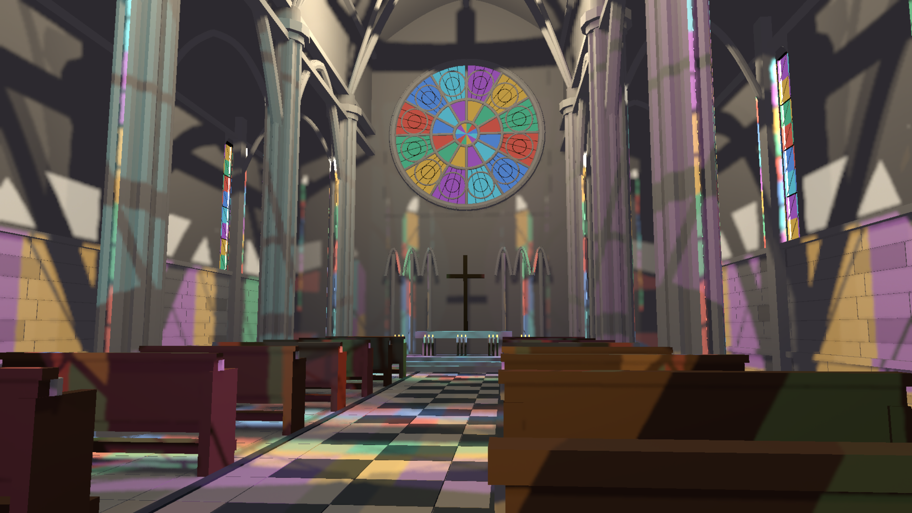
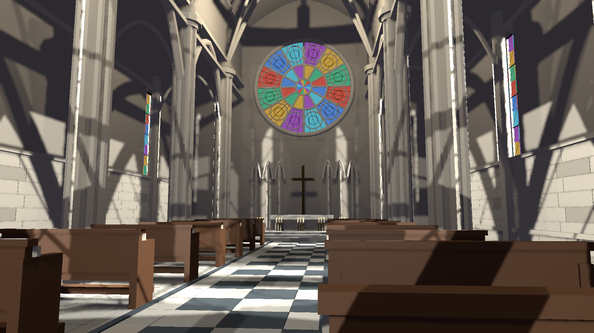
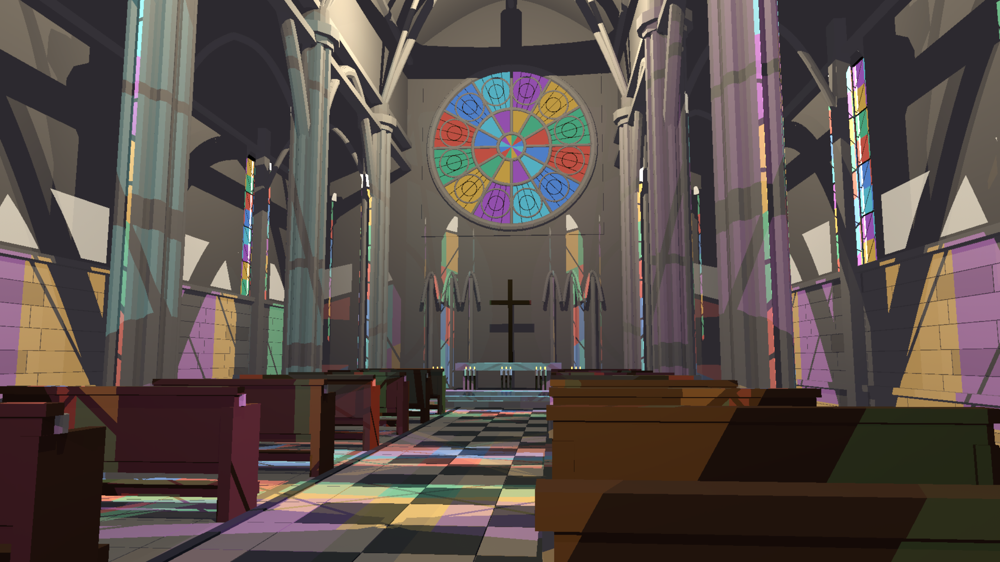

> Resolution correction (2026-09-20): architectural scene captures made by the shared harness without native TSR used renderer scale 0.75. A 1440p output was internally 1920x1080; 4K output was internally 2880x1620. References used that same internal size with full HLFS shading. Native-resolution wording for those captures is superseded; standalone GPU fixtures are unaffected. See the HLFS validation report `resolution-audit-20260920/README.md` for corrected, matched measurements.

# Thin-sheet RGB RT transmission checkpoint

PR #248 remains draft. This establishes transmission correctness, not final visual or performance acceptance.

SceneDB material entities can carry `RayTransmission([r,g,b])`: finite linear RGB in [0,1] for each triangle crossed. Display alpha is independent. Single-surface panes attenuate once; a closed mesh attenuates on both entry and exit. This models straight direct-light transmission, not refraction, thickness absorption, caustics, or colored volumetric scattering. Masked/custom-shader casters remain unsupported.

The frame-scoped transmission buffer follows TLAS instance ordering. Missing/stale TLAS data cannot publish transmission. Opaque publications clear previous rows. Opaque-only shaders retain scalar visibility; RGB shaders visit non-opaque candidates and multiply transmission. Opaque blockers terminate with zero throughput, independent of traversal order. Compact transmitting-light lists (up to 32 local lights) are evaluated exactly at the shading resolution; larger lists retain stochastic sampling. This quality tier can exceed the two-ray baseline cost.

The cathedral now uses white exterior window sources in RT mode. Raster-only mode keeps the older interior colored fills. `HLFS_CLEAR_GLASS=1` sets shadow transmission to white without changing geometry, lighting, or raster pane appearance. The control makes the source of the colored projections testable.

## Validation

- 13 hardware RT regressions pass on RTX 3060 / Vulkan, including clear/colored/stacked panes, opaque blockers in either instance order, dynamic material edits/removal, invalid transmission, stale-frame handling, and a 33-light RGB sampler/cache test.
- 14 screen-space GPU regressions pass; 2 CPU/WGSL validation tests pass.
- 5 core acceleration GPU tests passed for the frame-publication change.
- Example release build succeeds.
- Frame 31/63/99 display-RGB NRMSE against all-lights reference falls from 15.47/16.69/15.86% (rejected two-ray result) to 9.16/9.73/9.99%. Remaining reconstruction blur and raster edge aliasing are visible. This metric is post-tonemap and is not a linear-light energy measurement.

## GPU timing

Single runs, RTX 3060, 2560x1440 output. Primary synthetic workload uses 120 warmup and 600 measured frames; cathedral captures use 16 warmup and 84 measured frames. CSVs retain raw measurements. P95 for cathedral uses linear interpolation.

| Workload | Scope | Median ms | P95 ms |
| --- | --- | ---: | ---: |
| Opaque 1,024 lights / 10,000 moving instances | HLFS + TLAS | 3.872 | 4.461 |
| Colored cathedral, compact exact shading | HLFS only | 5.398 | 5.764 |
| Colored cathedral, full-resolution all-lights reference | HLFS only | 11.839 | 12.588 |

The 3-4 ms goal is still unmet for the colored cathedral. Do not compare HLFS-only cathedral numbers to full-frame latency or claim final acceptance. The initial generic RGB sampler cost ~0.27 ms on the opaque primary workload; separate scalar/RGB specializations removed that regression.

## Reproduction

Build with `cargo build --release -p examples --bin indoor_cathedral_hlfs`. Set `HLFS_RT=1`, `HLFS_PRESAMPLED=1`, `HLFS_RESOLUTION=1440p`, `HLFS_CAPTURE_FRAMES=100`, and `HLFS_CAPTURE_TIMINGS=1`, then run `target/release/indoor_cathedral_hlfs.exe --capture target/transmission-repro`. Add `HLFS_CLEAR_GLASS=1` for the clear control or `HLFS_REFERENCE=1` for the all-lights reference; unset both for the normal run. Run captures and timings in isolation after builds/tests finish.

RT regression: `cargo test --release -p helio-pass-hlfs --test gpu_hlfs_rt -- --ignored --skip benchmark --test-threads=1`.

Colored reconstruction:

Clear transmission control:

All-lights reference:

## Traversal optimization follow-up

The transmitting exact-light loops now reject zero incident energy without evaluating the whole BRDF twice, and prepare the precision-corrected ray origin once per receiver. SceneDB builds separate opaque/non-opaque BLAS variants when one mesh uses both kinds of material. Opacity is part of the BLAS cache key. The classified path allows hardware to terminate on opaque stone while the shader multiplies glass candidates. Generic caller-owned TLAS inputs can retain opacity override behavior.

The transmission buffer ABI now begins with four u32 words: flags, live row count, zero, zero, followed by the existing 16-byte RGB rows. Flag bit 0 asserts that BLAS opacity matches the rows; flags=0 requests generic opacity override. Buffer capacity and live row count both bound shader access. Frame ownership remains unchanged.

An intermediate shared traversal version regressed the opaque sampling stage (primary median 4.285 ms), so it was rejected. Dedicated opaque and transmitting traversal shaders preserve the scalar baseline. A branch intended to skip legacy depth reconstruction also failed to show improvement and was reverted.

Final colored-cathedral runs (HLFS only) measured **4.859 / 4.870 / 4.931 ms median**, with **5.551 / 5.520 / 5.623 ms p95**. All nine checked captures (frames 31/63/99 in each run) are pixel-identical to the prior 5.398 ms checkpoint. The adjacent optimized CSVs and JSON retain the evidence.

Final opaque-primary runs (HLFS + TLAS) measured **4.093 / 3.848 / 3.913 ms median**, with **4.578 / 4.280 / 4.661 ms p95**. This spread is not a strict all-runs-under-4-ms pass. The colored scene still misses the 3-4 ms target, and the prior reconstruction blur/aliasing is unchanged.

Validation: 13 RT regressions, 14 screen-space regressions, 6 core acceleration GPU regressions, and 2 CPU/WGSL checks pass. New checks cover changing BLAS opacity without changing geometry revision, plus simultaneous opaque/transmitting instances of the same SceneDB mesh and removal of the opaque variant. Final example release build succeeds. This remains an in-progress checkpoint; broader scene, texture, reflection, fog and review gates remain open.
