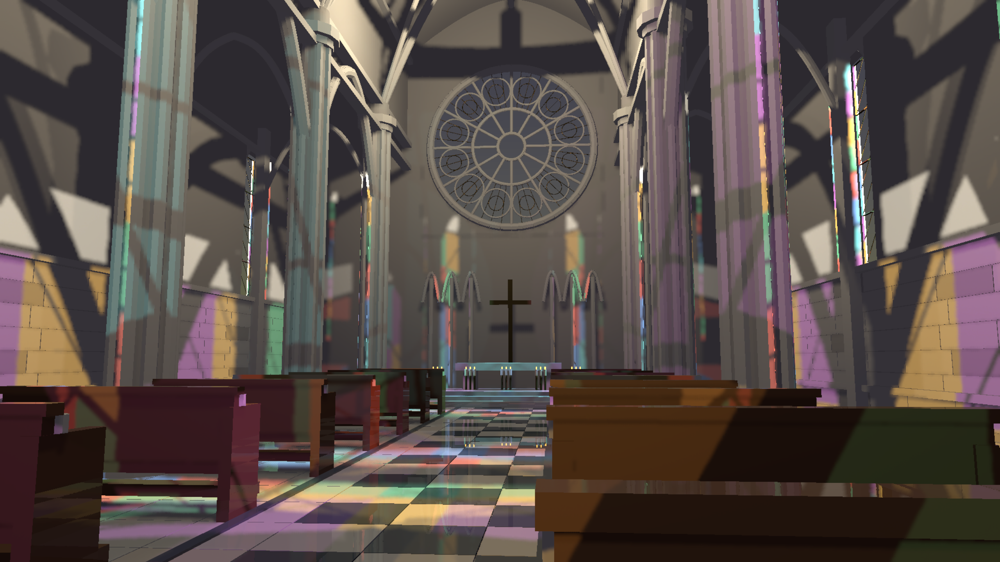
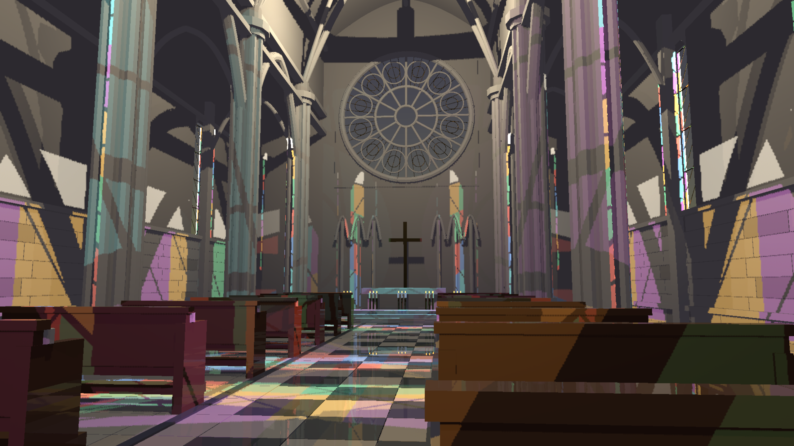
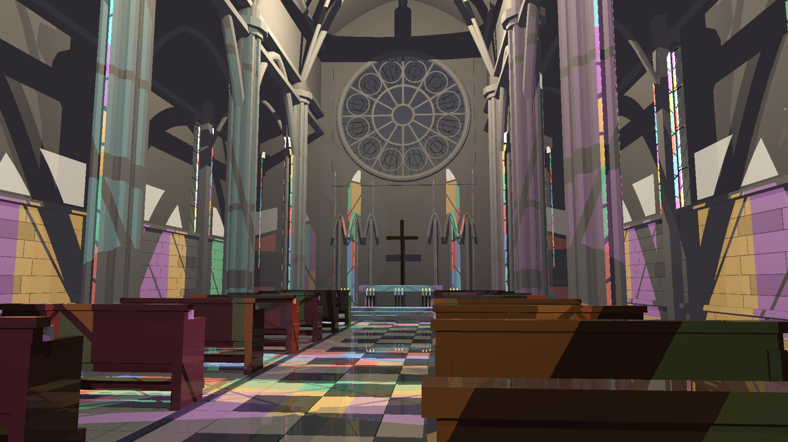

# Exact colored-light filtering correction

The sampler exhaustively evaluates transmitting local light sets with up to 32 entries, but the temporal filter recognized only the ordinary two/four-sample exact threshold. It consequently clipped and spatially blurred already exact colored visibility, leaking light across shadow boundaries. The current-frame transmission flag now reaches the temporal pass, which uses the sampler's exact-set rule. HLFS declares the transmission resource dependency so it is visible during preparation, not just rendering. Existing packed history age marks exact results and bypasses the spatial filter. Opaque scenes retain their previous behavior.

## Correctness

The new `exact_transmission_sets_bypass_noisy_history_filters` GPU test compares final and reference output for eight lights through a colored sheet, at full shading resolution and four frame indices. It fails with the old classification (including a dark pixel receiving light) and passes with the correction. Sixteen RT correctness tests and fourteen screen-space GPU tests pass. Benchmark entry points are excluded from those counts; the first indiscriminate suite invocation also failed two benchmark entry points because their required output environment variables were unset, not because they ran a quality experiment. The actual scene captures below provide timing evidence.

Commands: `cargo test --release -p helio-pass-hlfs --test gpu_hlfs_rt -- --include-ignored --skip benchmark_` and the same command with `--test gpu_hlfs`. Build `cargo build --release -p examples --bin indoor_cathedral_hlfs`.

## Visual and timing evidence

RTX 3060, native 1440p, FXAA, colored RT transmission, SSR enabled, two-ray presampled mode, temporal RIS off. Each capture uses 100 moving-camera frames and discards the first 16 for timing. The small exact light-set rule is unchanged in the sampler. All-light reference is a slow correctness control. Image error is display RGB NRMSE against that reference, not linear-radiance error or a whole-scene correctness proof.

| Frame | Previous filter RGB NRMSE | Corrected filter RGB NRMSE |
| --- | ---: | ---: |
| 31 | 9.057% | 5.526% |
| 63 | 9.795% | 5.973% |
| 99 | 10.114% | 5.907% |

| Run | HLFS-only median / p95 ms |
| --- | ---: |
| Corrected 1440p run 1 | 4.444 / 5.216 |
| Corrected 1440p run 2 | 4.479 / 5.122 |
| Corrected 1440p run 3 | 4.512 / 5.306 |
| Corrected 4K stress | 9.573 / 10.130 |
| 1440p all-light reference | 11.269 / 11.623 |

Three preceding baseline runs measured 4.828, 4.837 and 4.844 ms median. In the first corrected run temporal/spatial medians fell to 0.220/0.104 ms from about 0.406/0.294 ms in the earlier cathedral capture. These are separate GPU pass timings; HLFS-only excludes TLAS, SSR, fog, all other passes and CPU. Serialized CPU+GPU latency was 24.623/28.086 ms median/p95 for corrected 1440p run 1 and 36.886/45.426 ms for 4K, excluding capture readback. No whole-frame GPU or sustained 60 FPS claim.

The 1440p and 4K images were inspected. The fix removes inappropriate blur and improves agreement with the oracle, but sharp chromatic/opaque shadow edges show aliasing at the shading resolution. Faceted columns, incomplete reflections, missing textures and residual reference differences also remain. **The artifact-free and 3-4 ms gates are still unmet.** This is a correctness correction with a measured performance benefit, not acceptance of the complete renderer.

Reproduce captures using `HLFS_RT=1`, `HLFS_PRESAMPLED=1`, `HLFS_SSR=1`, `HLFS_RESOLUTION=1440p`, `HLFS_FXAA=1`, `HLFS_CAPTURE_TIMINGS=1`, then `target/release/indoor_cathedral_hlfs.exe --capture <directory>`. Add `HLFS_REFERENCE=1` for the oracle; use `HLFS_RESOLUTION=4k` for stress.

## Rejected key-light support check

An earlier experiment checked the key light's unshadowed support before issuing its full-resolution shadow ray. Twelve inspected frames (0/31/63/99 in each of three paired runs) were RGBA-identical. However, composite medians were 1.567/1.571/1.583 ms before versus 1.571/1.566/1.576 ms after, with no repeatable useful improvement. The experiment was reverted; its zero-context patch, CSVs and results are retained to avoid repeating it. It is not part of the engine change.

