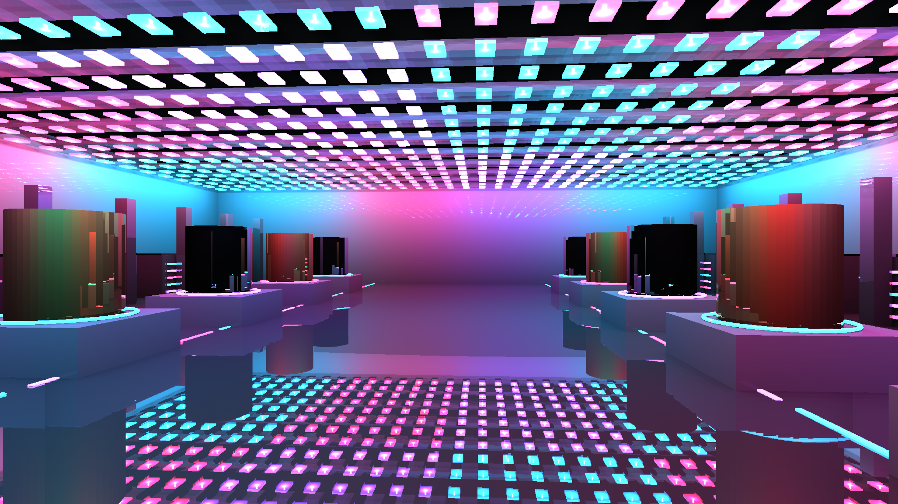
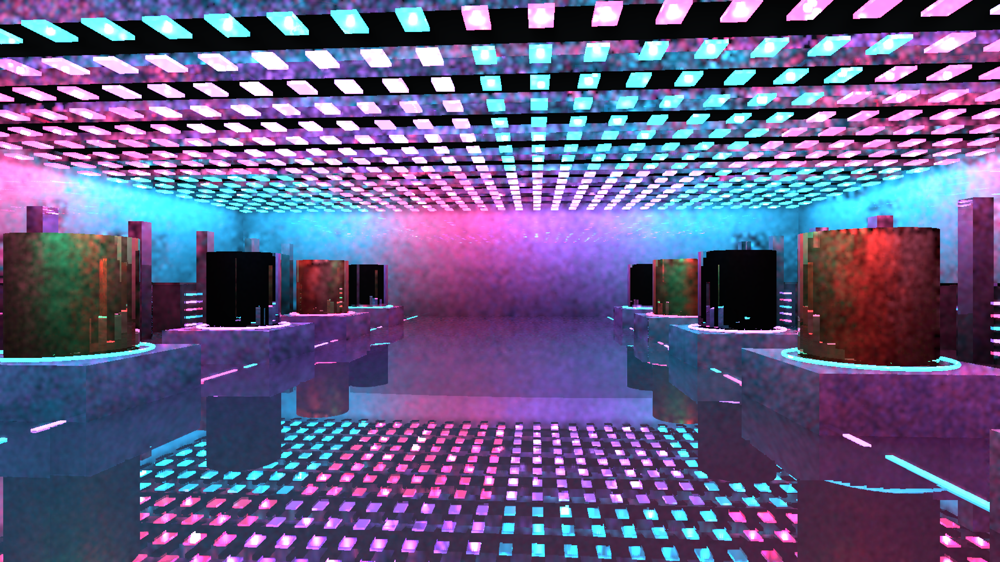

# HLFS reflection integration: development validation

The native and FXAA HLFS graphs now honor `RendererConfig::enable_ssr`. Tracing follows HLFS direct lighting, then a separate additive pass composes Fresnel/confidence/material-AO weighted radiance into linear HDR before fog and transparency. The compositor never samples its own render target. `HLFS_SSR=1` enables the path in the shared capture and interactive-viewer harnesses; it remains off by default.

SSR tracing now records on the main encoder after its raster/lighting producers, rather than the early compute encoder. Cache keys retain GPU texture/TLAS handles instead of wrapper addresses. The hybrid shader performs at most one hardware fallback query per low-confidence pixel and accepts projected hit color only when camera depth and surface orientation agree. This prevents treating an unrelated foreground pixel as the radiance of a hidden RT hit.

**Scope:** this is screen-radiance reflection with a hardware intersection fallback, not material/light evaluation at arbitrary off-screen ray hits. The reference capture visibly reflects ceiling lights and plinths in the floor, with partial metal reflections. Off-screen black areas, faceted cylinders, aliasing, rough-reflection filtering and sampled direct-light mottling remain unresolved. The 4K capture was inspected and still exhibits those limitations. No artifact-free or complete reflection-shading claim is made. Interactive input/resize and the older deferred graph have not received visual acceptance in this step.

## Validation

`cargo test --release -p helio-pass-ssr -- --include-ignored` passes all three tests: resolved raster/hybrid/composition WGSL validation, hardware-RT/composition pipeline creation, and a GPU pixel readback test. The latter checks the expected additive RGB result, Fresnel channels, zero-confidence rejection, material AO, background-depth rejection and preservation of destination alpha. It does not substitute for whole-scene reflection correctness.

`cargo build --release -p examples --bin technology_gallery_hlfs` passes. RTX 3060/Vulkan captures completed for 100 moving-camera frames at native 1440p and 4K, FXAA, presampled two-ray lighting, 16 warmup frames. Weighted temporal RIS was off. A separate all-light reference isolates reflection appearance from direct-light sampling variance. Frame 99 changes 1,335,730 pixels versus the earlier SSR-disabled reference; this is an effect-coverage diagnostic, not an accuracy score. Frame zero has no changed pixels while scene data initializes.

| Capture | HLFS-only median / p95 ms | Serialized CPU + GPU median / p95 ms |
| --- | ---: | ---: |
| 1440p sampled + reflections | 3.206 / 3.891 | 16.312 / 26.511 |
| 1440p all-light reference + reflections | 117.521 / 121.697 | 132.982 / 138.648 |
| 4K sampled + reflections | 7.026 / 7.629 | 27.005 / 30.919 |

Single runs. HLFS-only excludes SSR, composition, TLAS, fog, all other passes and CPU. Serialized latency excludes capture readback and is not a pipelined whole-frame GPU measurement. These figures neither isolate SSR cost nor establish the full 3-4 ms goal or sustained 60 FPS. Full data is retained in the CSVs and `results.json`.

Reproduce with `HLFS_RT=1`, `HLFS_PRESAMPLED=1`, `HLFS_SSR=1`, `HLFS_RESOLUTION=1440p`, `HLFS_FXAA=1`, `HLFS_CAPTURE_TIMINGS=1`, then `target/release/technology_gallery_hlfs.exe --capture target/technology-ssr`. Add `HLFS_REFERENCE=1` for the slow lighting reference; set `HLFS_RESOLUTION=4k` for stress. The supplied PNGs are the final 1440p reference and sampled frame 99. The PR remains a draft development branch.

