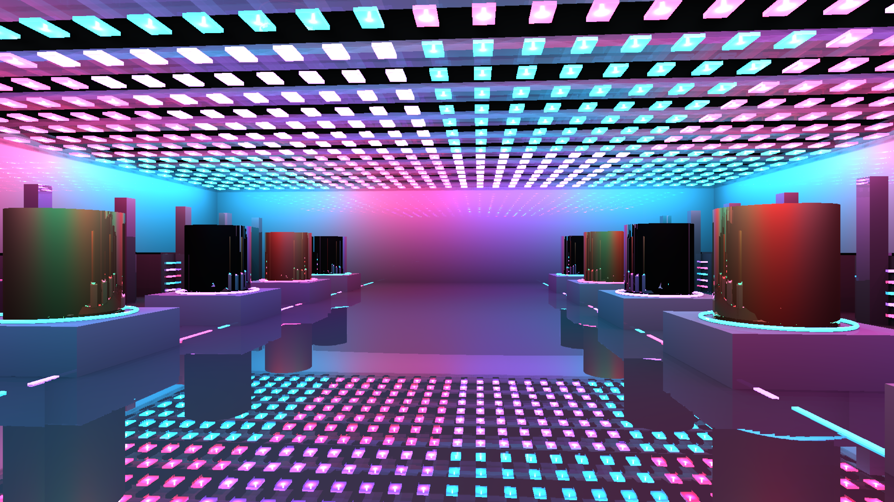
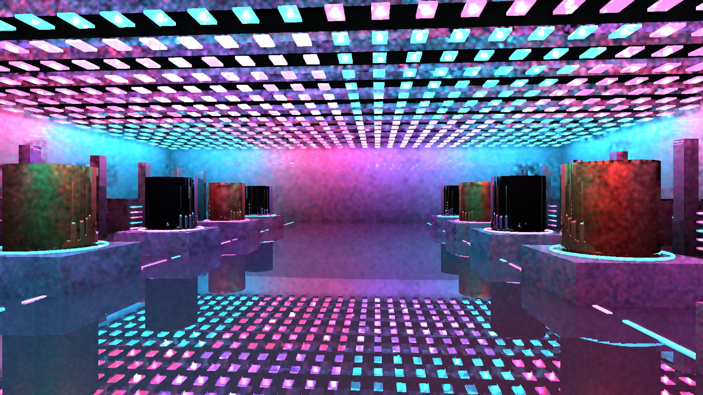

> Resolution correction (2026-09-20): architectural scene captures made by the shared harness without native TSR used renderer scale 0.75. A 1440p output was internally 1920x1080; 4K output was internally 2880x1620. References used that same internal size with full HLFS shading. Native-resolution wording for those captures is superseded; standalone GPU fixtures are unaffected. See the HLFS validation report `resolution-audit-20260920/README.md` for corrected, matched measurements.

# Reflection transmission and smooth specimen validation

Development evidence; the complete visual/performance acceptance gate is still failed.

The hybrid reflection path consumes the same frame-scoped `ray_transmission` buffer as HLFS direct lighting. With metadata, it finds the nearest opaque endpoint using material-aware candidate confirmation, then traces a bounded second segment to multiply RGB sheet transmission only before that endpoint. This avoids multiplying glass behind the reflected surface when hardware visits candidates out of order. Missing material rows are opaque. Without metadata, the original single opaque query remains. Bind-group cache identity includes the transmission buffer, including transitions to the zero-header fallback.

All screen-space reflection hits are hardware-checked in transmission scenes because the opaque G-buffer cannot establish whether a transparent pane lies along a reflection segment. A mismatching/hidden endpoint is rejected rather than retaining an unfiltered screen hit. This is straight thin-sheet attenuation, not refraction, thickness absorption, caustics or full material shading at offscreen hits. Two hardware queries per reflective pixel in transmission scenes is a correctness baseline, not an optimized final budget. A ray without an opaque endpoint currently returns no reflection; it does not shade a transmitted environment.

`cargo test --release -p helio-pass-ssr -- --include-ignored` passes four tests. The new hardware readback test executes the production query function with two stacked colored panes, clear panes, a nearer opaque blocker, no opaque endpoint, and removed metadata. It checks endpoint position and independent RGB throughput, reverses instance order, and covers classified and generic BLAS inputs (20 cases). An additional tinted sheet behind the endpoint must not affect the result. Existing shader, pipeline and composition checks also pass. This fixture proves segment filtering, not whole-scene reflection quality or refraction.

Technology-gallery cylinders now use shared radial side normals and 96 sides rather than flat 48-sided faces. The UV seam has identical positions/normals and separate U coordinates; caps retain separate flat normals and planar UVs. Captures show smoother reference gradients; sampled mottling and missing reflection regions persist. Other procedural architecture remains faceted and untextured.

## Captures and timing

RTX 3060, native 2560x1440, FXAA, SSR enabled, 100 moving-camera frames, first 16 discarded, temporal RIS disabled. CSV p95 uses linear interpolation. HLFS-only excludes reflections, TLAS and all other passes. Serialized latency includes CPU plus GPU synchronization, excludes capture readback, and is not pipelined whole-frame GPU time.

| Scene | HLFS-only median / p95 ms | Serialized CPU + GPU median / p95 ms |
| --- | ---: | ---: |
| Smooth technology, sampled | 3.205 / 3.864 | 16.375 / 18.503 |
| Smooth technology, slow all-light reference | 117.776 / 121.942 | 133.712 / 141.775 |
| Cathedral, sampled colored transmission + SSR | 4.806 / 6.462 | 25.900 / 32.090 |

Single runs. Technology captures were taken after geometry changes and before the transmission shader change; that scene has no transmission metadata. The cathedral capture uses the new transmission shader. It shows colored direct illumination and floor reflections but does not isolate glass reflection attenuation; the numerical GPU fixture provides that control. Cathedral edge aliasing, faceted columns and incomplete reflected regions remain visible. Neither scene establishes artifact-free output or the complete 3-4 ms goal. No 4K transmission stress result is claimed here.

Build with `cargo build --release -p examples --bin indoor_cathedral_hlfs --bin technology_gallery_hlfs`. Capture with `HLFS_RT=1`, `HLFS_PRESAMPLED=1`, `HLFS_SSR=1`, `HLFS_RESOLUTION=1440p`, `HLFS_FXAA=1`, `HLFS_CAPTURE_TIMINGS=1`, then the selected executable plus `--capture <directory>`. For the technology reference add `HLFS_REFERENCE=1`.

