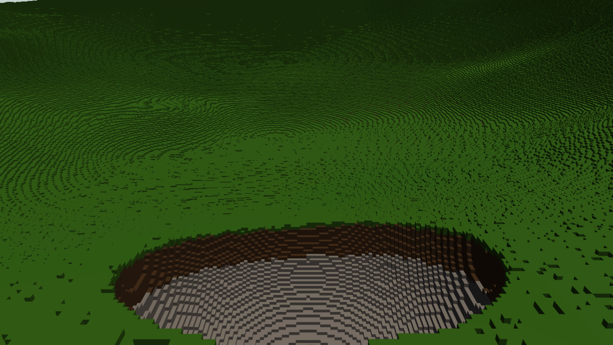

# Terrain integration validation — 25–26 September 2026

## Outcome

Engineering progress; **AAA visual quality and seamless exact-detail arrival do not pass**. This work repairs movement/residency and final image composition, implements configurable authored grids, and exercises the real engine graph. It does not establish that the distant sampled-density representation satisfies the exact voxel-derived terrain contract.

Visual direction: [Lay of the Land](https://store.steampowered.com/app/2776090/Lay_of_the_Land/). Its readable fine block detail, varied terrain silhouettes, material separation, vegetation and lighting remain a target. The captured procedural test planet is not a style match or a representative populated game scene.

## Changes

- Default 10 cm base grid, configurable through the generic terrain component from 0.1–1.0 m in 0.1 m increments. Grid size is authored, never automatically enlarged as a visual LOD. Planet dimensions and edit addresses do not scale with it. CPU queries, exact GPU generation, negative coordinates and storage-brick crossings share integer sample representatives.
- Keep a complete resident cut visible throughout walking, teleportation and orbital descent. `ready` means a complete cut exists; separate refinement/planning/pending state keeps an idle editor rendering until the new view completes. This does not promise immediate exact arrival detail.
- Preserve compatible pass-owned residency across same-device graph rebuilds. Old graph resource bindings are not inherited. Camera roll and zoom invalidate view selection.
- Retain view-independent classifications with edit-prefix, undo/replacement and grid-change invalidation. Use an integer-key hash for the classification cache; selection budgets and output remain unchanged.
- Budget generation by sample evaluations: a coarse brick costs 729 evaluations, an exact brick 32,768. A warm dispatch can contain up to 256 cheap jobs while retaining the previous 64-exact-brick sample budget.
- Connect temporal resolve to postprocessing, allocate the postprocessing intermediate on the first frame, and encode DOF after its graphics-produced input. A full-graph magenta sentinel verifies that the final result survives composition.
- Pulsar's backend validates its recipe independently of generic live-payload chunk metadata, clears invalid replacement recipes, retains immutable world snapshots, supplies planetary clipping planes, and commits exact remote brush edits through the SceneDB recipe/source revision.

## Reproduction and scope

Windows; AMD Ryzen 5 3400G (4 cores/8 threads), approximately 16 GB RAM, NVIDIA GeForce RTX 3060, Vulkan driver 616.64. Rust 1.98.1. Code revision: `03290f1b9f600224461df05e81dd700950e179e6`. Flight executable SHA-256: `6D6B93670A5A29464E280556AA98A785D111B136DCC90942172308E44848858A`. Later evidence/documentation commits do not change the tested source.

Use serial compilation on this machine: a parallel full-editor dependency build exhausted Windows commit memory. That failed build and the overlapping aborted flight are excluded from performance evidence. The final flights ran after both compilations completed, on the user's normal workstation rather than a dedicated benchmark host. Each configuration has one measured flight; do not interpret small differences as a controlled optimization result.

```powershell
cargo +1.98 test -j 1 -p helio-pass-tiny-voxel --features engine --release --lib -- --test-threads=1
cargo +1.98 test -j 1 -p helio-pass-tiny-voxel --features engine --release --lib selection_flight_benchmark -- --ignored --nocapture --test-threads=1
cargo +1.98 test -j 1 -p helio-default-graphs --release --test voxel_pass_graph
cargo +1.98 build -j 1 -p helio-default-graphs --release --example voxel_flight
target/release/examples/voxel_flight.exe target/voxel-flight/final-720p 1280 720 native
target/release/examples/voxel_flight.exe target/voxel-flight/final-1080p-quality 1920 1080 quality
```

The flight uses the actual deferred graph with SceneDB sunlight, sky, GBuffer/depth, temporal resolve, postprocessing and DOF, an `f64` eye and camera-local matrices. No foliage or other authored mesh objects are present, and the terrain's optional ray-traced sunlight is disabled. This is an offscreen engine capture, not a new interactive-editor validation.

Each timed frame waits for GPU completion. Times include CPU submission, graph work and GPU completion, exclude capture/PNG writes and presentation, and are not presented FPS or isolated GPU timings. The first resize frame includes graph reconstruction. The stationary samples follow residency settlement; walking/descent do not wait for refinement. The descent covers 300 km to ground in 240 logarithmically spaced positions. Small readbacks occur at the documented capture positions even in the unrecorded run.

For a separate frame-by-frame visual recording:

```powershell
$env:HELIO_VOXEL_FLIGHT_RECORD = '1'
target/release/examples/voxel_flight.exe target/voxel-flight/movement 640 360 native
Remove-Item Env:HELIO_VOXEL_FLIGHT_RECORD
```

Open `movement.html` in that output directory. Its 30 Hz playback is illustrative; capture overhead changes worker scheduling, so its timing data is not used for the performance table.

## Validation results

- Terrain suite: 25 passed, one ignored benchmark, then that benchmark passed separately. Tests include exact GPU materials after overlapping edits at five authored grid sizes, CPU grid checks at all ten sizes, planetary picking, journaling, cache invalidation and bounded generation batches. The far traversal test compares against a DDA of the **same interpolated field**; it is not an exact-leaf fidelity test.
- Full deferred-graph integration test: 1 passed.
- Temporal resolve: 5 tests passed. Postprocessing GPU exposure reduction: 1 explicitly selected test passed.
- Pulsar source/component/backend integration: 9 tests passed; distant-planet gizmo regression: 1 passed. Remote edits are checked from 2 km, 300 km and 1,000,000 km; those are CPU edit/query results, not GPU visibility guarantees at those distances.
- Selection cache hasher A/B: one seven-view sequence took 1.27 s before and 0.93 s after. The new run checked identical cold/cached leaf keys, node structure and pixel budget. This is a narrow CPU experiment, not an end-to-end speedup claim.

### Full-graph frame times

Milliseconds, median / p95, nearest-rank percentiles from `frames.csv`. Stationary rows use the final 60 settled frames. Walking uses all 120 frames; descent uses all 240, including refinement.

| Scenario | 1280×720 native | 1920×1080 Quality TSR |
| --- | ---: | ---: |
| Walking | 19.27 / 24.59 | 24.19 / 28.01 |
| 200 m, settled | 14.53 / 33.50 | 18.95 / 22.15 |
| 1 km, settled | 13.66 / 15.49 | 15.78 / 18.15 |
| 300 km orbit, settled | 17.44 / 20.05 | 20.65 / 24.35 |
| Continuous descent | 9.63 / 19.30 | 10.53 / 20.26 |

Quality TSR uses **75% internal dimensions**: 1440×810 before resize. Descent maximum frame times were 36.07 / 42.53 ms respectively. Almost the entire descent (239/240 frames in both runs) was still refining; lower frame times do not establish equivalent settled image detail.

| Delay | 720p native | 1080p Quality |
| --- | ---: | ---: |
| Ground settlement after descent | 2,310 ms | 2,381 ms |
| Graph resize frame | 391 ms | 289 ms |
| Further refinement after resize | 257 ms | 301 ms |
| Orbital edit settlement at inspection view | 179 ms | 227 ms |
| Authored grid change to 1 m | 2,915 ms | 3,756 ms |

The sample-based generation budget reduced observed refinement intervals compared with earlier runs in this task (for example, the earlier 720p return interval was 5.79 s). Those earlier runs overlapped compilation/tests and are **not a controlled before/after benchmark**.

### Movement and image audit

- 720p: 1,150 frames; 1080p Quality: 1,217 frames. The published-cut readiness assertion never failed after initial loading. Each run passed first-frame final-composition, GPU validation, resize-residency and orbital-edit assertions.
- 20 post-loading captures per measured flight: zero exhausted or loading pixels, with solid terrain present. This audits captured primary hits, not every pixel of every frame.
- Separate 640×360 recording: 1,008 frames, all 120 walking and 240 descent images retained locally, 367 post-loading capture audits with zero exhausted/loading hits. Browser playback, both stage choices and scrubbing to arrival were exercised without browser errors. Recording changes worker scheduling and is excluded from the timing table.
- Visual inspection confirms a local 10 cm crater after a brush ray from 300 km, and visible 1 m cells only after explicitly selecting a 1 m base grid. It also confirms strong bands/noise, coarse unresolved regions during descent, a visually plain orbital surface, and a substantial gap from the reference art direction. **These images are not accepted as AAA quality.**



Actual 10 cm terrain after a 4 m-radius excavation selected from orbit; output is 1344×756 after the resize stage. [Walking](validation/2026-09-25/final-720p/walk-060.png), [mid-descent](validation/2026-09-25/final-720p/descent-120.png), [orbit](validation/2026-09-25/final-720p/orbit.png), [explicit 1 m grid](validation/2026-09-25/final-720p/1m-base.png), and [Quality TSR excavation](validation/2026-09-25/final-1080p-quality/orbital-edit.png) show the remaining quality limitations.

Raw CSVs, logs, audit summaries and representative unmodified captures are in [validation/2026-09-25](validation/2026-09-25). Run `python summarize.py final-720p final-1080p-quality movement` there to reproduce the statistics. The full movement image sequence and `movement.html` are generated by the recording command instead of storing hundreds of frames in Git.

The successful Pulsar test output was observed before its local `target` directory became unavailable. [Preserved output excerpts](validation/2026-09-25/pulsar-test-transcript.txt) distinguish that transcript from retained raw Helio logs. The final source checkout remains intact; the editor executable itself was not rebuilt/launched as a validation gate for this revision.

## Remaining acceptance gates

1. **Far fidelity fails the required contract.** Far bricks reconstruct density from sparse samples rather than filtered exact edited leaves. Fine edits and thin features may disappear until refinement; contour-like bands and noisy distant surfaces remain visible. Antialiasing cannot restore absent geometry. Replace or rigorously qualify this representation before claiming full visual destruction at every distance.
2. **Arrival latency remains visible.** A previous complete cut now stays on screen, but a completed global replacement is still required for publication. Ground detail can lag rapid descent. Measure this separately from blank-frame prevention and use bounded incremental publication with valid coverage before raising the claim.
3. **Resize still rebuilds other graph resources.** Terrain residency survives, but shader/pipeline/resource work can cause a frame spike. This has not become a hitch-free editor.
4. **Memory and scene complexity are not qualified.** The brick pool permits up to 65,536 slots (512 MiB of brick payload), with additional graph/history/hit buffers and CPU data. No large populated level, multi-planet scene, sustained edit stress, foliage/water interaction, physics fracture or navigation benchmark is included.
5. **Generic integration remains intentionally limited.** This backend accepts one procedural planet recipe, rejects live raw chunk payloads, and does not implement a bounded `VoxelComponent` renderer. Other approaches can register against the shared source contract. Ordinary mesh/editor-tool large-coordinate precision remains separate from the voxel camera path.

Both integration PRs should remain drafts. No AAA completion or seamless-flight acceptance is implied by passing the engineering tests.
