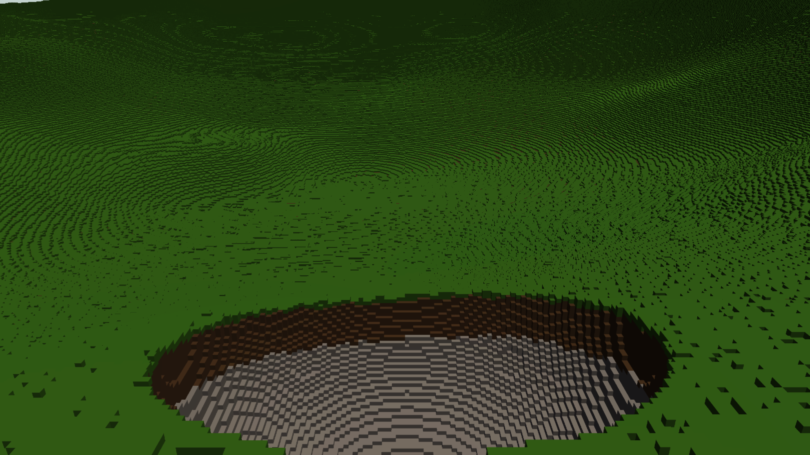

# Validation after upstream synchronization — 26 September 2026

The integrated renderer passes the checks below, but **does not meet the requested AAA visual quality, faithful distant destruction or seamless exact-detail arrival**. The larger generation-batch experiment was rejected because it worsened descent frame times. The retained implementation still uses a 256-job dispatch cap.

Retained Helio runtime: `fcfb4d850542696c3d8adc71f270d33bda6f7398`, including upstream main `1d4a5e9e`. Pulsar runtime: `89860371084b634e3ce7c93862948a241cb362e7`, including upstream main `c93f2f7da`; `0ef469994aa9d8d71f332df6b5396455241b3cb9` subsequently fixes two upstream test expectations without changing runtime code. Later documentation, evidence and submodule-pointer commits do not change this tested runtime.

The [preceding report](VALIDATION_2026_09_25.md) describes the implementation, exact-grid tests, CPU cache experiment and earlier measurements. Upstream changed graph profiling, light/shadow work and inactive fog dispatch, so the combined graph was measured again here.

## Scope and checks

Windows, Ryzen 5 3400G, 16 GiB RAM, RTX 3060 / Vulkan driver 616.64, Rust 1.98.1. The flight uses the actual offscreen deferred graph, SceneDB sunlight, temporal resolve, postprocessing and depth of field. It contains terrain and sky, no authored meshes or foliage; terrain ray-traced sunlight is disabled. Times include CPU submission and GPU completion, excluding image readback, encoding and presentation. Quality TSR uses 75% internal dimensions: 1440×810 for a 1920×1080 output.

- Retained terrain source, rerun after rejecting the experiment: **25 tests passed, 1 benchmark ignored**. The benchmark was separately run in the preceding report.
- Full deferred-graph integration: **1 passed**. Upstream light-culling and sparse-shadow GPU regressions: **1 passed each**.
- Fresh Windows Pulsar build: **9 voxel backend tests passed**, plus the distant-planet gizmo regression. The corrected filesystem feature-policy test also passed with default features disabled.
- Pulsar Linux CI at `0ef469994`: **1,717 tests passed, 3 skipped**; [CI job](https://github.com/Far-Beyond-Pulsar/Pulsar-Native/actions/runs/36265526403/job/108469339563). All three platform packaging smoke tests passed. The two corrected expectations enumerate current local-filesystem callers and the camera already saved in the cathedral fixture; neither alters production behavior.
- Retained 720p and 1080p flights: **1,161 and 1,220 frames**, 40 post-loading capture audits in total, zero exhausted/loading hits.
- Final separate 640×360 movement recording: **1,006 frames**, 367 post-loading capture audits, zero exhausted/loading hits. It records every one of the 120 walking and 240 descent frames. Browser play/pause, stage selection and scrubbing to arrival were verified without console errors.
- Every flight passed the first-frame magenta composition sentinel, per-frame GPU validation, complete-cut readiness, residency preservation on resize, remote edit and authored 1 m grid assertions.

These checks do not replace final interactive editor validation, physics/navigation integration, a populated-scene benchmark, or visual acceptance.

## Measurements with the separate GPU job paused

The user paused their GPU workload before this comparison. PID 7096 was absent, GPU-engine utilization was sampled before every flight, and no Cargo/rustc process was running. Normal desktop GPU activity remained; this is one sequential workstation run per variant/resolution, not a statistically controlled benchmark. Raw probes and run timestamps are retained.

| Retained renderer observation | 720p native | 1080p Quality |
| --- | ---: | ---: |
| Walking p50 / p95 | 22.05 / 31.57 ms | 26.85 / 36.26 ms |
| Descent p50 / p95 | 11.20 / 23.13 ms | 11.93 / 26.33 ms |
| Worst descent frame | 58.00 ms | 51.50 ms |
| Ground refinement after descent | 2.73 s | 2.65 s |
| Resize frame | 283 ms | 301 ms |
| Orbital edit settlement | 234 ms | 224 ms |
| Authored 1 m grid replacement | 3.31 s | 4.15 s |

Percentiles use the nearest-rank method. Walking and descent include all their frames. Keeping a complete old terrain cut visible avoids missing-data holes but does not mean the arrival is already fully refined. These are not presented FPS measurements.

## Rejected 1,024-job experiment

The candidate increased the maximum generation dispatch from 256 to 1,024 jobs while retaining the existing evaluation budget of 64 exact bricks when warm and 256 when cold, plus the 262,144 edit-reference limit. A coarse job evaluates 729 density samples instead of 32,768 exact samples, so the old dispatch cap leaves evaluation capacity unused.

The [protocol](validation/2026-09-26/batch-trial-protocol.md) was recorded before comparison. Retention required matching settled brick counts/pixel budgets, all correctness assertions, improved arrival at both resolutions, walking/descent p95 within 15% of control, and maximum frames within 2× control. No further parameter search was performed after rejection.

| Observation | 720p control → candidate | 1080p control → candidate |
| --- | ---: | ---: |
| Ground refinement | 2.733 → 0.768 s | 2.648 → 1.378 s |
| Walking p95 | 31.57 → 24.97 ms | 36.26 → 31.98 ms |
| Descent p95 | **23.13 → 45.35 ms** | **26.33 → 38.18 ms** |
| Worst descent frame | 58.00 → 69.50 ms | 51.50 → 64.25 ms |
| Resize frame | 283 → 277 ms | 301 → 612 ms |

The candidate passed 26 terrain tests (one benchmark ignored), all flight assertions and 40 capture audits, with identical final cuts at every compared settled stage. It still failed the descent p95 gate at both resolutions: **+96% and +45%**. Its code was reverted, with the exact [patch](validation/2026-09-26/batch-candidate.patch), binaries' hashes, raw data and [computed gate results](validation/2026-09-26/batch-trial-comparison.json) preserved.

This compares complete flights, not isolated generation kernels. Faster publication changes which terrain cut is visible during movement, even when settled cuts match. A sample-count budget alone does not establish a predictable frame-time budget. Future scheduling work must measure both visible refinement progress and GPU time instead of judging only settlement latency.

## Visual result

The retained renderer shows the authored 10 cm cubes and an orbital edit's local crater, but strong contour bands/noise and unresolved arrival regions remain. The candidate did not eliminate those defects. The result does not match the [Lay of the Land visual reference](https://store.steampowered.com/app/2776090/Lay_of_the_Land/).




Exact CPU editing at arbitrary ray distance does not prove faithful distant GPU visibility of small edits. The far representation still reconstructs independently sampled density instead of deriving coverage from exact edited leaves. No smooth terrain replacement or enlarged visual LOD was added. Increasing the authored base grid to 1 m intentionally changes the actual voxel size.

## Earlier contended runs

The `postsync-*` files preserve the earlier synchronized-branch flights while PID 7096 was using approximately 96–97% of the GPU. They are correctness evidence, **not current-head performance qualification or regression evidence**. Those flights completed 1,139 frames at 720p and 1,176 at 1080p, plus a 1,003-frame recording, with zero exhausted/loading hits across their 407 post-loading audits. Walking p95 was 58.04 / 69.90 ms and ground refinement 3.74 / 3.47 s.

That GPU process started at 15:34:16 local on 26 September, after the preceding report's 1080p flight and recording completed at 15:27:45 and 15:28:47. Its 720p flight completed on 25 September at 22:36:38. The earlier report remains attributable to its original revision.

## Reproduce and provenance

```powershell
cargo +1.98 test -j 1 -p helio-pass-tiny-voxel --features engine --release --lib -- --test-threads=1
cargo +1.98 build -j 1 -p helio-default-graphs --release --example voxel_flight
cargo +1.98 test -j 1 -p helio-default-graphs --release --test voxel_pass_graph
target/release/examples/voxel_flight.exe target/voxel-flight/current-720p 1280 720 native
target/release/examples/voxel_flight.exe target/voxel-flight/current-1080p-quality 1920 1080 quality
$env:HELIO_VOXEL_FLIGHT_RECORD = '1'
target/release/examples/voxel_flight.exe target/voxel-flight/current-movement 640 360 native
Remove-Item Env:HELIO_VOXEL_FLIGHT_RECORD
```

From Pulsar-Native, the fresh backend build used:

```powershell
$env:CARGO_PROFILE_DEV_DEBUG = '0'
$env:CARGO_INCREMENTAL = '0'
cargo +1.98 test -j 2 -p engine_backend --lib voxel --target-dir target/voxel-validation-20260926 -- --test-threads=1
cargo +1.98 test -j 2 -p engine_fs --no-default-features --test workspace_feature_policy --target-dir target/voxel-validation-20260926
```

Retained flight executable SHA-256: `51A4BD308D5725EEA426469E6715BFA72185E1BE77E01C4E3A47DF6568E87E0F`. Rejected candidate: `5FE396E3C1665CD3F940927F8B43DB03F9E747045DAB1A850F0C89CB5CA71AE5`. The candidate is reproducible from the runtime revision plus the retained patch; the trial runner expects both separately built executables in `target/voxel-flight` and `target/release/examples` as recorded in its arguments.

The [evidence directory](validation/2026-09-26) contains raw CSVs, aggregated capture audits, logs, unmodified representative images, comparison scripts and a checksummed manifest. `summarize.py` accepts the retained run directory names and recomputes their statistics. Full movement frames remain local in `target/voxel-flight/final-movement-idle`; open `movement.html` there. Its fixed 30 Hz playback is illustrative, not game FPS; readback changes scheduling, so its refinement timings are excluded from the performance comparison.

Both integration PRs remain drafts. The next architecture gate is exact-derived far coverage, faithful edit propagation and incremental refinement without unresolved arrival surfaces, followed by populated-scene performance and interactive editor validation.
