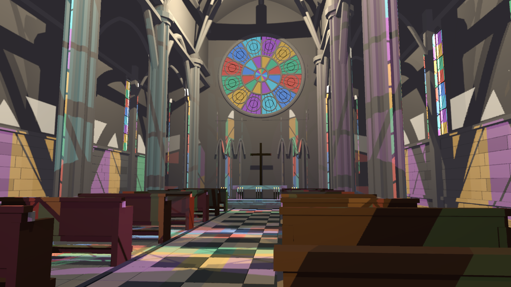
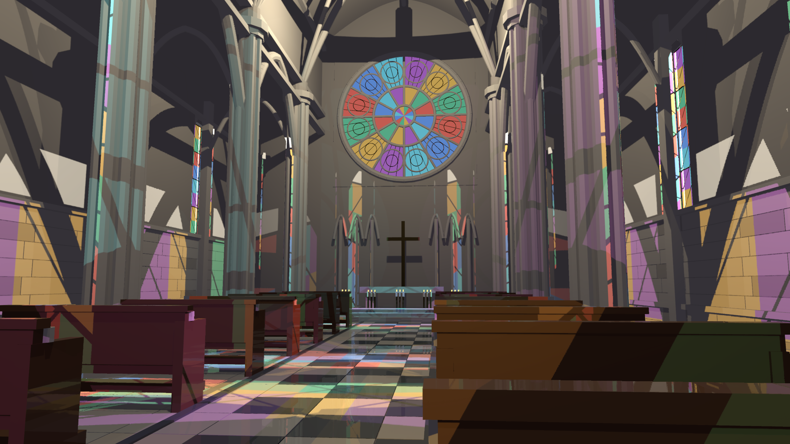

# TSR history-depth rejection

Base: b5d3a9d4. TSR previously compared current depth with itself, so its disocclusion test could not reject a prior surface. It now writes linear view depth into an R32Float attachment beside the resolved HDR color, copies both into history, and uploads the previous view matrix. The reprojected receiver is compared in the previous camera's view space, not against its current-frame distance. Nonpositive/missing depth or a mismatch rejects history entirely. Tolerance includes a small relative/absolute floor and screen-space depth slope. Sky has depth zero and does not accumulate through this path.

Current/history depth textures are recreated with color on resize. The internal uniform grows from 32 to 96 bytes. Additional depth storage is 8 bytes/output pixel: 28.125 MiB at 1440p and 63.28125 MiB at 4K, plus an attachment write and history copy each frame. No isolated pass-cost improvement is claimed.

Five GPU tests pass. They cover the actual current/previous jitter, previous-view and timestep uploads; resize dimensions/publication; reprojection preserving camera motion; depth acceptance/rejection cases; and a full production fragment/pipeline readback. In the full draw, wrong-surface depth must produce exactly the reset pixel, matching depth must visibly contribute history, and the second attachment must contain the expected linear depth. This verifies binding and attachment behavior beyond a helper-function check.

Release cathedral captures completed at native-TSR 1440p and 4K (the latter with SSR), 100 frames, fixed 1/60 simulation timestep. Repeated 1440p captures match RGBA at frames 0/31/63/99. Frame 99 at both sizes was visually inspected: doubled rose-window details are visibly reduced. This does not implement transparent-surface depth/velocity or object-motion reprojection; glass over missing opaque depth now rejects history, which can leave spatial aliasing. Remaining lighting reconstruction, temporal quality, reflections and the performance goal are not accepted. TSR remains opt-in; PR remains draft.

Reproduce: cargo test --release -p helio-pass-tsr --lib; cargo build --release -p examples --bin indoor_cathedral_hlfs. Set HLFS_RT=1 HLFS_PRESAMPLED=1 HLFS_TSR_NATIVE=1 HLFS_CAPTURE_TIMINGS=1 HLFS_RESOLUTION=1440p, then target/release/indoor_cathedral_hlfs.exe --capture <directory>. For 4K use HLFS_RESOLUTION=4k and HLFS_SSR=1. CSVs/JSON discard 16 warmup frames and use interpolated p95. HLFS-only excludes TSR, SSR, TLAS and every other pass. Serialized latency includes CPU synchronization and excludes readback; it is not whole-frame GPU timing. These remain above the target.

