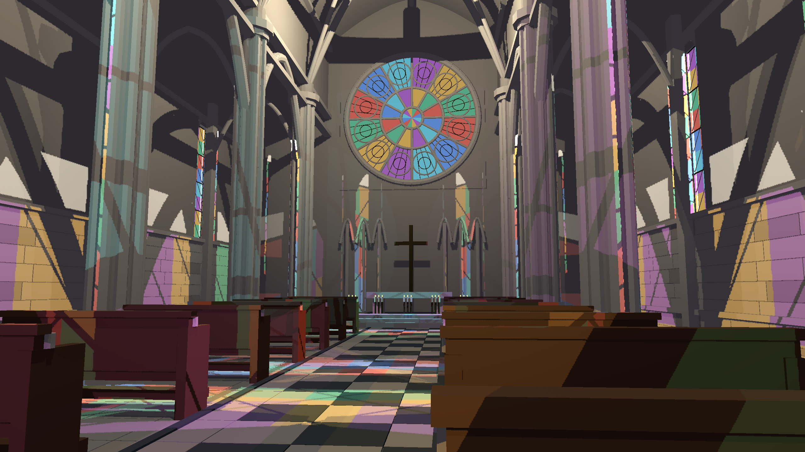
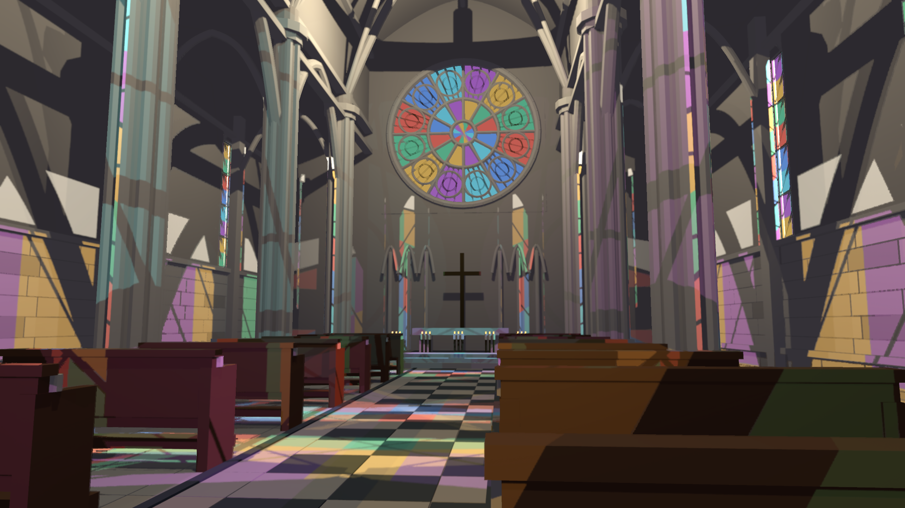
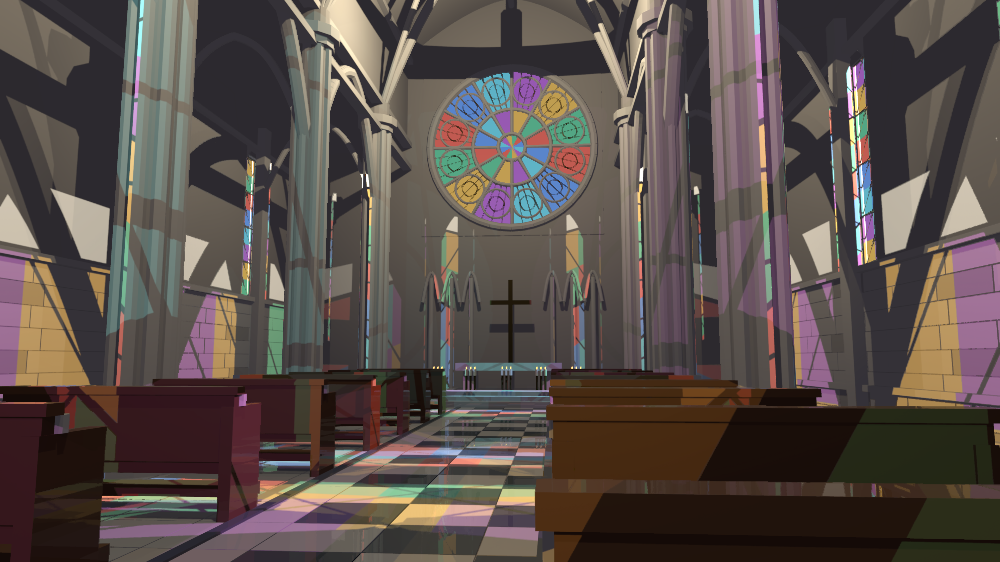

# HLFS TSR output integration checkpoint

TSR resolved HDR history and blitted to the surface, but the following PostProcess read unresolved pre_aa and overwrote it. The HLFS graph now consumes the pass-owned tsr_color resolve when TSR is configured, and omits the redundant surface blit. TSR remains opt-in; FXAA and no-TSR graph selection are preserved. Other non-HLFS graph integrations are outside this checkpoint.

PostProcess chooses pre_aa, fxaa_color or tsr_color explicitly. TSR publishes its output view and republishes the replacement after resize. The existing camera-sampling GPU test was stale after SceneDB migration; it now uses the current PrepareContext fields. Both the actual camera jitter/time upload test and the new output-publication/resize test pass. This does not establish interactive resize correctness.

The capture harness now supplies a fixed 1/60-second simulation step. Previously TSR's adaptive history weight depended on GPU/readback wall time, so even identical indexed camera paths were not reproducible. Two independent 100-frame 1440p runs now match RGBA exactly at frames 0/31/63/99. FXAA captures after the input-selection and clock changes match the prior baseline exactly at the same four frames.

1440p and 4K native-TSR captures were rendered and visually inspected. Edges are smoother, but ghosted/doubled stained-glass tracery remains visible at 1440p. The shader still substitutes current depth for history depth, and transparent panes lack an appropriate temporal depth/velocity/reactivity representation. These are unresolved quality defects. The 4K run includes SSR and retains incomplete reflection regions. This wiring repair is not final visual acceptance and TSR is not promoted to a default.

Reproduction: cargo build --release -p examples --bin indoor_cathedral_hlfs; cargo test --release -p helio-pass-tsr --lib. Capture using HLFS_RT=1 HLFS_PRESAMPLED=1 HLFS_TSR_NATIVE=1 HLFS_CAPTURE_TIMINGS=1 HLFS_RESOLUTION=1440p and target/release/indoor_cathedral_hlfs.exe --capture <directory>. For 4K set HLFS_RESOLUTION=4k and HLFS_SSR=1. Do not set HLFS_FXAA alongside TSR. All captures use 100 frames; timing drops the first 16.

results.json and CSVs report HLFS-only GPU timing and serialized CPU+GPU latency. HLFS-only excludes TSR, SSR, TLAS and all other passes. Serialized latency is not pipelined whole-frame GPU timing. The discarded-output baseline used wall-clock simulation; it is provenance for the integration defect, not a matched temporal-quality or performance control. No 3-4 ms acceptance claim is made.

## Rejected traversal experiment

An opaque-first traversal was tried before this repair: classified scenes first traced opaque blockers while culling nonopaque triangles, then processed transmitting sheets only on unblocked segments. Four cathedral captures were pixel-identical to baseline, but median HLFS increased from 4.450 to 5.555 ms and sampling from 2.233 to 3.226 ms. The experiment was reverted; its patch and timings are retained, not part of production shaders.

