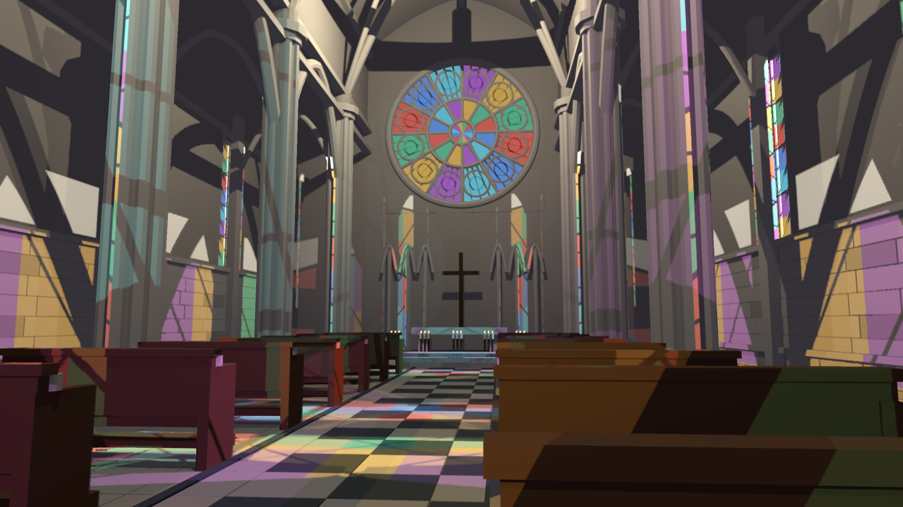
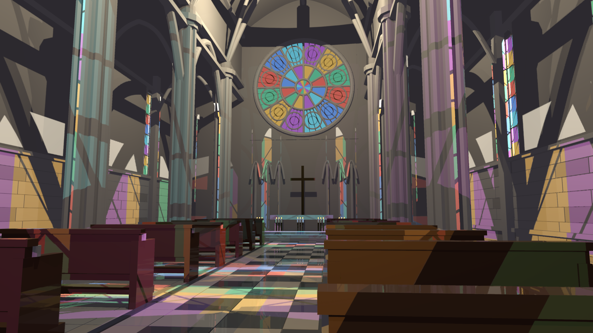

# TSR reprojection coordinate correction

Base: 51132a4f. This fixes a mathematical coordinate mismatch, not final temporal-quality acceptance.

Current color was sampled at jitter-corrected raster UV, but depth and inverse projection used uncorrected output UV. Projection into the previous frame then retained the previous camera jitter although the history image is stored in an unjittered display grid. TSR now reconstructs depth/world position at the same raster UV as color and removes the previous projection jitter from history UV. Previous jitter is uploaded through the existing uniform padding, retaining the 32-byte ABI. Nonpositive previous clip W rejects history.

Three GPU tests pass: actual current/previous jitter and timestep uploads, output-view replacement on resize, and numerical execution of the production reprojection function. The new test uses affine camera translation with four independent current/previous jitter phases at 33x17 and 2560x1440. It verifies jitter cancellation while preserving camera motion, to 1e-6 UV tolerance. The scene captures additionally exercise perspective cameras; no exhaustive camera-model coverage is claimed.

Built the release cathedral and ran fixed-60-Hz 100-frame captures at 1440p (no SSR) and 4K (SSR enabled). Inspected frame 99 at both sizes. Stained-glass ghosting/doubled details remain; the correction is necessary but insufficient. There is still no true history-depth rejection or transparency-aware temporal depth/velocity/reactivity. TSR stays opt-in and the PR remains draft. No final visual or 3-4 ms acceptance.

Reproduce with cargo test --release -p helio-pass-tsr --lib and cargo build --release -p examples --bin indoor_cathedral_hlfs. Set HLFS_RT=1 HLFS_PRESAMPLED=1 HLFS_TSR_NATIVE=1 HLFS_CAPTURE_TIMINGS=1 HLFS_RESOLUTION=1440p; run target/release/indoor_cathedral_hlfs.exe --capture <directory>. For 4K set HLFS_RESOLUTION=4k and HLFS_SSR=1. Capture clocks are fixed by the harness.

CSV/JSON discard 16 warmup frames and use interpolated p95. HLFS-only timing excludes TSR, TLAS, SSR and the rest of the renderer; serialized CPU+GPU latency excludes readback and is not whole-frame GPU time. These measurements do not isolate the correction's cost. The retained previous checkpoint provides before images; do not confuse its earlier wall-clock run with a matched temporal control.

