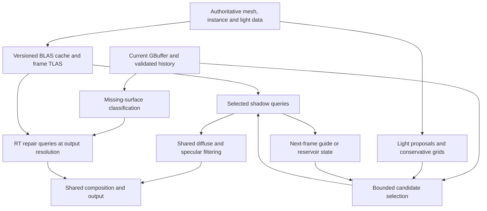

# Ray-traced HLFS research and implementation plan

## Recommendation

Extend the existing `HlfsPass` with an explicit `HlfsMode::RayTraced`, using native Vulkan ray queries, a scene acceleration structure shared across lights, and bounded light selection before visibility. Start with the existing visibility-guided estimator as the control. Compare tile presampling and full ReSTIR DI reuse experimentally before choosing the production sampler. Retain the common lighting, history, filtering, and output infrastructure; introduce backend-specific resources only where the visibility and sampling algorithms require them.

The primary target is **2560×1440 output on RTX 3060, 1,024 or more dynamic lights, with a 3–4 ms direct-lighting GPU budget**. Test 3840×2160 as a stress tier. Report full-resolution and reduced-resolution shading separately: a 1440p GBuffer/output with 1280×720 stochastic shading is a reconstructed 1440p result, not native per-pixel lighting. Native 1440p shading is a mandatory comparison, not an established 4 ms capability. No RT implementation or new performance measurement is delivered by this planning change.

The evidence supports a plausible architecture, not a guarantee of the fastest algorithm or constant execution time. Bounded rays limit one part of the work. Light-grid construction, candidate scoring, geometry updates, traversal divergence, reconstruction repairs, and memory traffic still depend on scene content. The performance claim must cover these costs rather than hide them behind the visibility dispatch.

## Evidence and scope

Implementation is tracked in [issue #247](https://github.com/Far-Beyond-Pulsar/Helio/issues/247). This planning document does not complete that issue.

Research snapshot: September 12, 2026. Helio was inspected at current `origin/main`, `befeb33a0485f619c00bf5db0d2869cd02f01b97`, after [PR #243](https://github.com/Far-Beyond-Pulsar/Helio/pull/243) merged. Its [review direction](https://github.com/Far-Beyond-Pulsar/Helio/pull/243#issuecomment-5560438337) requests shared HLFS infrastructure, hardware visibility, and pre-trace candidate pruning. The requested 1080p target has since been raised to 1440p, with 4K stress tests.

The comparisons below combine authenticated Unreal source inspection, public engine source, official documentation, and research publications. They are architecture comparisons; no matched Unreal/Godot/Bevy/Unity benchmark was run. Unreal source was read at release commit `16d75d84714512edfb744e1fd0a59e9c74d57873`, whose `Build.version` reports **5.8.2**. Godot source is **4.8-dev**, commit `c24bf5d933c53d9477d5e82c51403856a9e7da62`; its cited architecture documentation is explicitly version 4.5. Bevy source is a development snapshot, `96e3bcfd87f4cb6372dd9da8b5318f3e64899a01`, rather than a released compatibility promise. Exact source links appear in [Sources](#sources).

Initial scope is opaque direct lighting for current supported analytic lights and static/rigid mesh casters, followed by explicit coverage of masked and deforming geometry before general production readiness. GI, path tracing, reflections, emissive triangle sampling, textured area lights, volumetrics, and console support are separate extensions. They must not be implied by the name “RT.” A hardware shadow ray cannot invent an area-light model or a missing caster representation.

## What the engine comparisons establish

| System inspected | Relevant mechanism | What Helio should adopt or test | Important difference |
| --- | --- | --- | --- |
| Unreal MegaLights 5.8.2 | Importance-selected light samples, visibility history, compacted hardware-ray work, denoising | Separate candidate selection from expensive visibility; preserve exploration of hidden lights; test compacted dispatch | Rich area/material/scene machinery; no transferable RTX 3060 timing guarantee |
| NVIDIA RTXDI / ReSTIR DI | Initial importance sampling, temporal/spatial reservoir reuse, final visibility; optional ReGIR proposals | Use as the estimator and normalization reference; compare a limited reuse variant | More history, normalization work, and potentially correction rays than a simple visibility guide |
| Bevy Solari development source | Rust render graph, WESL ray queries, light presampling and reservoir passes | Study resource lifetime, light remapping, pass boundaries, and actual visibility calls | Broader real-time path-lighting scope; not a drop-in WGSL pass |
| Godot Forward+ development source | Clustered lists and per-cluster light evaluation; separate shadow/GI infrastructure | Baseline for conservative culling, sparse-light efficiency and fallback behavior | Clustered shading does not itself bound shadow rays across many overlapping lights |
| Unity HDRP 17.0 | Configured ray-traced shadows with sample/denoiser controls and bounded screen-space shadow allocation | Compare a few important RT lights against many-light sampling | Per-light RT shadowing is a different workload from stochastic many-light shading |

### Unreal: useful production structure, not a literal port

Epic's public MegaLights overview describes fixed per-pixel light sampling, history-informed guiding, periodic hidden-light sampling, and denoising. It also acknowledges increased estimation cost with overlapping lights and quality loss under difficult lighting. Its default short screen trace can recover geometry detail absent from the RT representation; it is not evidence that screen depth is a complete visibility oracle. [S1]

The inspected `MegaLightsSampling.cpp` exposes distinct hidden-light weights for valid and missing history. `MegaLightsSampling.ush` carries candidate selection weights and selected-light state. `MegaLightsRayTracing.cpp` implements trace compaction and chooses inline tracing based on capability; `MegaLightsHardwareRayTracing.usf` consumes the compacted work and requests early termination for ordinary shadow visibility. These findings justify testing compacted opaque any-hit queries and treating history misses explicitly. They do not justify copying its packing limits, random-number transformations, wave sizes, or material policy into Helio. [S2–S5]

Epic's RT performance guide separates dynamic BLAS cost, scene-level acceleration work, and traversal. This distinction should be reflected in Helio's counters and acceptance budget. A static scene that amortizes all BLAS work cannot stand in for moving characters or streamed geometry. [S6]

### ReSTIR / RTXDI: stronger reuse has a real price

The original ReSTIR publication introduces resampling across candidates, pixels and frames, with both unbiased and biased variants. Its published speedups are against its own scenes and baselines; none are forecasts for Helio. [S7] The production follow-up reports improvements in coherence, ray budgets and memory behavior, motivating experiments beyond a direct shader substitution. [S8]

RTXDI's integration guide distinguishes ReSTIR DI from world-space ReGIR, and describes light-index translation and access to previous-frame light data. ReGIR is an optional proposal generator, not hardware visibility or a denoiser. The noise/bias guide explains why an approximate target must retain support, why temporal reuse alone can create persistent patterns, and why more complete correction can add visibility evaluations. [S9–S10]

Helio already performs reservoir selection inside a frame and retains visible-light guides. That is not automatically the same estimator as persistent per-pixel ReSTIR reservoirs. The first implementation should preserve the existing control and add one mechanism at a time. Full ReSTIR is the preferred *comparison* if guided sampling misses the quality target; it is not an unconditional dependency for the first RT path.

### Bevy: the closest implementation-stack reference

The inspected Solari shaders separate light presampling from temporal and spatial operations. They validate reused surfaces, remap temporal light identities, cap history confidence, and perform visibility evaluations during merging. Its presampling stage also shows explicit packed sample storage. These details make Bevy more useful than a generic C++ RT tutorial for studying Rust/wgpu data flow. [S11–S13]

Count all ray calls in a candidate implementation. A reservoir that emits one final sample does not necessarily cost one ray once correction and reuse validation are included. Bevy's broader algorithm and chosen workgroup sizes should be treated as implementation evidence, not tuning parameters for RTX 3060 HLFS.

### Godot and Unity: necessary comparison baselines

Godot's inspected Forward+ shader traverses cluster masks and evaluates selected omni/spot entries, while its host code sets up the cluster builder and separate shadow/GI resources. This supports using clustered deterministic lighting as a sparse-light control. It does not establish an equivalent MegaLights/ReSTIR RT implementation, nor does it prove anything about every Godot renderer or future RT work. SDFGI in the versioned documentation concerns indirect lighting, not this direct-shadow problem. [S14–S16]

Unity HDRP 17.0 exposes per-light ray counts, denoising and a maximum screen-space shadow allocation. Here “screen-space” describes the storage of results and does not mean rays only intersect screen depth. That distinction also matters when describing ReSTIR's screen-indexed reservoirs. HDRP is a useful control for a small subset of costly lights, but a thousand overlapping shadowed lights should not be evaluated by simply multiplying a per-light RT pass. [S17]

## Helio audit: work required before sampling optimization

The following findings are from source inspection at the pinned Helio revision, not from new GPU tests.

| Location | Finding | Required change or verification |
| --- | --- | --- |
| `crates/helio-core/src/acceleration.rs` | BLAS construction copies CPU geometry into fresh buffers, submits, and waits; caches by mesh ID | Build from authoritative GPU geometry where possible; track geometry generation, offsets and lifetimes; batch builds without a per-mesh blocking wait |
| Same file, `TlasManager::build` | Fixed capacity, truncates excess instances; clears trailing slots; missing BLAS inside the populated range has no explicit clearing branch | Handle capacity exhaustion visibly; clear missing entries; test removal, missing assets and replacement at the same index |
| Search of `crates/**/*.rs` | `build_blas` and `TlasInstanceInput` appear in definitions/exports, with no construction call sites found | Wire real mesh/instance extraction and frame-ordered builds; do not equate capability detection with a populated TLAS |
| `shaders/ray_shadow.wgsl` | Prototype skips shadows for `INVALID_LIGHT` atlas indices and first calls `screen_occluded` | Separate authored cast-shadow intent from atlas slots; start with pure hardware visibility to obtain a clean correctness control |
| `shaders/composite.wgsl` | Missing reduced-resolution samples run their own bounded sampler using `shadow_factor` | Provide RT-consistent full-resolution repair; count these rays and classify repair coverage |
| `shaders/light_grid.wgsl` | Coarse groups scan all lights; overflow switches to global support | Measure build cost and overflow quality separately; do not claim globally constant work |
| `shaders/sample.wgsl` | Candidate loops and duplicate-ray reuse already precede selected-light tracing | Measure what is already bounded; optimize proposal construction and coherence before adding redundant pruning |
| `src/pipelines.rs`, `src/lib.rs` | One explicit ScreenSpace backend; ray prototype validates but is not dispatched | Add runtime mode only with complete executable bindings, frame readiness and error behavior |
| `Cargo.toml`, `Cargo.lock` | Workspace requests wgpu 30.0.0; lock resolves 30.0.1 | Validate against the locked API and actual device, not older ray-query examples |

The locked wgpu documentation lists experimental ray queries as native Vulkan functionality. Use explicit capability negotiation and the existing experimental-feature acknowledgement. A hardware brand alone does not establish that an externally supplied device enabled the feature. ScreenSpace remains the default; an explicit unsupported RT request should return a clear configuration error. An optional application fallback must expose the effective mode. [S18]

[Issue #231](https://github.com/Far-Beyond-Pulsar/Helio/issues/231) removes persistent authored `Scene` mirrors while retaining BLAS/TLAS as resource infrastructure. RT caches should be derived from authoritative mesh data and generation keys, not become another authored scene database. [Issue #246](https://github.com/Far-Beyond-Pulsar/Helio/issues/246) concerns CPU shadow-atlas selection and external light buffers. RT must not depend on atlas admission, but that does not solve or remove the atlas work for other rendering consumers. Coordinate the shadow-intent contract with that issue without absorbing the whole rewrite.

## Proposed data flow

The diagram shows dependencies, not an obligation to make every box a separate dispatch. Benchmark fused and separated variants. Keep externally visible graph resource contracts stable. A mode switch invalidates sampling and radiance history and creates only the required backend resources; internal shading changes preserve the published output texture where its dimensions/format remain compatible.

### 1. Scene acceleration and material semantics

Use immutable static-mesh BLASes keyed by geometry identity plus generation. Rigid instances reuse BLASes and update transforms in the TLAS. Buffer pool growth, mesh replacement, removal, scene rebasing and device recreation must invalidate affected references. Distinguish an intentionally empty ready TLAS from a missing or stale TLAS; the latter cannot silently mean “unoccluded.” Frame data and acceleration structures must refer to the same geometry/transform epoch.

Keep offscreen casters that can intersect receiver-to-light segments. Camera-frustum-only caster culling recreates the very offscreen shadow failure RT is intended to solve. Start with a conservative scene bound. Later, compare receiver/light-influence culling and RT LOD against the oracle before narrowing it. Directional-light distance limits require a documented scene-bound policy, not the prototype's arbitrary far distance.

Opaque triangles should use early-terminating binary visibility and avoid material work. Masked surfaces need UV/material identity and candidate alpha testing, or a declared unsupported status until implemented. Never force masked foliage opaque or silently drop it to obtain a timing win. Deforming meshes need validated refit/rebuild scheduling; changes in topology require rebuilds. NVIDIA and AMD both motivate measuring traversal together with build/update cost, because poor geometry partitioning or deformation can erase build-time savings. [S19–S20]

### 2. Candidate selection with preserved support

Separate conservative geometric rejection from probabilistic guidance. Range/cone/receiver tests may eliminate a light only when its true contribution is zero under the engine's light model. Previous occlusion, low estimated brightness, or exclusion from a finite top-K list is not such a proof.

For a directly sampled proposal, use a mixture such as `q(i|x) = (1-e) q_guided(i|x) + e q_discovery(i|x)`, where discovery covers every potentially contributing light. The implementation must evaluate the probability of the *actual sampling process*, including overlap between distributions. A stratified or multi-stage reservoir scheme requires its corresponding estimator; inserting this formula into the current sampler without a derivation is not sufficient.

For independent initial RIS candidates `i_j ~ q_j`, with nonnegative target `h(i)` positive wherever contribution may be nonzero, weights are `w_j = h(i_j)/q_j(i_j)`. Reservoir selection proportional to these weights yields the single-stage estimate `F(y) * sum(w_j)/(M*h(y))`, where `F` contains current visibility and the actual BRDF contribution. This is an initial RIS identity, not a complete temporal/spatial ReSTIR normalization. Merging persistent reservoirs requires re-evaluating targets at the receiving surface and accounting for the source stream and reuse scheme. [S7, S10]

Start with current 8 candidates per sample and 2 samples per 2×2 block as the control. Test candidate counts 4/8/16 and sample counts 1/2/4 only within a preregistered ablation. Cold history may spend more of the existing budget on discovery; it must not increase rays invisibly. Keep independent random dimensions for reservoir updates, group choice, neighbor selection and reconstruction. Preserve the finite-rank STBN regression that fixed PR #243. STBN helps error distribution, but is not a proof that correlated resampling remains unbiased. [S21]

The first optimization candidate is shared tile presampling with explicit proposal weights and an escape distribution on overflow. It can reduce repeated light loads without requiring persistent per-pixel reservoirs. Compare it against the current conservative grids on dense overlap and separated rooms. Consider a world-space ReGIR-like proposal only if these measurements show poor initial sampling in spatially distributed scenes. Its grid update and storage costs must be charged to the result.

### 3. Temporal identity and invalidation

Use stable light identities plus generations, or an explicit previous-to-current index map. A light count staying constant does not mean the same light occupies an index. Moving lights require current parameters for current shading; previous parameters are required when the chosen reuse estimator evaluates previous-frame targets. Missing mappings invalidate samples, not merely their cached visibility.

If a ReSTIR correction requires previous-frame visibility, previous geometry/acceleration structures and relevant alpha-material data must also remain available. Using the current TLAS to answer a previous-frame visibility question is an approximation in moving scenes. Either retain and budget that state or explicitly document the approximation; do not claim unbiased temporal correction based only on retaining old light records. [S10]

Reprojection validates bounds, depth, normal, material compatibility and motion. Camera-only reprojection is insufficient for independently moving receivers. If motion information is absent, reject uncertain temporal reuse or declare a restricted static-receiver path. Reset history after camera cuts, incompatible resolution changes, exposure changes without valid rescaling, mode changes, topology changes and source-buffer replacement. Geometry validation for denoising is distinct from validation for reservoir reuse: each stage must own its rule.

### 4. Hardware visibility and repair

The first RT control should use no screen-space occlusion decisions. For punctual lights, trace a normalized segment with scale-aware origin and endpoint offsets; verify coordinate transforms and large/small world scales. Count unique queries after duplicate selected-light elimination. Cached visibility must not replace current visibility across unrelated surfaces or moving occluders.

Compare a fused select/trace kernel with a queue-based version. Compaction wins only when reduced inactive work and divergence exceed queue writes, reads, atomics and extra dispatches. Begin with a portable compute implementation; make subgroup variants optional and measure them on the actual adapter. Do not assume NVIDIA wave sizes are a cross-platform contract.

Reduced-resolution output needs an explicit repair path for thin geometry and disocclusions with no compatible sample. Prefer a compute repair stage using the same RT visibility module before composition. A sparse queue is an optimization, not a license to discard excess repair work. Its worst case may approach full-screen shading; overflow must use a correct fallback and report that the performance target was missed. A small screen-contact pass can be evaluated later as an optional hybrid, with separate quality and ray-count accounting.

### 5. Denoising and memory

Reuse the existing separated diffuse/specular history, demodulation, geometry tests and exposure handling first. RT reduces visibility incompleteness but does not eliminate reduced-resolution edge noise, temporal lag, missing motion data, or variance. Test glossy surfaces and thin moving shadows, not only average energy on a diffuse plane.

Only replace the denoiser after raw lighting passes estimator gates and evidence identifies reconstruction as the limiting stage. An NRD-style integration is a separate experiment because it adds input conventions, resources and integration work; it is not a free benefit of selecting RTXDI. Packed storage remains a measured quality/performance choice, with RGBA16F as a control. Queue/reservoir packing must retain full light identity or have an explicit overflow representation.

## Cost model and the higher-resolution target

The existing [September 8 ScreenSpace evidence](validation/hlfs/energy-fix.md) measures compact 1080p HLFS at 6.998 and 7.252 ms in two serial runs. Sampling plus visibility contributes about 5.00–5.05 ms; temporal, spatial and composite stage medians together are approximately 1.69–1.78 ms. These are old synthetic GPU measurements, not current RT results. Stage medians do not necessarily sum to the median frame total.

A pixel-count-only extrapolation would make that latter work roughly 3.00–3.16 ms at 1440p before RT traversal, proposals or acceleration updates. This is a diagnostic estimate, not a predicted benchmark: cache behavior, dispatch occupancy and repair coverage change with resolution. It nevertheless shows why substituting hardware rays alone is unlikely to establish a comfortable 4 ms budget. The shared filters and reconstruction deserve measurement alongside sampling.

| Output / shading configuration | Shading sites | Selected rays at 2 samples/site, before deduplication | 32-byte reservoir, two histories |
| --- | ---: | ---: | ---: |
| 1920×1080 / 960×540 | 518,400 | 1,036,800 | 31.64 MiB |
| 2560×1440 / 1280×720 | 921,600 | 1,843,200 | 56.25 MiB |
| 2560×1440 / 2560×1440 | 3,686,400 | 7,372,800 | 225.00 MiB |
| 3840×2160 / 1920×1080 | 2,073,600 | 4,147,200 | 126.56 MiB |
| 3840×2160 / 3840×2160 | 8,294,400 | 16,588,800 | 506.25 MiB |

These are arithmetic illustrations, not allocated resources or final layouts. Reservoir bytes exclude shared lighting histories, queues, guides, GBuffer, BLAS/TLAS, driver overhead and repair queries. Two samples per 2×2 block are 0.5 selected samples per output pixel on average; all extra reuse/correction/repair rays must be added. At 1440p, a 16-byte queue record for all 1,843,200 selected rays alone would require 28.125 MiB, motivating compact indices and reconstructed ray data.

Define `T_lighting = T_proposals + T_selection + T_visibility + T_reuse + T_filter + T_repair + T_composite`. Report `T_incremental = T_lighting + T_RT_scene_incremental + T_other_new_dependencies` as well. The proposed acceptance target is `T_incremental` median ≤4 ms at 1440p in the declared gameplay scene tier, with ≤3 ms as a stretch goal and p95 ≤5 ms. This deliberately makes the budget stricter than a visibility-only number. CPU extraction, uploads and whole-frame critical-path effects must also be published.

For diagnosis only, start with an allocation of 0.50 ms for incremental scene maintenance, 0.45 ms for proposals/selection, 1.25 ms for queries, 1.30 ms for filtering/repair/composition, and 0.50 ms contingency. This is a planning allocation totaling 4 ms, not an estimate supported by an RT run. Reallocate based on evidence without changing the total target or quality gates. At 4K, publish timings and failure envelopes; do not silently inherit the 1440p acceptance claim.

## Implementation sequence and decisions

| Phase | Concrete deliverable | Exit condition |
| --- | --- | --- |
| 0. Freeze baseline | Parameterized resolution/camera/light fixtures, source manifest, timestamps and quality masks | Repeat current ScreenSpace evidence on current main at 1080p/1440p/4K; record variance |
| 1. Establish correct world visibility | Versioned BLAS/TLAS extraction, shadow-intent contract, explicit RT mode, pure hardware rays including repairs | Offscreen/moving/removal/empty/capacity cases pass; full-light RT oracle agrees with analytic tests |
| 2. Bound and account work | Candidate/ray/repair counters, identical-budget fused and compacted variants | All visibility call sites accounted; no hidden atlas limit; no truncation or stale identities |
| 3. Improve proposals | Tile presampling plus supported discovery; optional limited ReSTIR comparator | Select the best measured time/quality tradeoff on static and moving scenes; publish rejected variants |
| 4. Meet quality and resolution target | Shared denoiser tuning, memory/layout optimization, material and geometry coverage | Frozen 1440p quality/performance gates pass; 4K/native comparisons reported |
| 5. Integrate and hand off | Graph/editor/example support, capability fallback, reproducible captures and CI | Complete evidence and limitations; PR non-draft and In Review; user handles merge |

Phase 1 can be a correct opaque/rigid implementation PR, but must be titled and scoped accordingly. General production readiness also requires the relevant masked/deforming scene tier. No elapsed-time estimate is defensible until the scene-build and first RT measurements exist. Phase 0/1 measurements should determine whether the 4 ms goal is attainable before committing to a complex reservoir architecture.

Prefer guided RIS if it meets the frozen gates. Select full ReSTIR only if it earns its additional resources through lower error at comparable time or lower time at comparable error. If traversal dominates, inspect acceleration structure coverage, overlap and ray divergence. If filtering dominates, optimize bandwidth/reconstruction before changing the sampling algorithm. If all valid configurations exceed 4 ms, publish a missed target with the measured quality frontier; do not lower light energy or drop offscreen casters to manufacture a pass.

## Sources

All links were inspected or retrieved on September 12, 2026 unless an access limitation is stated. This document contains independent design analysis and no copied Unreal source. Private source permalinks require an Epic-authorized GitHub account. No vendor benchmark is used as a Helio forecast.

- **S1.** Epic Games, [MegaLights, UE 5.8 documentation](https://dev.epicgames.com/documentation/en-us/unreal-engine/megalights-in-unreal-engine). Technique, quality tradeoffs and profiling scope.
- **S2.** Epic Games, [MegaLightsSampling.cpp, UE 5.8.2 source](https://github.com/EpicGames/UnrealEngine/blob/16d75d84714512edfb744e1fd0a59e9c74d57873/Engine/Source/Runtime/Renderer/Private/MegaLights/MegaLightsSampling.cpp). Authenticated inspection; history-guidance settings.
- **S3.** Epic Games, [MegaLightsSampling.ush](https://github.com/EpicGames/UnrealEngine/blob/16d75d84714512edfb744e1fd0a59e9c74d57873/Engine/Shaders/Private/MegaLights/MegaLightsSampling.ush). Authenticated inspection; candidate and sampler representation.
- **S4.** Epic Games, [MegaLightsRayTracing.cpp](https://github.com/EpicGames/UnrealEngine/blob/16d75d84714512edfb744e1fd0a59e9c74d57873/Engine/Source/Runtime/Renderer/Private/MegaLights/MegaLightsRayTracing.cpp). Authenticated inspection; compaction and capability selection.
- **S5.** Epic Games, [MegaLightsHardwareRayTracing.usf](https://github.com/EpicGames/UnrealEngine/blob/16d75d84714512edfb744e1fd0a59e9c74d57873/Engine/Shaders/Private/MegaLights/MegaLightsHardwareRayTracing.usf). Authenticated inspection; compacted queries and shadow termination.
- **S6.** Epic Games, [Ray Tracing Performance Guide, UE 5.8](https://dev.epicgames.com/documentation/en-us/unreal-engine/ray-tracing-performance-guide-in-unreal-engine). Scene update and traversal cost categories.
- **S7.** Bitterli et al., SIGGRAPH 2020, [Spatiotemporal reservoir resampling for real-time ray tracing with dynamic direct lighting](https://research.nvidia.com/publication/2020-07_spatiotemporal-reservoir-resampling-real-time-ray-tracing-dynamic-direct). Publication abstract and estimator motivation; full PDF retrieval unavailable in this audit. Detailed integration caveats cross-checked with S9–S10.
- **S8.** Wyman and Panteleev, HPG 2021, [Rearchitecting Spatiotemporal Resampling for Production](https://research.nvidia.com/labs/rtr/publication/wyman2021rearchitecting/). Publication abstract inspected; full 92 MB PDF was not retrieved. Production-architecture motivation, not a claim of reproducing all paper details.
- **S9.** NVIDIA, [RTXDI Integration guide](https://github.com/NVIDIA-RTX/RTXDI/blob/a6efab966b7c3b272da0461578eb56ac61c7cbff/Doc/Integration.md). Pinned source; algorithm separation, history identity and optional ReGIR.
- **S10.** NVIDIA, [RTXDI Noise and Bias guide](https://github.com/NVIDIA-RTX/RTXDI/blob/a6efab966b7c3b272da0461578eb56ac61c7cbff/Doc/NoiseAndBias.md). Pinned source; target support, reuse and correction tradeoffs.
- **S11.** Bevy contributors, [Solari reservoir shader](https://github.com/bevyengine/bevy/blob/96e3bcfd87f4cb6372dd9da8b5318f3e64899a01/crates/bevy_solari/src/realtime/restir.wesl). Temporal identity, compatibility and visibility in reuse.
- **S12.** Bevy contributors, [Solari light presampling](https://github.com/bevyengine/bevy/blob/96e3bcfd87f4cb6372dd9da8b5318f3e64899a01/crates/bevy_solari/src/realtime/presample_light_tiles.wesl). Proposal/sample packing.
- **S13.** Bevy contributors, [Solari render node](https://github.com/bevyengine/bevy/blob/96e3bcfd87f4cb6372dd9da8b5318f3e64899a01/crates/bevy_solari/src/realtime/node.rs). Retrieved host integration reference; exact scheduling must be rechecked when implementing.
- **S14.** Godot contributors, [Forward clustered renderer](https://github.com/godotengine/godot/blob/c24bf5d933c53d9477d5e82c51403856a9e7da62/servers/rendering/renderer_rd/forward_clustered/render_forward_clustered.cpp). Cluster and GI setup.
- **S15.** Godot contributors, [Forward clustered shader](https://github.com/godotengine/godot/blob/c24bf5d933c53d9477d5e82c51403856a9e7da62/servers/rendering/renderer_rd/shaders/forward_clustered/scene_forward_clustered.glsl). Per-cluster light iteration.
- **S16.** Godot documentation, [Internal rendering architecture, 4.5](https://docs.godotengine.org/en/4.5/engine_details/architecture/internal_rendering_architecture.html). Versioned background; not a feature inventory for 4.8-dev.
- **S17.** Unity Technologies, [Ray-traced shadows, HDRP 17.0](https://docs.unity3d.com/Packages/com.unity.render-pipelines.high-definition@17.0/manual/Ray-Traced-Shadows.html). Shadow allocation, sample and denoiser controls.
- **S18.** gfx-rs, [wgpu 30.0.1 experimental ray-query feature](https://docs.rs/wgpu/30.0.1/wgpu/struct.Features.html#associatedconstant.EXPERIMENTAL_RAY_QUERY). Locked-version platform constraint.
- **S19.** Juha Sjoholm / NVIDIA, July 25, 2022, [Best Practices for Using NVIDIA RTX Ray Tracing](https://developer.nvidia.com/blog/best-practices-for-using-nvidia-rtx-ray-tracing-updated/). General acceleration-structure guidance, subject to adapter/API profiling.
- **S20.** AMD GPUOpen, [Improving raytracing performance with Radeon Raytracing Analyzer](https://gpuopen.com/learn/improving-rt-perf-with-rra/). Geometry overlap, multiple geometries and deformation tradeoffs; AMD evidence is not an RTX 3060 timing claim.
- **S21.** Wolfe et al., EGSR 2022, [Spatiotemporal Blue Noise Masks](https://research.nvidia.com/publication/2022-07_spatiotemporal-blue-noise-masks). Spatial/temporal noise distribution; not a reservoir-unbiasedness guarantee.

The [benchmark and acceptance protocol](hlfs_ray_traced_validation.md) defines reproducible experiments and the issue's completion criteria.
