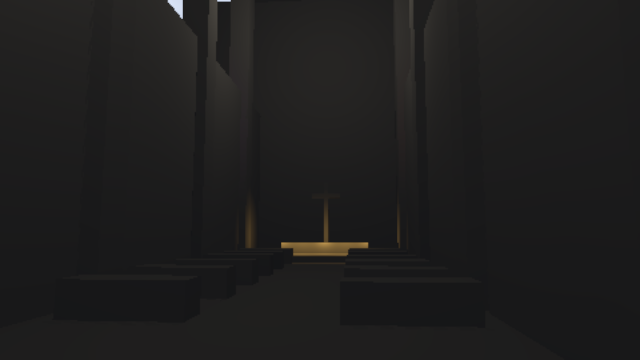
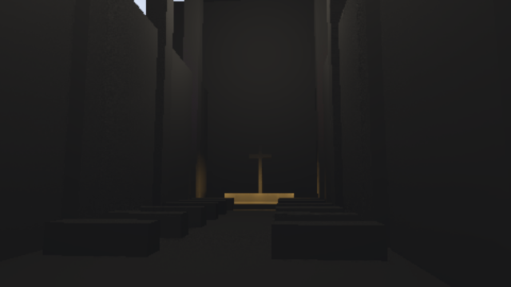

# HLFS validation

Validated on 2026-09-05 with an NVIDIA RTX 3060, Vulkan, driver 616.64,
against main revision `c3106597329f8b52386dfe3cd35eda9f0b9fbf7c`.

## Correctness and rendering

The shader test parses and validates all five WGSL programs, including the
optional ray-query variant. Seven explicit GPU regressions cover pipeline
creation, light-buffer growth, tile-list overflow, removal of lights, extinction
without changing the light count, mixed colored/directional lights, offscreen
culling, minimal targets, shadow atlas lookup beyond light index 42, moving
screen-space occluders, and isolated one-pixel geometry at half resolution.

At 65×49, equal-light scenes with 0, 1, 2, 65, 257 and 1,024 lights retain mean
lighting within 0.9% of the full-light reference. The one- and two-light cases
match the reference exactly. The 129-light mixed scene has 0.71% mean error and
4.13% normalized RMSE at full resolution after convergence. Half-resolution
shading has 6.25% mean error and 11.40% normalized RMSE in that scene; it is an
optional memory/performance tradeoff rather than the default.

| Full-light reference | Stochastic, full resolution |
| --- | --- |
|  |  |

The offscreen cathedral path renders 100 moving-camera frames with 17 lights,
640×360 output and the default 0.75 render scale (480×270 internal rendering).
Both the standard HLFS graph and its FXAA variant complete this path without
GPU validation errors.
Frames 31, 63 and 99 have sRGB mean absolute errors of 0.060%, 0.071% and 0.088%
of the output range, respectively, compared with matching full-light captures.
These are image comparisons, not proof that every possible scene is artifact-free.

| Cathedral reference, frame 99 | Stochastic, frame 99 |
| --- | --- |
|  |  |

The repository's CI commands, `cargo build` and `cargo test`, pass at the root.
The cathedral example builds, and the explicit GPU/shader checks above test the
lighting implementation beyond that root package's checks.

## GPU timing

640×360, default two shadow samples and eight candidates per sample, 16 warmup
frames and 40 measured frames per case. GPU timestamps surround HLFS on the
render encoder. Median / p95 times are milliseconds. This synthetic plane uses
spatially distributed overlapping point lights; shadowed cases use a shared
16×16 fully lit six-layer atlas and enable bounded screen-space contact tracing.
They exercise shader cost, not production shadow-map construction or bandwidth.

| Lights | Shadows | Full-light reference | Stochastic HLFS |
| ---: | :---: | ---: | ---: |
| 64 | No | 1.409 / 3.551 | 2.055 / 4.233 |
| 256 | No | 3.901 / 5.851 | 2.133 / 4.523 |
| 1,024 | No | 12.673 / 13.848 | 2.390 / 4.821 |
| 64 | Yes | 5.493 / 7.980 | 2.167 / 4.818 |
| 256 | Yes | 21.788 / 24.229 | 2.334 / 4.594 |
| 1,024 | Yes | 87.912 / 92.471 | 2.515 / 3.527 |

Low-light-count scenes can be slower because sampling and denoising have fixed
costs. These results compare the new stochastic path with its full-light oracle;
they are not measurements of the old clip-stack implementation or total game
frame time. Desktop scheduling contributes to the observed tail variability.

## Allocation and sampling asset

Requested pass-owned allocations are 18,123,516 bytes (17.28 MiB) at 640×360.
The same allocation formula gives 155.27 MiB at 1920×1080 with full-resolution
shading, or 57.21 MiB with half-resolution shading. These counts exclude driver
alignment, graph-owned textures, shared scene resources and pipeline memory.
Full-resolution history can cost more than the removed fixed 128 MiB clip stacks;
the design does not promise net memory savings at every resolution.

The independently generated 32×32×32 R8 noise asset has exactly 128 entries in
each of its 256 bins. Against a seeded white-noise volume, low-frequency power
ratios are 0.00189 spatially and 0.04878 temporally (spatial FFT radii 1–4 and
temporal bins 1–4). This checks the asset, not independence of every downstream
reservoir decision.

Reproduction commands and platform choices are documented in the
[pass README](../../../crates/passes/3d/helio-pass-hlfs/README.md).
