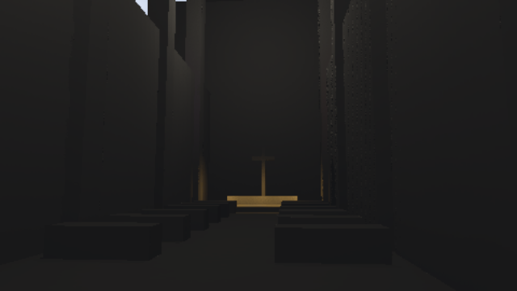
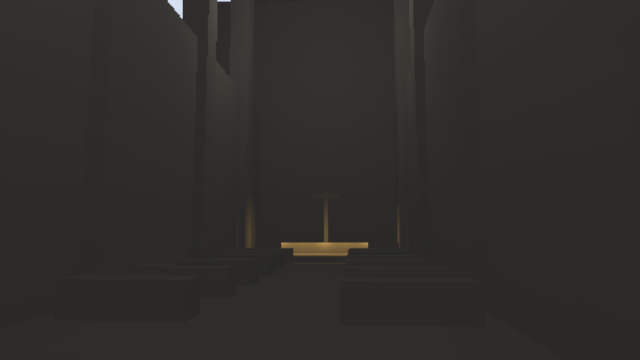

# HLFS validation

Validated on 2026-09-05 with an NVIDIA RTX 3060, Vulkan, driver 616.64,
against main revision `c3106597329f8b52386dfe3cd35eda9f0b9fbf7c`.

## Correctness and rendering

The shader test parses and validates all seven WGSL programs, including the
optional ray-query variant. Eleven explicit GPU regressions cover pipeline
creation, light-buffer growth, tile-list overflow, removal of lights, extinction
without changing the light count, mixed colored/directional lights, offscreen
culling, minimal targets, shadow atlas lookup beyond light index 42, moving
screen-space occluders, isolated one-pixel geometry at half resolution, packed
HDR rounding and strong hidden-light discovery. The exposure regression also
checks that reducing pre-exposure does not remove a perceptible dim light.
The allocation regression creates full, half and compact-performance 1080p
configurations and requires shading-scale changes to retain the published output
texture. Additional tests cover 65,536 lights through the global fallback, native
packed-HDR energy, the 80% energy-confidence threshold, and a one-pixel occluder
with a two-world-unit screen trace. Balanced lighting flags 0.30% of pixels as
confident; a dominant visible light flags 100%.

At 65×49, equal-light scenes with 0, 1, 2, 65, 257 and 1,024 lights retain mean
lighting within 3.2% of the full-light reference. The one- and two-light cases
match the reference exactly. The 129-light mixed scene has 0.25% mean error and
3.78% normalized RMSE at full resolution after convergence. Its unfiltered
64-frame mean differs by 0.031%, separating estimator accuracy from denoising
bias. Half-resolution shading with two samples has 6.03% mean error and 11.07%
normalized RMSE. The four-sample performance preset has 6.30% mean error and
11.02% normalized RMSE. Reduced-resolution shading is an explicit tradeoff;
it does not match full-resolution quality in this mixed-light test.

| Full-light reference | Stochastic, full resolution |
| --- | --- |
|  |  |

A light 1,280 times stronger than each local light is first fully shadowed,
then revealed without resetting guiding. Converged mean errors are 5.41% while
occluded and 0.062% after reveal. These are finite-sample denoised results; the
test does not claim zero transient error immediately after the change.

The packing test evaluates 12 values spanning zero, subnormals and HDR through
all 256 rounding ranks for both radiance mantissa sizes and E6M5 squared-luminance
moments. Every result is finite and
within one quantization step. The mean error is bounded by one step / 256.
The thin-surface test allows two R11 rounding steps instead of an RGBA16F
absolute tolerance; it still requires illumination and zero leakage into sky.

The offscreen cathedral path renders 100 moving-camera frames with 17 lights,
640×360 output and the default 0.75 render scale (480×270 internal rendering).
Both the standard HLFS graph and its FXAA variant complete this path without
GPU validation errors.
Frames 31, 63 and 99 have sRGB mean absolute errors of 0.050%, 0.060% and 0.065%
of the output range, respectively, compared with matching full-light captures.
The performance preset completes the same moving-camera path after changing
shading scale at runtime; its errors are 0.059%, 0.067% and 0.064%. It exhibits
some stochastic edge noise. These averages are dominated by the dark interior
and do not replace inspection or prove that every scene is artifact-free.

| Cathedral reference, frame 99 | Stochastic, frame 99 |
| --- | --- |
|  |  |

The reduced-resolution preset retains camera motion and geometry, with an
explicit edge-noise tradeoff:

The repository's CI commands, `cargo build` and `cargo test`, pass at the root.
The cathedral example builds, and the explicit GPU/shader checks above test the
lighting implementation beyond that root package's checks.

## GPU timing

640×360, default two shadow samples and eight candidates per sample, 16 warmup
frames and 40 measured frames per case. GPU timestamps surround HLFS on the
render encoder. Median / p95 times are milliseconds. This synthetic plane uses
spatially distributed overlapping point lights; shadowed cases use a shared
16×16 fully lit six-layer atlas and enable bounded screen-space contact tracing.
They exercise shader cost, not production shadow-map construction or bandwidth.

| Lights | Shadows | Full-light reference | Stochastic HLFS |
| ---: | :---: | ---: | ---: |
| 64 | No | 1.719 / 4.030 | 2.314 / 4.431 |
| 256 | No | 4.442 / 6.717 | 2.409 / 4.877 |
| 1,024 | No | 16.763 / 18.431 | 2.542 / 5.200 |
| 64 | Yes | 7.425 / 8.336 | 2.335 / 4.788 |
| 256 | Yes | 23.284 / 24.996 | 2.544 / 5.103 |
| 1,024 | Yes | 95.007 / 102.938 | 2.856 / 5.197 |

Low-light-count scenes can be slower because sampling and denoising have fixed
costs. These results compare the new stochastic path with its full-light oracle;
they are not measurements of the old clip-stack implementation or total game
frame time. Desktop scheduling contributes to the observed tail variability.

## 1080p stage profiling

Two serial runs use 1920x1080 output, 16 warmup and 40 measured frames for each
case, the same fully lit point-shadow fixture, and High shadow quality. Ranges
below are the two run medians, in milliseconds. [Raw timings and stage medians](gpu-1080p.json)
include p95 values; they are retained without selecting only the faster run.

| Lights | Full, 2 samples | Half, 2 samples | Compact performance, 4 samples |
| ---: | ---: | ---: | ---: |
| 1 | 2.27-2.27 | 1.21-1.22 | 1.18-1.18 |
| 8 | 18.36-18.79 | 5.24-5.91 | 6.87-8.44 |
| 64 | 24.03-24.03 | 6.17-7.00 | 8.62-10.45 |
| 1024 | 26.23-27.05 | 8.18-8.57 | 10.12-11.38 |

Sampling remains the dominant cost with many lights. The dedicated small-light
pipeline brings the one-light sampling stage to about 0.90 ms at full shading
resolution and 0.25 ms at half resolution. Reconstruction runs the spatial
kernel at shading resolution and composition takes approximately 0.53-0.58 ms.
The four-sample performance preset trades shading density for a total of one
shadow sample per output pixel; the full preset uses two. These are HLFS-only
GPU times, not whole-engine or console timings, and do not establish a global
performance optimum. Desktop scheduling produces substantial tail variability.

## Previous-renderer comparison

The previous renderer is built from `c3106597329f8b52386dfe3cd35eda9f0b9fbf7c`
with only the [capture harness patch](baseline-capture.patch). The same cathedral,
100-frame camera path, 17 movable lights, dimensions and shadow quality are used.
Each frame waits for GPU completion; image readback is excluded from the timer.
After discarding 16 warmup frames, retained baseline runs had median / p95
latencies of 14.053 / 15.835 ms and 16.452 / 18.270 ms. Current full-resolution
HLFS captures measure 18.267 / 23.169 ms, and the performance preset measures
18.266 / 24.171 ms. These separate captures do **not** demonstrate an end-to-end
speedup in this 17-light scene. The GPU light-scaling measurements above are
separate synthetic measurements. Scheduling variability makes small
completed-frame differences inconclusive; this is not a console benchmark.

The previous image also has different indirect illumination from the removed
clip stack. It is retained for comparison, not treated as the lighting oracle:

| Previous renderer, frame 99 | Stochastic, frame 99 |
| --- | --- |
|  |  |

To reproduce the baseline, create a detached worktree at the revision above,
apply `baseline-capture.patch`, then run the same cathedral capture command from
the pass README. The patch adds the offscreen path and its timer; it does not
modify the previous lighting shaders or graph. Run the baseline and current
executables serially so their GPU work does not overlap.

## Allocation and sampling asset

Requested pass-owned allocations are 12,189,288 bytes at 640x360 with
RGBA16F output. At 1920x1080:

| Shading / output | Bytes | MiB |
| --- | ---: | ---: |
| Full / RGBA16F | 109,380,120 | 104.31 |
| Half / RGBA16F | 43,487,640 | 41.47 |
| Performance (half, four samples) / R11G11B10 | 35,193,240 | 33.56 |

The last row is 35.19 MB in decimal units: it is near the proposal's approximate
34 MB budget, but it is not a 34,000,000-byte hard bound. Default graphs select
native packed HDR when the device exposes renderable R11G11B10 and otherwise
retain RGBA16F. Full shading remains the default. Packed lighting and metadata
use 40 bytes per shading pixel; the output, packed grids, depth pyramid and both
history parities are included. Driver alignment, graph-owned textures, shared
scene resources and pipeline memory are excluded. Allocation grows with output
resolution.

The independently generated 32×32×32 R8 noise asset has exactly 128 entries in
each of its 256 bins. Against a seeded white-noise volume, low-frequency power
ratios are 0.00189 spatially and 0.04878 temporally (spatial FFT radii 1–4 and
temporal bins 1–4). This checks the asset, not independence of every downstream
reservoir decision.

Reproduction commands and platform choices are documented in the
[pass README](../../../crates/passes/3d/helio-pass-hlfs/README.md).

## Proposal coverage and remaining adaptations

| Proposed phase | Implemented behavior and review boundary |
| --- | --- |
| Clip-stack removal and visible lists | Clip stacks are removed. Up to 16 explicit visible IDs are sorted after parallel workgroup selection. Reprojected guiding uses stochastic bilinear tile lookup. Portable workgroup operations provide the fallback allowed by the proposal; no subgroup requirement is introduced. |
| Dual reservoirs | Visible/hidden reservoirs, 20%/50% discovery budgets, directional budget, STBN warping and stratification are implemented. Discovery doubles on disocclusion, capped at 16 candidates. An exact unshadowed bound controls exposure-relative dim-light rejection and its aggregate error. |
| Denoiser | Separate albedo/EnvBRDF-demodulated signals, temporal YCoCg rectification, distance rejection, linear luminance moments and relative-variance spatial filtering are implemented. R11G11B10 bit packing uses portable integer storage images and stochastic rounding. A per-pixel 80% visible-energy coverage estimate reduces the filter footprint when variance allows; exactly evaluated and stable low-variance signals bypass it. |
| Light grid | Coarse/fine culling uses workgroup staging, packed 16-bit IDs and current depth bounds. Capacity overflow and populations above 65,535 have an explicit 32-bit global fallback. Barn-door culling and area-light permutations depend on unsupported rectangular light types. |
| Screen visibility | A complete current-frame minimum-depth mip chain above 8x8 cells supports variable-length cell traversal. Rays descend to full-resolution depth confirmation and fall back to shadow maps on misses or the 96-iteration limit. |
| Area guiding | Conditional phase: current engine light types are point, spot and directional. No area quadrants or barn doors are invented in the shared light layout. |
| Reduced-resolution sampling | Optional quarter-pixel-count sampling visits a jittered 2x2 pattern. Spatial filtering runs at shading resolution; composition selects one geometry-matching bilinear sample with STBN. Missing current samples reuse geometry-validated history without color rectification when lighting is unchanged. New surfaces and changed lights use bounded fresh samples. |

The compact reduced-resolution preset reaches 33.56 MiB at 1080p; full shading
uses more memory. Console timing, optional hardware-ray execution and the background
reference's volumetric/translucency/ray-reuse extensions are not validated here.
