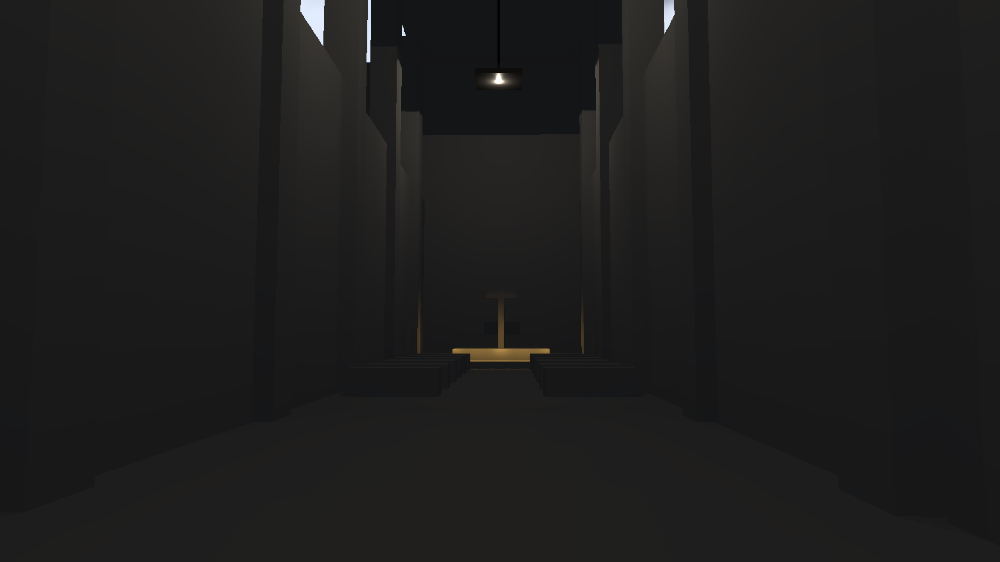

# Directional-budget fast path

Continuation of [PR #248](https://github.com/Far-Beyond-Pulsar/Helio/pull/248), September 12, 2026.

## Change and correctness argument

HLFS normally scans each sample's proposals twice: first to find a directional/local weighting budget, then to fill its reservoir. For a set with no directional light, the directional scale is exactly 1. The proposal-budget scan and the guide-budget score scan therefore cannot affect the reservoir or normalization. Both are skipped when the flag proves they are unnecessary.

The coarse grid now records a conservative `has_directional` flag while examining lights, and propagates it to each fine tile. Directional lights intersect every tile, so the flag remains conservative when either grid overflows and the sampler uses the global light population. The >65,535-light path skips coarse inspection and explicitly sets the flag to 1; it retains the original budget calculation. The same flag covers IDs reused from the visible guide, since a directional light cannot be excluded from the coarse tile. The fast path does not change sample counts, candidate counts, proposal support, discovery probabilities, selected-light visibility, BRDF evaluation or denoising.

After filling the hidden reservoir, the random state is assigned from the proposal replay stream. It therefore advances by exactly the same number of draws regardless of whether the budget scan ran. No per-pixel candidate arrays are introduced.

Grid records grow by one u32 each. Requested additional allocation is 234,080 bytes at 2560x1440 and 526,560 bytes at 3840x2160, independent of sample scale. No extra dispatch or CPU light scan is added.

## Validation

All five RT correctness tests, all 14 ScreenSpace GPU regressions, and both configuration/WGSL tests passed with the fast path. They cover mixed light convergence, thin geometry, missing TLAS, perspective receiver bias, packed-ID overflow and output formats. GPU correctness tests ran during CPU compilation; their elapsed time is not performance evidence.

The explicit `benchmark_candidate_output_audit` exports 16 frames of linear f32 RGB output for four cases: local and mixed directional/point/spot lights, each with a 48-light tile list or a 1,024-light global overflow population. Inputs include zero-energy lights, changing blockers, moving lights, history reuse, full/half resolution, and 1/8/16 configured candidate counts. The comparator in `scripts/compare_hlfs_rt_audits.py` records hashes, changed values, mean error and NRMSE.

The final release build and baseline are byte-identical in all three overflow cases: 1,024 local lights, 1,024 mixed lights, and 65,536 mixed lights (152,880 floats per case). The final audit extends the original four-case audit with the packed-ID boundary. See [the final output audit](rt-control/directional-budget/final-output-audit.json).

Tile-list output is not bit-identical, and a [baseline-versus-baseline repeat](rt-control/directional-budget/release-baseline-repeat.json) confirms existing variation from atomic insertion order. Final-versus-baseline mean changes are 0.066%/1.64% for local/mixed tile cases. Their cross-run NRMSE is 6.88%/59.42%, compared with 6.33%/49.49% between baseline runs. The one-candidate mixed case has substantial stochastic noise. These cross-run comparisons do not establish a visual quality pass, and the frozen image-error gate remains separate. The existing converged mixed-light oracle regression passes.

The sampled 1440p cathedral frame was captured and visually inspected for the baseline, intermediate variant and final variant. All three PNGs have the same SHA-256 hash, recorded in [capture metadata](rt-control/directional-budget/capture-hashes.json). The dark scene appearance remains unresolved; these 17-light images are not performance evidence or a visual acceptance pass.



## Exploratory development runs

An earlier candidate cached up to 16 proposal IDs/scores in private arrays to avoid replay evaluation. Its first development run measured 14.23 ms against 12.37 ms baseline. It was not adopted; the [patch](rt-control/directional-budget/candidate-cache.patch) is retained as a rejected adoption experiment, not proof that caching is always slower.

Development-build directional-flag runs measured 14.09/14.66 ms. CPU submission was roughly 35-46 ms across the development runs, and GPU clocks varied substantially. Changes in untouched stages make those timings insufficient for choosing an optimization. See [exploratory metadata](rt-control/directional-budget/exploratory-debug.json). Release binaries are built before the comparative GPU runs; GPU clock, utilization, temperature and power telemetry is collected alongside them.

## Final release comparison

Three serial A-C-C-A blocks each used 120 warmup and 600 measured frames per run, with 1,024 moving lights and 256 moving instances. C skips both proposal and guide budget scoring where safe; A is the original streaming baseline. Binaries were built first, and no other benchmark or compiler ran during these measurements. At 2560x1440 output, half-width/half-height sampling, 2 samples and 8 configured candidates:

| Implementation | Pooled GPU median | Pooled GPU p95 | Sampling-stage median |
| --- | ---: | ---: | ---: |
| Baseline | 11.9910 ms | 14.1363 ms | 8.5750 ms |
| Final directional-budget fast path | 9.7766 ms | 11.8088 ms | 6.1870 ms |

This is an **18.47% reduction in pooled median GPU time**. Each variant contributed 3,600 measured frames. All six candidate run medians (9.194-10.126 ms) were below all six baseline run medians (11.890-12.092 ms). Median spatial/composite timings are unchanged, while the fine-grid flag adds approximately 0.004 ms. Stage medians need not sum to the median frame total.

The change is retained. **The 3-4 ms target is still not met.** These results do not establish production RT readiness.

[Final per-run results, binary hashes and pooled statistics](rt-control/directional-budget/final-summary.json), twelve `final-*.csv` frame records, and `final-telemetry.csv` are stored beside the report artifacts. [The final production patch](rt-control/directional-budget/final-production-change.patch) isolates the shader/grid change for cross-build comparison using the same current harness.

An intermediate variant B skipped only proposal-budget scoring. Its separate three-block experiment measured 12.0090 -> 10.2446 ms median and 13.7472 -> 12.1293 ms p95 (14.69%). Those [earlier results](rt-control/directional-budget/release-summary.json), their twelve `release-*.csv` files and two telemetry files remain available. `production-change.patch` reproduces B; it is superseded by `final-production-change.patch`. One initial C smoke probe overlapped the end of a visual capture and is excluded from the final comparison.

## Wider resolutions

These are one run per implementation per resolution, each with 120 warmup/600 measured frames. A/B ran consecutively; final C ran after the repeated primary comparison. They are wider-resolution coverage, not repeated comparative acceptance blocks. Light/sample/candidate counts and moving instances remain the same.

| Output and shading | Baseline median / p95 | Final median / p95 |
| --- | ---: | ---: |
| 1440p, native shading | 42.7612 / 47.3068 ms | 32.7670 / 34.7494 ms |
| 4K, half-width/half-height shading | 25.3962 / 28.6423 ms | 21.0944 / 24.2524 ms |

[Resolution metadata and per-frame data](rt-control/directional-budget/resolution-probes.json) preserve the intermediate B results as well. Neither row is a whole-frame latency or an engine comparison.

## Reproduce

Select `1440p-reconstructed`, `1440p-native` or `4k-reconstructed`:

```powershell
$env:HLFS_RT_PROBE_FOCUS = '1440p-reconstructed'
$env:HLFS_RT_PROBE_OUTPUT = 'target/rt-budget-probe'
cargo test --release -p helio-pass-hlfs --test gpu_hlfs_rt benchmark_rt_resolution_and_acceleration -- --ignored --nocapture --test-threads=1
```

Build binaries before timing comparisons. For the cross-build output audit, set `HLFS_RT_AUDIT_OUTPUT` and run `benchmark_candidate_output_audit` with the same explicit GPU flags, then run `python scripts/compare_hlfs_rt_audits.py BASELINE_DIR CANDIDATE_DIR OUTPUT.json`. Reverse the final production patch to build the baseline while retaining the same harness, and restore it before building the candidate. The script requires exact equality for the overflow cases and reports tile-list differences without interpreting them as a quality pass.

A relative output path is resolved from the test crate's working directory when invoked through Cargo. Direct executable invocation instead uses the shell's working directory.

## Scope

This is a synthetic work-accounting comparison, not completion of the frozen scene/quality protocol. The GPU sum covers six HLFS stages plus TLAS rebuild for 256 moving triangle instances with a cached BLAS. It excludes initial BLAS construction, upload GPU cost, real scene CPU preparation, GBuffer, AA and the remaining frame. Changing light generation disables temporal composite repair reuse; it does not invalidate the reweighted sampler guide. The earlier validation record has been corrected on that distinction.
