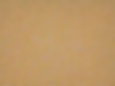
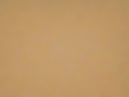
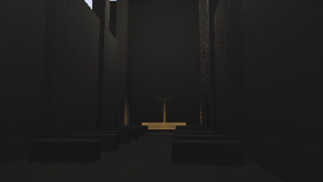
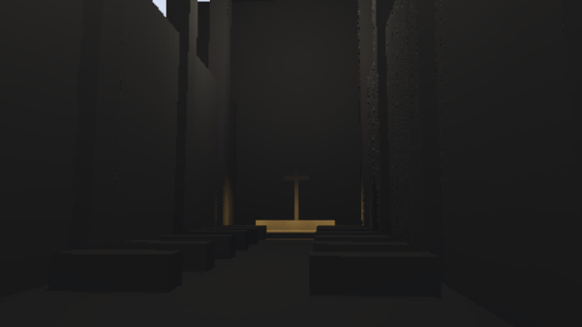

# Reduced-resolution energy and sampling corrections

Validated on 2026-09-08 on RTX 3060 / Vulkan / driver 616.64 against
`958d76aa505b25f492c7f907bc1767efb6d0ad43`. This resolves the failed promotion
gates in the [previous audit](followup.md), without relaxing their tolerances.

## Causes and fixes

History reprojection used the allocated shading texture dimensions to scale
full-resolution UVs. At 65x49, half-resolution storage is 33x25, but each sample
still covers a fixed 2x2 block. Scaling by 33/65 stretched the coordinate mapping:
for example, the center of full-resolution pixel 33 mapped to shading cell 17
instead of 16. Repeated temporal lookups transported the lighting history into
neighboring cells. Reprojection now uses `uv * screen_size / sample_scale` in
temporal history, visible-light guiding, and missing-sample reconstruction.

A separate reservoir issue reused the residual of repeated interval warps for
the visible/hidden group choice. Those warps preserve an ideal continuous uniform
distribution, but distort a finite set of 8-bit noise ranks. As a numerical check,
16 equal-weight reservoir additions with four stratified samples select the
hidden group for about 22.85% of those ranks at a nominal 20% probability.
Each sample now uses a separate full-range STBN dimension for the group choice.
Reservoir sampling retains stratification, interval warping and PDF correction.

No shadow budget, candidate budget, exposure threshold or error tolerance changed.
The prior guide-score optimization is retained. No new GPU resource is allocated.

## Stage isolation

The 65-light probe uses a 65x49 plane, native packed HDR, 32 warmup frames and
64 averaged frames. Signed errors below compare mean image energy against the
same full-light reference:

| Variant | Two samples, raw | Two samples, final | Four samples, raw | Four samples, final |
| --- | ---: | ---: | ---: | ---: |
| Before | +1.94% | -29.68% | +9.32% | -19.22% |
| Coordinate fix only | +1.85% | -2.49% | +9.31% | +9.31% |
| Both fixes | +0.10% | -0.13% | -0.13% | -0.28% |

Bypassing the spatial filter while retaining temporal filtering left the original
two-sample error at -29.74%. This isolated the main loss to the temporal stage;
the coordinate fix then exposed the separate raw four-sample excess. The raw
and final odd/even-size probes are now regular GPU regressions. Ablation values,
all per-run timings, p95 values and image metrics are in
[gpu-energy-fix.json](gpu-energy-fix.json).

## Quality gates

The original 8% mean-energy and 20% normalized-image-error limits remain intact.
Fourteen GPU regressions pass, including the formerly failing promotion cases.
The reduced-resolution contact case was additionally expanded and passes after
both ordinary and one-pixel occluders move away. Two CPU tests validate defaults
and all seven WGSL programs; root build/tests and the cathedral example build pass.

- At 65 lights, single-frame mean error falls from 29.49% to 0.32% for two samples,
  and from 17.17% to 0.24% for four samples. Growth through 257 and 1024 lights,
  removal, same-count extinction and low pre-exposure also pass.
- The occluded strong-light case is within 5.9% for two samples and 5.6% for four;
  after revealing that light, both are within 0.8%.
- Mixed colored/directional lights with packed output improve from 10.93% to
  4.06% NRMSE for two samples and from 10.35% to 2.99% for four samples. Mean
  errors are 1.01% and 0.76%, respectively.
- During a 64-frame moving-camera test, worst mean error is 6.2% at 65x49 and
  2.3% at 128x96; worst NRMSE is 12.6% and 5.0%, respectively. All four sample
  phases retain isolated one-pixel geometry. Removed contact shadows clear on
  the following frame.

| Full-light mixed reference | Compact, two samples | Performance, four samples |
| --- | --- | --- |
|  |  |  |

## Rendering and performance

Default, compact, performance and reference presets each completed the 100-frame
cathedral camera path. All four saved reference frames match the prior reference
captures. Compact output has at most 6.3% normalized display-image RMSE across
the saved moving-camera frames. These display metrics are not HDR energy metrics;
reduced-resolution edge noise remains visible.

| Cathedral reference, frame 99 | Compact, frame 99 | Performance, frame 99 |
| --- | --- | --- |
|  |  |  |

At 1920x1080 and 1024 lights, two serial run medians after the fixes were:

| Setting | HLFS GPU time | Requested pass storage |
| --- | ---: | ---: |
| Full, 2 samples, RGBA16F | 24.04-25.06 ms | 104.31 MiB |
| Half, 4 samples, packed HDR | 8.71-10.24 ms | 33.56 MiB |
| Half, 2 samples, packed HDR | 7.00-7.25 ms | 33.56 MiB |

The matched runs use before/after/after/before ordering, 16 warmup and 40 measured
frames per case, with builds idle and no overlapping benchmark processes. Timing
variation is visible: the incorrect two-sample baseline measured 6.36-6.99 ms.
The fixes establish quality at the cheaper sample budget; they do not establish
an independent speedup over the incorrect implementation. These are synthetic
pass measurements, not whole-frame or console targets.

`HlfsConfig::compact()` now exposes the validated two-sample, half-resolution
setting. `performance()` retains four samples; the default retains full
resolution. Choose `HlfsPass::preferred_output_format()` separately at pass
creation for packed HDR (or RGBA16F fallback). Reproduction:

```text
cargo test -p helio-pass-hlfs --test gpu_hlfs -- --ignored --skip benchmark --nocapture --test-threads=1
cargo test -p helio-pass-hlfs --test gpu_hlfs benchmark_gameplay_resolution_stages -- --ignored --nocapture --test-threads=1
```

Set `HLFS_PERFORMANCE=1` and `HLFS_SAMPLE_COUNT=2` for the compact cathedral
capture; the command is in the pass README. Hardware-ray visibility and candidate
pruning remain separate follow-up work.
