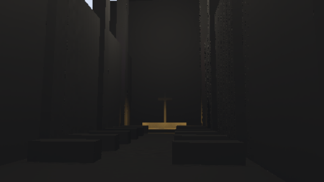

# Guide scoring and reduced-resolution audit

Measured on 2026-09-08 with RTX 3060 / Vulkan / driver 616.64 against
`49da777f9de6a3d4366bc95c33e47b253102394b`.

## Accepted optimization

Guided directional/local importance totals are now accumulated once per shading
pixel, outside the sample loop. The guide list, surface and accumulation order
are unchanged; hidden proposals, random-number progression, reservoir selection
and visibility evaluation retain their existing behavior. No private candidate
arrays or additional GPU allocations are introduced.

Five 129x97 linear HDR captures are byte-identical before/after: full two-sample,
half two/four-sample RGBA16F, and half two/four-sample packed HDR. The 100-frame
standard cathedral camera path also completed; saved frames 0, 31, 63 and 99 are
pixel-identical to the pre-optimization captures. These checks cover the recorded
scenes and settings, not every possible scene or GPU compiler.

The stage benchmark uses 16 warmup and 40 measured frames per case at 1920x1080.
Two runs of each shader were executed serially in before/after/after/before
order, without concurrent builds. Ranges below span the two run medians:

| Setting | Lights | Before, ms | After, ms |
| --- | ---: | ---: | ---: |
| Full, 2 samples, RGBA16F | 64 | 22.09-22.18 | 19.77-19.77 |
| Full, 2 samples, RGBA16F | 1024 | 23.55-24.89 | 22.54-22.61 |
| Half, 4 samples, packed HDR | 64 | 8.76-8.81 | 8.15-8.42 |
| Half, 4 samples, packed HDR | 1024 | 9.78-10.06 | 9.19-9.30 |

All 64 case results, p95 values, per-stage medians, allocations and equivalence
hashes are retained in [gpu-followup.json](gpu-followup.json). Desktop scheduling
variation is visible in several other cases; do not extrapolate a universal
percentage speedup. These are synthetic pass GPU times, not whole-frame or
console measurements. The small-light path bypasses the changed loop.

## Rejected two-sample preset

Half-resolution two-sample packed HDR measured 6.16-6.80 ms at 1024 lights and
uses the same 35,193,240 bytes (33.56 MiB) as four samples. Mixed colored lights
passed the existing 8% mean-error / 20% normalized-RMSE limits: two samples had
5.81% mean error and 10.93% NRMSE; four samples had 6.03% and 10.35%.

However, the broader energy gates failed. At 65 identical lights, two samples
lost 29.49% of mean image energy; four samples lost 17.17%. With a strong light
occluded, both reduced-resolution settings lost about 16-18%. All exceed the
pre-existing 8% tolerance. These failures were reproduced with the original
shader as well as the optimized shader. The lower-sample setting was therefore
**not promoted** to a public named preset, and the existing `performance()`
setting is now explicitly documented as experimental. The full-resolution
default and existing preset values are unchanged. The underlying source of the
reduced-resolution bias needs a separate investigation; a faster timing or a
good-looking cathedral frame does not resolve it.

The experimental 100-frame camera path completed and isolated one-pixel geometry
remained lit in all four sample phases. The retained frame also shows edge noise:



The two CPU tests (including all seven WGSL programs), eleven normal GPU
regressions, root build/tests and cathedral example build pass. The additional
explicit promotion audit is a **known failure**, not included in that pass count.
It runs both energy and hidden-light cases before reporting rejection, retaining
the original tolerances. Reproduce it in PowerShell (exit 101 is the recorded
quality failure):

```powershell
$env:WGPU_BACKEND = 'vulkan'
$env:HLFS_QUALITY_SPP = '2' # Repeat with '4' for the existing performance setting.
cargo test -p helio-pass-hlfs --test gpu_hlfs benchmark_reduced_resolution_quality_gate -- --ignored --nocapture --test-threads=1
```

For the experimental capture, set `HLFS_PERFORMANCE=1` and
`HLFS_SAMPLE_COUNT=2`, then use the cathedral capture command in the pass README.
The next quality step is to isolate the reduced-resolution energy loss and pass
these gates before promoting a cheaper preset. Hardware-ray visibility and
candidate pruning remain separate follow-up work.
