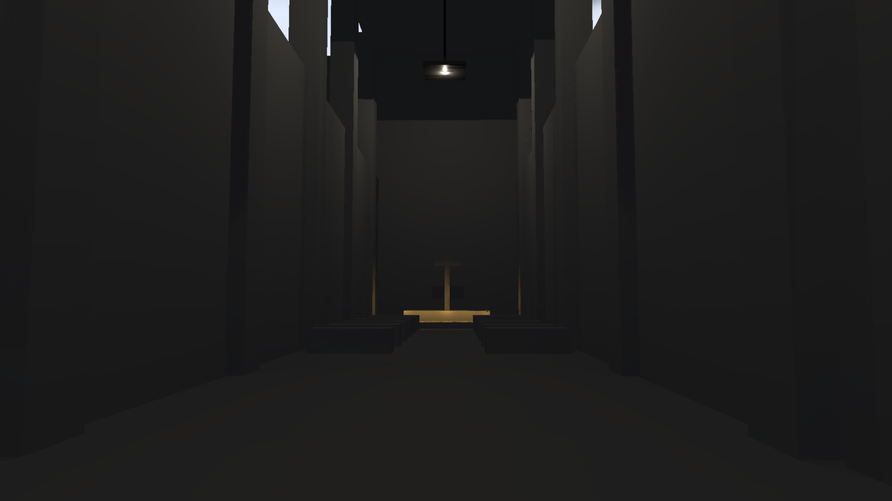
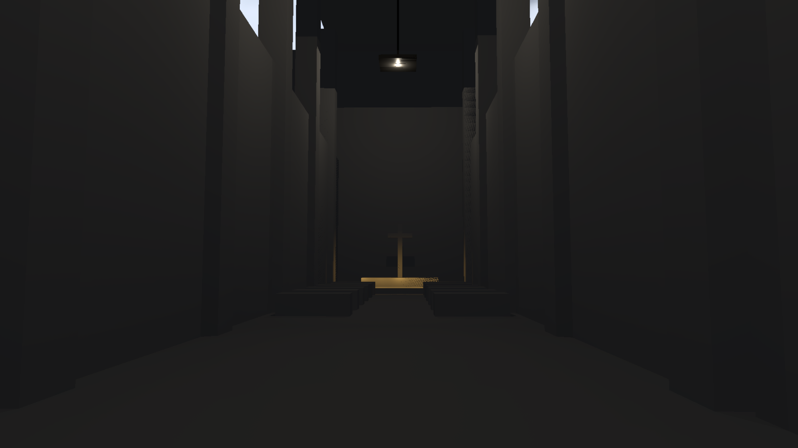

# Ray-traced HLFS implementation control

September 12, 2026. Implementation continues in [PR #248](https://github.com/Far-Beyond-Pulsar/Helio/pull/248), with [issue #247](https://github.com/Far-Beyond-Pulsar/Helio/issues/247) still in progress. The research document remains the design record; this is the first executable opaque-triangle control.

## Implemented

- `HlfsMode::RayTraced` uses hardware ray queries in both stochastic sampling and full-resolution reconstruction repair. The existing bounded visibility-guided estimator, filtering, history and output remain shared with ScreenSpace mode.
- Explicit configuration validation rejects missing hardware features/limits. A missing TLAS fails preparation; visibility does not silently fall back to screen-space depth. Mode changes invalidate history and preserve the output allocation unless its size changes.
- The normal renderer detects passes requiring RT and prepares scene acceleration before graph execution. The caster set includes off-screen objects and respects hidden groups and shadow-caster flags.
- BLAS caching keys mesh generation, geometry revision, source buffer identity and allocation range. Dynamic vertex updates advance the revision. Shared GPU pools use GPU copies when their buffers lack `BLAS_INPUT`; no CPU geometry readback or per-mesh host wait is introduced. External writers of adopted mesh ranges must call `Scene::invalidate_ray_tracing_mesh` after in-place changes.
- TLAS capacity grows instead of dropping instances; removals clear stale slots. Invalid geometry clears readiness. An abandoned scene-build encoder clears its unsubmitted cache entries.
- A light's explicit RT shadow intent survives atlas capacity exhaustion through two previously reserved bits in the existing 128-byte light structure. Low-level callers should use `GpuLight::set_ray_traced_shadows`; legacy unset bits continue to infer intent from `shadow_index`.

## Validation

Executed on NVIDIA RTX 3060, Vulkan, driver 616.64. Hardware tests are explicitly ignored in ordinary CI because they require a ray-query device; the commands below opt in and fail rather than silently skip unsupported hardware.

```powershell
cargo test -p helio-core --test ray_acceleration -- --ignored --nocapture --test-threads=1
cargo test -p helio-pass-hlfs --test gpu_hlfs_rt -- --ignored --nocapture --test-threads=1
```

All four acceleration tests and all four HLFS RT tests passed. Coverage includes actual hit/miss changes after mesh edits and buffer replacement, indexed suballocations, COPY_SRC pool inputs with 40-byte vertex strides, TLAS growth/removal/empty scenes, invalid replacements, off-screen blockers, blockers beyond the light, explicit disabled shadows, thin-surface reconstruction across sampling phases, missing TLAS and unsupported mode changes.

The integrated cathedral capture exposed an allocation bug not represented by tightly packed triangle fixtures: BLAS input validation requires the entire last vertex stride. The allocation was corrected and the padded pool regression was added.

The light-layout/intent unit test and both HLFS configuration/WGSL validation tests also passed.

The integrated 100-frame 1440p sampled and all-light RT runs completed without GPU validation errors. Visual inspection is **not a pass**: both are dark and the all-light image has visible surface speckling, requiring investigation of bias, reconstruction and scene light placement before acceptance. The all-light run shares geometry and reconstruction code and is not an independent ground-truth renderer.





Observed serialized whole-frame median/p95 latencies were 80.669/141.905 ms (sampled) and 63.895/98.695 ms (all-light). These development-build smoke runs ran while CPU compilation was active, use only 17 lights, and do not follow the frozen benchmark protocol. They establish neither comparative speed nor the direct-lighting budget.

A 100-frame 3840x2160 sampled smoke run also completed without GPU validation errors (whole-frame median/p95 79.192/107.039 ms). Its [frame 31 capture](rt-control/4k-sampled.png) was inspected and retains the dark appearance. This is resolution/dispatch coverage only, not the 1,024-light 4K stress acceptance gate.

## Run the integrated capture

```powershell
$env:WGPU_BACKEND = 'vulkan'
$env:HLFS_RT = '1'
$env:HLFS_RESOLUTION = '1440p' # or '4k'; omitted uses 640x360
cargo run -p examples --bin indoor_cathedral_hlfs -- --capture target/hlfs-rt-capture
```

The demo helper now explicitly marks its objects as shadow casters/receivers. The capture contains 17 lights, and therefore cannot establish the 1,024-light target. Capture latency is serialized CPU + GPU frame latency, not direct-lighting GPU time.

## Remaining gates

This control is experimental and is not a merge-ready completion of issue #247. The 1440p, 1,024-light, 3–4 ms target and 4K stress gates are unproven. Run the frozen [validation protocol](../../hlfs_ray_traced_validation.md) before claiming them.

The current scene path scans CPU objects and rebuilds TLAS every RT frame. Its submission is outside render-graph stage timestamps: those timestamps omit acceleration preparation. Include acceleration GPU cost and scene CPU cost in the eventual budget. BLAS builds currently favor trace speed; refit/rebuild policy and asynchronous scheduling still need measured comparison.

Masked, transparent and custom-shader casters, virtual geometry, voxel volumes, foliage, non-world coordinate spaces and stereo are not supported by this integration and are rejected explicitly. Low-level externally supplied TLAS data must likewise represent the intended opaque caster set. Directional shadows have a configurable finite ray distance (10 km default); local light rays end at the light. Self-intersection bias, temporal disocclusion, moving occluders and material transitions need broader visual stress coverage.

Tile presampling, full ReSTIR DI, stable light-generation reuse and inclusive timing instrumentation remain subsequent implementation work. No matched engine performance comparison or production performance claim is made by these correctness tests.
