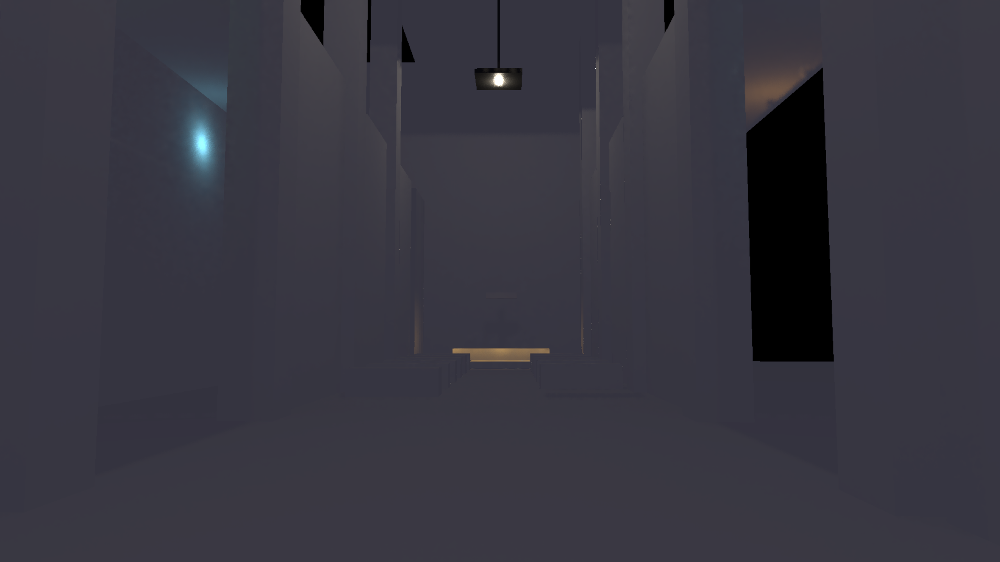
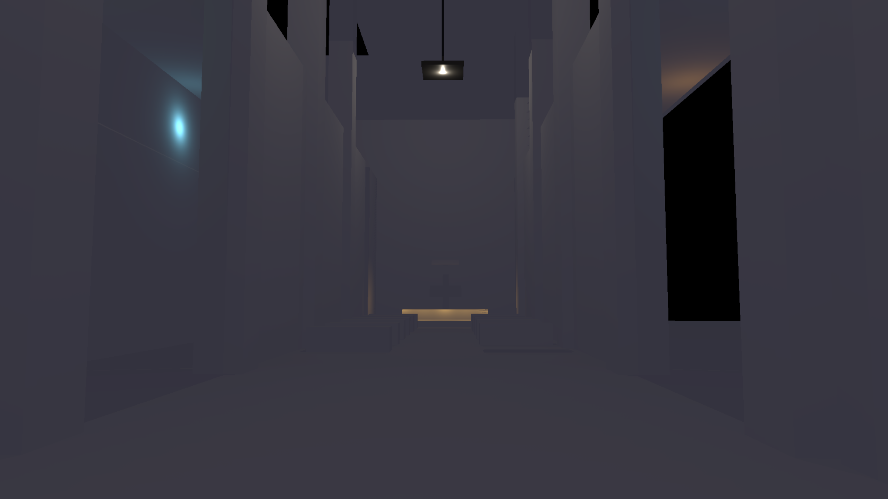

# SceneDB RT port — 2026-09-19

This ports the existing experimental RT tier from `c7a9b99b` to main
`02247938`, which removed the renderer-owned Scene/GpuScene. It does not change
the sampling algorithm. The frontend now projects SceneDB opaque static objects
into acceleration structures and publishes a frame-scoped TLAS through the
existing RenderEnvironment contract. Off-screen casters remain included.

The missing profiler dependency came from main's local
`../../../crates/profiling` path. The required context APIs are published in
Pulsar-Native, so Cargo.toml and Cargo.lock now pin remote commit
`45cda191beb316fee0859ae40d59f0dff986a66a`. No external local profiler checkout
is required. Repository-internal workspace paths remain normal Cargo members.

## Correctness and images

- 2 shader/configuration tests, 14 screen-space tests, 7 RT tests, and 4 core
  acceleration tests passed on RTX 3060 / Vulkan / driver 616.64.
- The new SceneDB regression exercises actual GPU mirror buffers: an off-screen
  blocker, an in-place mesh edit, an object transform, removal, an unsupported
  material, and missing next-frame acceleration publication.
- All 90 reserved-seed final-image checks pass. Unfiltered output passes only
  6/90 checks; the 84 failures are retained in `quality.csv`.
- Release cathedral example builds. Matched 32-frame 1440p sampled and all-light
  captures render and were visually inspected. Both remain dark; sampled bright
  details remain noisy and some boundaries differ. These images are not visual
  acceptance and this small scene is not the 1,024-light workload.

Capture latency is not reported as performance evidence: correctness builds
were active during capture. Isolated synthetic timing runs are recorded below.

## Isolated timing

Three serial A/B/B/A blocks compare pre-migration `c7a9b99b` (A) with this port
(U in filenames), using the same one-sample/eight-candidate presampled tier.
Each run has 120 warmup and 600 measured frames, 1,024 moving lights and 256
moving triangle instances. Compiles and capture jobs finished before these runs.
Raw per-frame CSVs, run logs, telemetry, the script and binary SHA-256 hashes
are retained here. This measures six HLFS GPU stages plus TLAS rebuilding;
initial BLAS/upload, frontend SceneDB scanning/hashing and the rest of the frame
are excluded. It is a small synthetic workload, not a whole-frame guarantee.

| Configuration | GPU median (ms) | GPU p95 (ms) |
| --- | ---: | ---: |
| Pre-migration reconstructed 1440p, six runs | 3.35–3.51 | 3.81–5.63 |
| SceneDB port reconstructed 1440p, six runs | 3.31–3.34 | 3.81–4.12 |
| SceneDB port native 1440p | 9.70 | 10.20 |
| SceneDB port reconstructed 4K | 7.54 | 8.14 |

All six port runs meet the synthetic <=4 ms median / <=5 ms p95 gates.
The GPU medians are effectively preserved; this is not evidence of an algorithmic
speedup from the migration. The old binary's slow p95 runs are retained. CPU
submission medians differ between binaries and are not representative frontend
SceneDB preparation measurements.

## Scope and remaining work

The projection supports opaque indexed world-space StaticObjectComponent
casters. It rejects masked/custom materials, incompatible draw ranges, stale
mesh/material generations and known unsupported geometry buffers. Other geometry
producers still need explicit projections; this is not universal scene support.

Mesh bytes are hashed once per referenced mesh per frame and object rows are
scanned on the CPU. This correctness-first invalidation has a CPU cost excluded
from GPU pass timing. Allocation epochs cannot prove that light contents are
unchanged, so composite repair history reuse is conservatively disabled.
The regular temporal lighting filter remains active. Light sampling includes all
allocated SceneDB slots (including zeroed vacant rows), avoiding the migrated
fixed 256-light truncation but potentially increasing work for sparse tables.

Keep PR #248 draft and tracker In Progress. Dense geometry, larger instance
counts, camera/glossy stress, direct-only error, discovery counters and visual
acceptance remain open. Native 1440p and reconstructed 4K have not met 4 ms.
