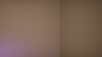
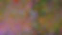

# Current-frame tile presampling (September 19, 2026)

This is an experimental direct-lighting tier in PR #248, based on
`95dde71d209cdc87ba12a710ce96bfccf1a13a07`. It is not production acceptance of
the million-triangle/10,000-instance protocol. The PR and issue remain In Progress.

## Implementation

The unchanged sampler benefits from cooperative 12x12 shared-memory halos for
its 5x5 temporal and spatial filters, selection before ray traversal, parallel
visibility-weight reduction, and sorting only the retained 16 light identities.
These optimizations are separated from the new estimator below.

The opt-in `HlfsConfig::ray_traced_presampled()` uses one ray sample and eight
candidates at half output width/height. The existing coarse-grid dispatch creates
64 weighted stratum reservoirs per 64x64 output tile and a Vose alias table over
stratum weights. Per-pixel candidates mix these current-frame proposals with
1/16 uniform discovery and use the mixture probability for normalization.
The pixel target is unshadowed BRDF luminance, and previous visible-ID guidance
is disabled for this tier. This is hierarchical current-frame RIS, not ReSTIR.
The sampler is compiled for the selected proposal mode so unused guidance code
can be eliminated. Changing modes rebuilds those pipelines and invalidates history.

Proposal storage adds 1,177,600 bytes at 2560x1440, or a 20-byte dummy when
disabled. Populations beyond packed 16-bit IDs use the existing global fallback.
No additional dispatch is needed. Initial compilation and scene construction
are outside the reported steady-state timings.

Reactive filtering uses the geometry-compatible current 5x5 neighborhood mean,
confidence-of-the-mean clipping, and a 5% luminance bound. Inconsistent history is
replaced by that neighborhood estimate. This intentionally changes image quality
and can blur or retain visible noise; it is not an exact-output optimization.
The default and existing presets retain the original estimator and history mode.

## Measurements and claim boundary

The performance harness renders 2560x1440 output from 1280x720 shading, with
1,024 moving lights and 256 moving triangle instances. It measures six HLFS
stages plus current-frame TLAS construction, with 120 warmup and 600 measured
frames per run. CPU submission is also exported. Initial BLAS/upload and the
rest of the renderer are excluded; this is not whole-frame latency.

An earlier runtime-branch candidate had five 3.49-3.55 ms runs and one
4.098 ms / 9.338 ms p95 failure. All raw runs are retained under
`rt-presample-final-*.csv`; the failure is not averaged away. A broad local
filesystem search occurred during that sequence, but no causal attribution was
established. The specialized candidate is tested in a new isolated sequence.

The specialized candidate passed all six reconstructed-1440p timing runs:
**3.320-3.525 ms median, 3.829-4.970 ms p95**. The three paired blocks saved
60.6-62.8% versus the two-sample baseline. The mean paired saving is 5.36 ms
(95% t interval across three block differences: 4.72-6.00 ms). This comparison
changes both sampling budget and estimator; it is not an equal-quality proof.
The separate held-out checks below bound only the tested small scene.

| Run | Median ms | p95 ms | p99 ms |
| --- | ---: | ---: | ---: |
| rt-isolated-1-1-A | 8.887 | 11.826 | 16.479 |
| rt-isolated-1-2-U | 3.334 | 4.769 | 5.190 |
| rt-isolated-1-3-U | 3.344 | 4.970 | 5.228 |
| rt-isolated-1-4-A | 9.059 | 11.541 | 16.712 |
| rt-isolated-2-5-A | 8.996 | 10.139 | 13.708 |
| rt-isolated-2-6-U | 3.336 | 4.953 | 5.207 |
| rt-isolated-2-7-U | 3.525 | 4.213 | 4.392 |
| rt-isolated-2-8-A | 8.520 | 9.185 | 15.544 |
| rt-isolated-3-9-A | 8.460 | 9.671 | 15.490 |
| rt-isolated-3-10-U | 3.320 | 4.059 | 4.226 |
| rt-isolated-3-11-U | 3.349 | 3.829 | 3.982 |
| rt-isolated-3-12-A | 8.450 | 10.854 | 15.563 |
| rt-isolated-1440p-native | 9.717 | 10.658 | 29.272 |
| rt-isolated-4k-reconstructed | 7.558 | 8.695 | 19.396 |

A is the unchanged 95dde71 executable (two samples/eight candidates); U is the
specialized experimental tier (one/eight). Native 1440p is **9.717 ms**, and
reconstructed 4K is **7.558 ms**. Neither meets the 4 ms target. See
[timing-summary.json](timing-summary.json), per-frame CSVs, and telemetry for the
complete measurements. The final telemetry row is partial because the logger
was stopped; per-frame GPU CSVs are complete. The final sequence ran after all builds, tests and other
benchmark processes finished. No run is discarded.

## Quality and failed experiments

`development-protocol.md` records the frozen small-scene metrics and withheld
seeds. The fixture is a 129x73 receiver with 1,024 colored point lights, one
bright dominant light, moving lights, and an appearing/disappearing blocker.
It compares final and unfiltered output against the all-light hardware-query
reference. The reference shares the BRDF; independent analytic visibility
regressions are separate. Metrics include a fixed ambient term.

All intermediate quality CSVs are retained, including failures. I is the exact
optimization control; J tightens history alone; K removes the legacy discovery
cap; L combines those; M adds coarse proposals; N changes clipping; O resets
inconsistent history to the neighborhood mean; P removes legacy guidance and
uses the BRDF target; Q tries 256 strata; R uses a weighted CDF; S adds the 5%
luminance history bound; T replaces CDF lookup with an alias table and uniform
support mixture. U specializes the same T shader algorithm at compilation.
These are development ablations, not independent acceptance comparisons.

The retained one/eight T tier passed 68 whole-image and 22 changed-region
final-output checks on the reserved seeds. Raw output remains noisy and fails
some quality thresholds. Visual inspection also shows colored residual noise
around the changing shadow. A numerical final-image pass does not establish
production visual approval.

Outstanding acceptance work includes dense geometry, camera motion/disocclusion,
glossy surfaces, thin/masked geometry policy, direct-only error, dominant-light
discovery counters, and normal render-graph critical-path measurements. Native
1440p and reconstructed 4K are separate stress cases, not covered by a 1440p
reconstruction timing pass. Do not mark this PR ready to merge on this evidence.

## Final checks and captures

- Six RT regressions, 14 ScreenSpace regressions, and two configuration/WGSL tests
  passed. Both proposal shader specializations validate.
- The specialized final shader passes all 90 held-out final-output checks:
  maximum whole-image mean error 6.06% / NRMSE 15.14%; changed-region maxima
  7.60% / 16.46%. Raw passes only 6/90 checks and reaches 80.16% changed-region
  NRMSE. Both sets are retained in [held-out-summary.json](held-out-summary.json).
- With experimental flags disabled, 2,446,080 overflow-case float values are
  bit-identical to the baseline across one through four samples, including HDR
  materials and 65,536 lights. Local grid cases differ because atomic insertion
  order is not stable; their results are reported, not called bit-identical.
  See [default-output-audit.json](default-output-audit.json) and a fresh identical-binary
  [baseline repeat](baseline-repeatability.json), which also differs in local grids.
- Fresh integrated 1440p sampled and all-light cathedral captures completed and
  were visually inspected. The sampled frame shows more speckling near the
  bright fixture and distant wall edge; both remain dark. These 17-light images
  do not constitute visual acceptance or many-light performance evidence.
  Serialized CPU+GPU frame medians are 13.261 ms sampled and 13.905 ms reference
  (16 post-warmup frames only, capture readback excluded), separate from the
  synthetic GPU timing series.

[Sampled cathedral](cathedral-sampled.png) / [all-light cathedral](cathedral-reference.png)

Held-out seed 101, frame 65, appearing shadow:

## Reproduction

Build with `cargo test -p helio-pass-hlfs --release --no-run`; run the ignored GPU
regressions serially, excluding `benchmark_` names. Run benchmarks alone after
compilation completes. The checked-in PowerShell timing driver expects verified
baseline and final test binaries at the paths it names; compile baseline from
95dde71 in a separate checkout. The baseline executable always uses two/eight;
its lack of the new environment controls is intentional.

For the held-out quality fixture, set `HLFS_RT_QUALITY_HELD_OUT=1`,
`HLFS_RT_QUALITY_SETTING=1:8`, `HLFS_RT_QUALITY_DISCOVERY=1`,
`HLFS_RT_QUALITY_PRESAMPLE=1`, `HLFS_RT_QUALITY_REACTIVE=1`, and an absolute
`HLFS_RT_QUALITY_OUTPUT`, then run `benchmark_rt_quality_frontier --exact
--ignored --nocapture` in the built RT test executable. The experiment exports
failed rows rather than asserting all metrics, so inspect `quality_pass`.

Capture with the release `indoor_cathedral_hlfs --capture <directory>` executable,
`HLFS_RT=1`, `HLFS_PRESAMPLED=1`, `HLFS_RESOLUTION=1440p`, and
`HLFS_CAPTURE_FRAMES=32`; add `HLFS_REFERENCE=1` for the all-light image.
