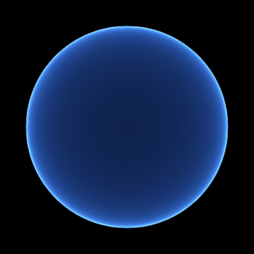

# Orbital atmosphere lookup correction

The planetary fallback used a fixed world-Y panorama with uniformly spaced
sine-elevation rows. From space, its thin spherical atmosphere intersected
only a few rows at varying azimuths. Bilinear filtering leaked bright wedges
outside the shell and undersampled the curved limb.

The planetary lookup now follows the eye's radial horizon. Half its rows
cover surface-facing directions and half cover the limb/sky, with squared
angular distances concentrating samples at the horizon. Outside the shell,
the second half covers only the atmospheric angular band. Generation and
sampling share one encoding. The composite rejects atmosphere rays that
miss the shell at screen resolution. Sphere intersections use perpendicular
distance rather than subtracting two large squared eye distances.

The authored-sky panorama, LUT dimensions (192x108), atmosphere integration
sample counts and terrain shading are retained. This fixes the lookup
artifacts; it does not establish final atmospheric art or whole-frame
performance acceptance.

## Validation

Release default-graph tests: 5 passed, including near-surface rotated skies,
resize, live appearance/history, residency and editor overlays. The new
orbital test renders 513x513 at the north pole, equator, tilted 3-radius eye
and distant 16-radius eye. It checks every pixel outside the shell plus a
two-pixel final-graph antialiasing footprint, and all 24 illuminated limb
sectors. All corrected cases have zero bright pixels outside that footprint
and no missing limb sectors.

The same test fails against the previous shaders with 4,244 / 128,252
outside pixels lit in its first case. These captures isolate the atmosphere
without terrain to expose its sampling, so the disc's interior shows the
sky that terrain normally covers.

Before:

Corrected distant tilted view:

Native viewport comparison and release validation are recorded in the
[Pulsar companion report](https://github.com/Far-Beyond-Pulsar/Pulsar-Native/blob/codex/voxel-flight-integration/docs/voxel-atmosphere-2026-10-01/README.md).
Keep both companion PRs drafts. The existing 5 ms, canonical distance
geometry and other outstanding acceptance gates remain open.
