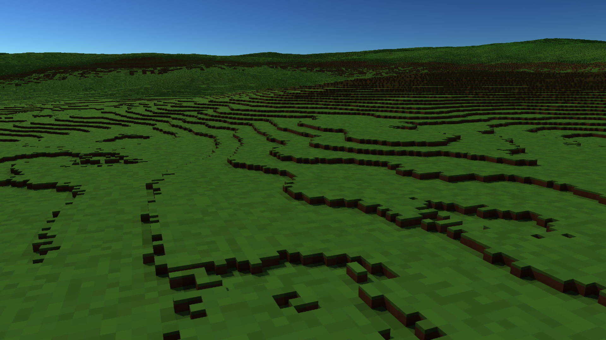
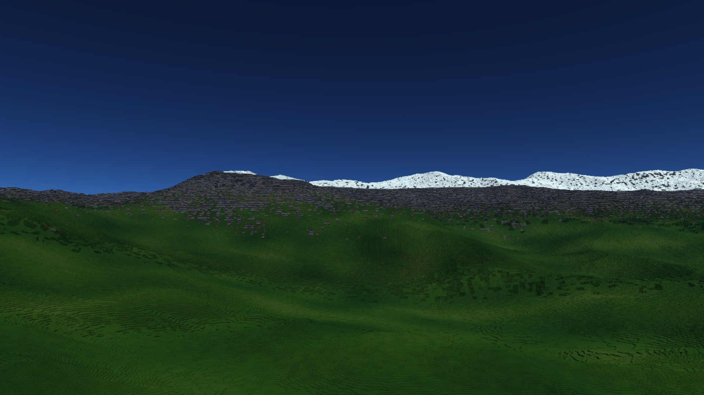

# Voxel flight corrections — draft evidence, 2026-10-01

Windows, RTX 3060, 1920x1080 quality mode (1440x810 internal), 0.1 m recipe.
Companion: [Pulsar-Native #994](https://github.com/Far-Beyond-Pulsar/Pulsar-Native/pull/994).

CPU: 32 passed / 2 ignored. Existing GPU: 14 passed. New surface-entry and
alpine-material regressions: 2 passed. Deferred graph/sky/resize: 4 passed.
GPU suites were serial.

The additional graph regression enables temporal reconstruction after initial
construction, switches quality, and disables it again. Runtime quality was
previously lost when reconstructing the graph config, so native selection
could disagree with an initially configured harness. It also verifies that a
material edit and reset of colour history show in one frame, keep resident
columns, and restore the default palette. `PlanetPass::set_appearance` now
reports whether appearance changed so hosts can invalidate history only when
necessary. Pulsar resets temporal history on appearance edits and camera cuts.

The final 5,676-frame offscreen flight used runtime code at 9a4f9dd4 and
the stricter audit in this PR. It reported:

| Observation | Result |
|---|---|
| Warm full-graph sync p95 | 11.82 ms |
| Movement sync p99 | 22.71 ms |
| Terrain GPU p95 | 9.69 ms; 5 ms target unmet |
| Descent arrival | 2 frames / 7.66 ms |
| Changed pixels after 250 ms vs settled | 0% |
| Local edit visibility | 27.47 ms |
| Settled loading/exhausted rays | 0 |
| Sampled near-field exact cell disagreement | 26 / 168,561; fails exact agreement |
| Resize resident columns | 708,723 before and after |
| Logical terrain GPU memory | 541.12 MiB including climate cache |

CPU compilation ran concurrently. This is not isolated native-editor timing.
An earlier run at 6b1126aa measured terrain p95 7.61 ms before the final
hemisphere-fill adjustment; neither run meets the 5 ms target. No cause for
the timing difference has been established.

The previous audit reported only disagreements exceeding three base voxels
in ray distance. It counted 24 and incorrectly accepted a small error rate
as an exactness gate. The final audit separately records that diagnostic and
requires zero cell disagreements. It finds 24 in the mountain walk and one
each in ground-up and arrival views. Comparison samples unjittered GPU level-0
hits every seventh pixel when the CPU also hits within 60% of the level-0
range; it does not qualify all rays or distance levels. The sampled sunlight
comparison also finds 613 disagreements; representative 2x2 shadow sharing
remains approximate. These are open gates, not waived by passing timings.

The final report writer also fixes a diagnostic entry that initially caused
Markdown/CSV export to panic after JSON export; the complete rerun produced
all reports successfully. The memory counter includes the climate cache.

Ground capture at f47bbb5f, final 1.25 hemisphere fill:

Mountain capture at 6b1126aa, before the final fill adjustment (0.75 fill):

These captures demonstrate the current result, including its shortcomings.
They are not production art acceptance. Coarse geometric level transitions,
small distant edit loss, representative shadow errors and worst-case native
flight timing remain open. Fine voxels and all-distance destructibility are
requirements; the current coarse field does not meet them. Palette,
roughness, grass/detail controls and planetary atmosphere are a foundation
for further art direction, not completed AAA visuals. Keep both PRs drafts.
