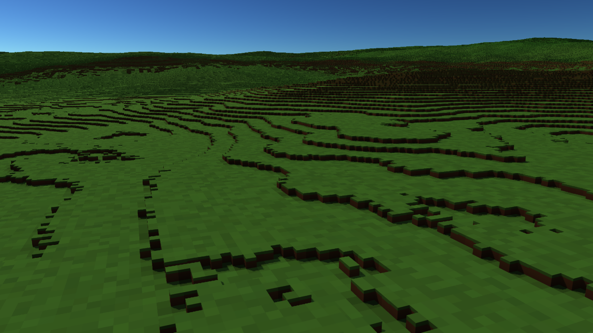
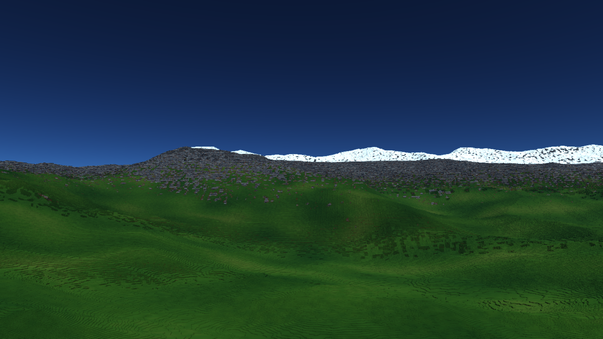
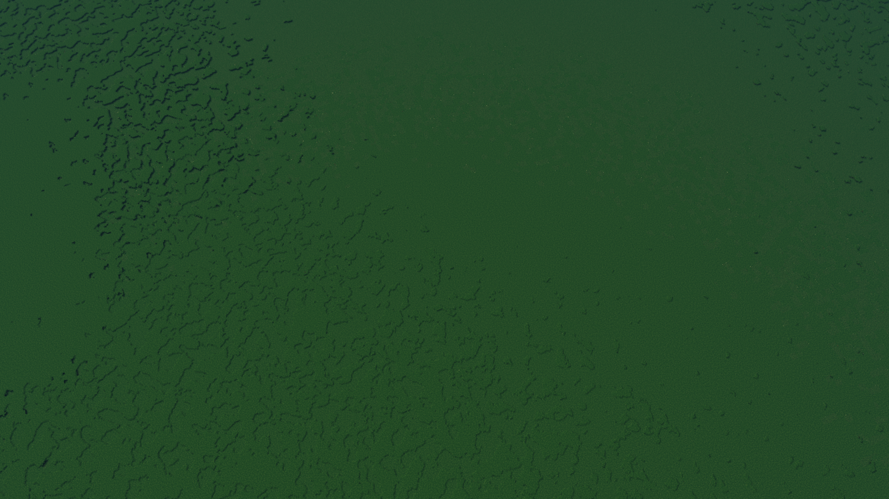

# Terrain shading regression correction — draft evidence

The appearance changes regenerated the terrain field for fine hits that already
had resident column tops. Distant discontinuity queries also left the full
generator inside the material/AO shader. This raised ground shading from about
0.83 ms in the older baseline to over 4 ms.

Fine hits now reuse their canonical resident top at base-cell precision. All
distant height queries run in the climate prepass, which resolves the existing
2x2 sharing and face/depth fallbacks into one height per pixel. Palette RGB is
converted from sRGB to linear on CPU upload; roughness stays linear.

Landform additionally skips height queries only when its symmetric bounds prove
that the entire possible canonical-height interval produces the same material.
Ambiguous basin/alpine transitions retain the full query. Custom generators
also retain it. This changes neither occupancy nor the existing distant material
sampling rules. It does not solve coarse geometry or missing distant small edits.

## Paired release measurement

Windows / RTX 3060 / Vulkan, 1920x1080 Quality (1440x810 internal), 0.1 m voxels,
traced sunlight, same flight and appearance settings. Before: runtime at
f238eef8, saved pre-fix executable; after: runtime at adc27b72. The before and
after flights completed 5,235 and 5,022 frames. The editor was closed and no
compilation or computer-use capture ran during either full timing run. Harness
readbacks/captures/audits are excluded from frame intervals; these are offscreen
measurements, not native presentation qualification. Stage p95s are independent
percentiles and must not be added together.

| Metric | Before | After |
|---|---:|---:|
| Terrain GPU p95, movement + warm | 7.552 ms | 5.776 ms |
| Ground material/climate p95 | 4.192 ms | 1.000 ms |
| Ground terrain GPU p95 | 7.229 ms | 4.346 ms |
| Warm full-graph completion interval p95 | 9.285 ms | 6.467 ms |
| Movement completion interval p99 | 17.552 ms | 14.451 ms |
| Arrival settle | 10.205 ms | 6.686 ms |
| Local edit visibility | 24.756 ms | 15.605 ms |
| Logical terrain GPU memory | 541.119 MiB | 544.681 MiB |

| View | Terrain p95 before | Terrain p95 after |
|---|---:|---:|
| Ground warm | 7.229 ms | 4.346 ms |
| Ascent | 7.410 ms | 4.451 ms |
| Descent | 7.859 ms | 5.544 ms |
| Mountain flight | 6.155 ms | 6.324 ms |
| Mountain walk | 7.674 ms | 5.977 ms |
| Orbit | 3.556 ms | 3.538 ms |

The strict 5 ms terrain gate remains **failed**. Mountain-flight and orbit
material costs did not improve materially; uncertain alpine heights still need
canonical queries. The older pre-appearance flight measured 5.143 ms overall,
so the new path has not recovered all of that baseline. The earlier 9.69 ms run
had concurrent CPU compilation and slower unchanged stages; it is retained as
historical evidence, not used as this paired baseline.

Movement/warm samples recorded graphics clocks of 1927–1950 MHz before and
1920–1950 MHz after (memory 7501 MHz), in the committed CSVs. The screen cache
adds 3.34 MiB at the initial internal size, 3.56 MiB at this route's peak size.
Settled loading/exhausted rays remain zero. Resize retains 708,723 columns.
The exact sampled cell disagreement remains 26 / 168,561 in both runs, so the
exactness gate remains **failed**; representative sunlight also remains an open
agreement gate. Do not treat the performance correction as overall acceptance.

## Regression validation

Release: 33 CPU tests passed, 2 ignored; 14 existing GPU tests plus 4 appearance
and surface-entry GPU tests passed; 4 deferred-graph tests passed. GPU suites
ran serially. The new bounded-query test compares all 65,919 surface records
byte-for-byte with full queries across seven lowland/alpine views, 330 m to
1,000 km, at an odd 129x73 viewport. No surface bytes differ. CPU samples check
both signs of the height bound at 0.1/0.3/1 m. A fine-grass GPU test verifies
authored sRGB survives upload conversion; live appearance/history tests pass.

Raw reports: [before](before-gates.json), [after](after-gates.json).
Per-frame records and clocks: [before](before-frames.csv), [after](after-frames.csv).

Keep [Helio #314](https://github.com/Far-Beyond-Pulsar/Helio/pull/314) and
[Pulsar-Native #994](https://github.com/Far-Beyond-Pulsar/Pulsar-Native/pull/994)
as drafts. Native timing, exact far geometry/edit coverage, geometric level
transitions, frame tails, startup/resize hitches and finished art remain open.
